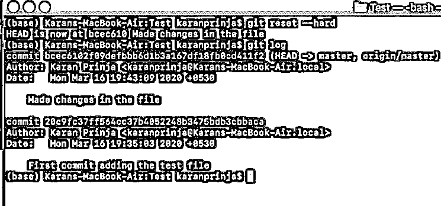
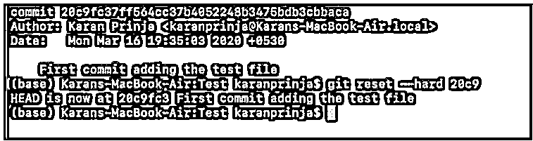
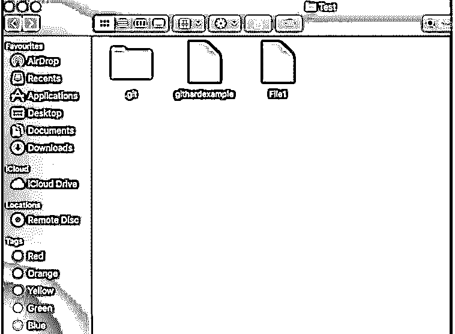
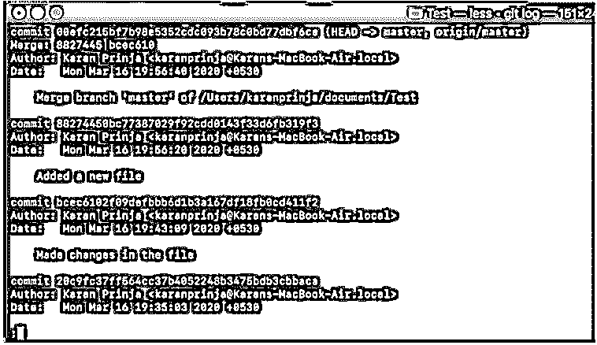
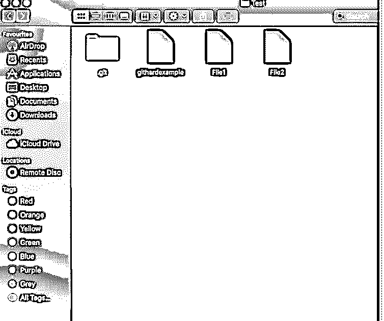
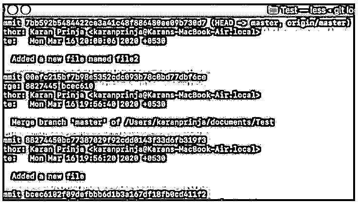
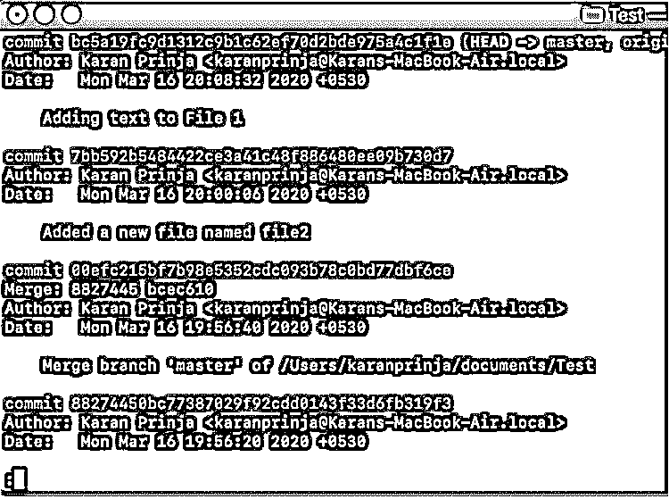
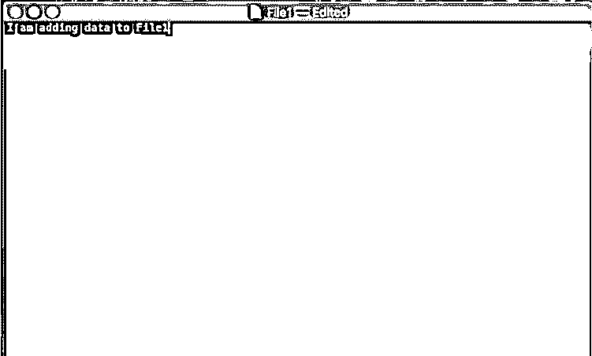
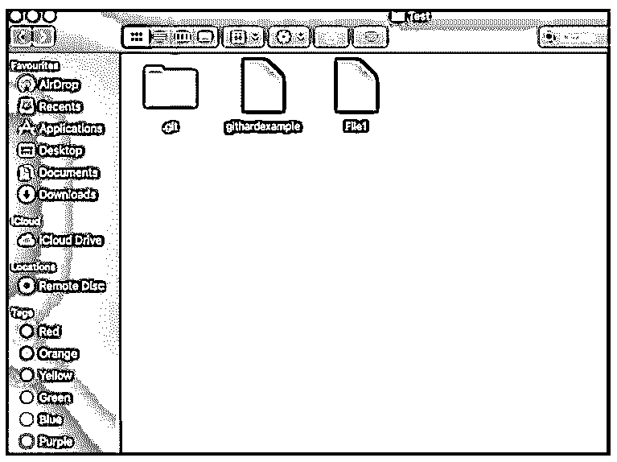
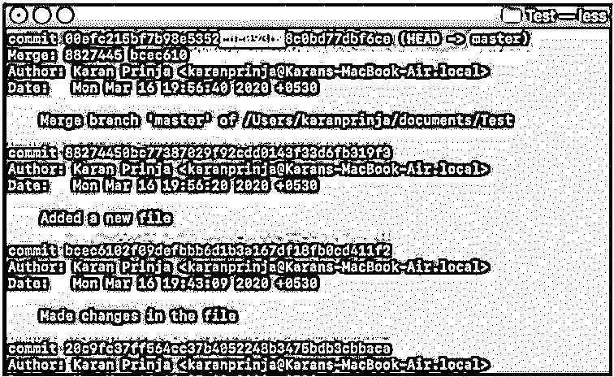

# Git 硬重置

> 原文：<https://www.educba.com/git-reset-hard/>

## Git 硬复位简介

Git Reset 是一个神奇的命令，通过它我们可以返回并观察代码的先前版本，并将其用作当前代码版本。

Git 重置有多种方式:

<small>网页开发、编程语言、软件测试&其他</small>

*   温和的
*   混合的
*   困难的

每一种都有自己的用法，每一种都有自己的危险。

1.  **Soft:**git reset-Soft 命令用于卸载我们使用 git add 命令存放的文件。
2.  **Mixed:** 该命令 git reset -mixed 用于删除我们使用 git commit 命令提交的文件。
3.  **Hard:** 这个命令 git reset -hard 用于删除我们在代码中推送的所有内容。我们可以进一步指定要删除代码的位置。

### Git 重置努力工作

现在，假设我们有一个名为 Test Repository 的存储库，其中有几个文件，如下所示:

如你所见，我们有一个名为 githardexample 的文件。现在我们来看看文件的内容。

如你所见，文件是空的，我们没有任何内容。

我们现在将在这个文件中添加文本。

这是我们在文本文件中输入并保存的文本。

我们的下一个文本将是添加变更并将它们提交给我们的存储库。因此，为了做到这一点，使用我们的正常命令。

完成这些修改后，我们现在将运行 git reset -hard 命令，按照这个命令，我们对史前的所有修改都将被删除。

但是首先，为了做到这一点，我们必须指定我们希望更改生效的点。

让我们运行 git log 来检查当前存储库中提交的数量。

如您所见，有 2 次提交，我们想在添加文件时将注意力转移到第一次提交。

因此，我们将在写入 git reset-hard 之后指定特定的提交 id。您只需要写提交 id 的前 4 个字母。

您应该会得到一条消息，表明 HEAD 位于特定的提交位置，即 20c9。

现在回到你的原始文件，检查它的内容。

您将会看到文件是空的，并且它已经到达了我们添加的原始状态。

现在运行 git log 命令。您将会看到，我们向文件添加内容的提交已被删除，我们只有一次提交。提交对应于文件的添加。

### Git 硬复位示例

下面是一些例子:

#### 示例#1

在本例中，我们将添加几个文件，而不是修改文件的内容，并在只有一个文件时返回到初始位置。

我已经在存储库中添加了一个新文件。该文件的名称是 File1。我将添加并提交文件。

您可以看到，我们有一个添加新文件的提交，即提交 idbcec6102。

现在，我们将向存储库中再添加一个名为 File2 的文件，并执行 add、commit 和 push 命令。

现在，您可以在我们的存储库中看到一个名为 File 2 的新文件。我们已经执行了添加提交和推送例程。

您可以在上面的图像中看到，我们有一个新的提交，它从提交 id 7bb592 开始。

为了更清楚地说明这个概念，让我们为一些数据编辑一个名为 File1 的文件。先前它是空的，现在我们将向它添加一些文本。

注意，我们已经将文本添加到文件中，现在让我们检查一下 git 日志。我们有一个 id 为 bc5a 的新 git 提交。

#### 实施例 2

现在，例如，假设我创建并推送了文件 2，但由于这个原因，我的代码已经停止工作，因此为了删除文件 2，我必须首先检查我添加文件 2 的提交，并使用 git reset hard 命令以及提交 id。

我添加文件 2 的提交 id 为 7bb59。所以我会在它之前提交。

我现在将使用的命令是 git reset —hard 00efc

如果您现在检查存储库，您会发现文件 2 已被删除。

如您所见，文件 2 已被删除，我们对文件 1 所做的所有更改也随之被删除。

我们的提交已被重置为点 00efc21 提交 id，如上图所示。

这是 git reset -hard 的主要缺点，即使您不想删除它们，所有的更改都会被删除。就像上面的例子一样，我们不想删除文件 1 中的更改，但是它被删除了

### 结论

Git reset hard 是一个应该小心使用的命令，因为它可以删除您的整个代码提交历史以及您在特定提交之前所做的事情。因此，应谨慎使用。除了 git reset hard 之外，还有其他命令可以用来回溯你的修改，比如 git checkout。根据您的需求，使用适当的命令来回溯您的更改

### 推荐文章

这是一个 Git 硬复位的指南。在这里，我们讨论的介绍，git 重置努力工作与各自的例子。您也可以看看以下文章，了解更多信息–

1.  [GIT 指数](https://www.educba.com/git-index/)
2.  [Git 中的 Head 是什么？](https://www.educba.com/what-is-head-in-git/)
3.  穿孔 vs Git
4.  [什么是 GitLab](https://www.educba.com/what-is-gitlab/)

