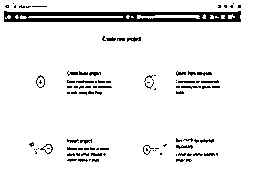
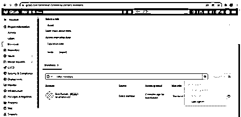

# Gitlab 权限

> 原文：<https://www.educba.com/gitlab-permissions/>

## Gitlab 权限介绍

GitLab 权限是组或项目中的一个职位，用户在用户项目组和项目本身的成员中拥有最高的角色。最高角色用于手动跟随成员添加或导入用户，它会被添加到成员列表中。如果他们有一个 GitLab 帐户，它接收邮件，如果我们需要一个电子邮件地址，用户还没有，它将被提示为每个用户创建邀请中提供的电子邮件地址。

### Gitlab 权限概述

所有者角色由其项目继承，并且只能在项目的组或个人命名空间级别上使用。对于可以由个人名称空间或组的每个所有者操作和执行的一些操作，它将保持并且是最大的项目级位置，并且它用于创建具有完全填充用户权限的实例管理员。这取决于他们在每个组或拥有 n 项技能的项目用户中所担任的最大职位数。如果该职位很高，则该职位将被项目组中的每个用户和项目本身所利用。

<small>网页开发、编程语言、软件测试&其他</small>

### Gitlab 权限指南

GitLab 中有几种访问用户操作的权限类型，在设计与所需权限交互的任何东西时，都应该考虑到它们。它有 n 个权限，如与组和项目相关的一般权限，应被视为一般权限。它将通过访问修饰符(如 public、private 和 internal)进行访问，它们中的每一个都应该是用户可见的独立实体。

### 项目中的权限

GitLab 通常是基于 web 的 DevOps 生命周期工具，它将向 Git 存储库管理人员提供数据。因为它是开源的，所以许可证将与问题跟踪、所需权限的部署管道功能和用户访问一起在线提供。

通常，它包含两种类型的 Gitlab，如 SaaS Gitlab 和自管理 git lab，

`https://gitlab.com/gitlab-com/gl-infra/next.gitlab.com/-/project_members`

在这里，我有一个 Gmail 登录帐户，所以我可以选择已经有一个帐户？登录选项自动导航并移动到登录页面，

上面的 Gitlab 是较新的版本，所以它在用户登录方面有一些更新的变化。如果我选择项目成员，它会列出与 GitLab 项目维护者或所有者相关的成员组。基本上，我们首先创建新项目来设置权限，

创建一个空白项目它会自动创建项目 URL，

在给出项目名称并选择 create a project 之后，项目创建成功，

然后导航到项目信息->成员，它显示两种类型，如邀请成员和邀请组，如果我给用户电子邮件地址，它会自动添加项目，

使用以下选项选择角色，

此外，访问截止日期是指项目交付时间，一旦用户访问结束，项目将自动停用。

我们可以使用以下过滤器选项来过滤用户信息，

如果我在同一个项目中与 n 个用户一起工作，那么我将使用邀请组选项来创建组，看起来与上面的步骤相同。

### 用户类型:

一般来说，Gitlab 有如下四种类型的用户:

1.嘉宾
2。记者
3。开发商
4。维护者

**嘉宾:**

用户拥有单独的用户会话。会话注销后，它会自动删除用户数据。访客用户是指没有帐户，但希望通过随处可用的网络利用热点连接到互联网的人。

**记者:**

这种类型的用户运行报告，并使用典型功能的标准优势来打印和导出数据。它对访问公司或项目中的数据没有限制。用户必须是任何安全组的成员才能访问 Insight。

**开发商:**

我们已经知道了开发人员角色这个名字本身用来标识权限。它将是实施项目的主要角色。它还使用单元测试等方法测试项目数据。

**维护者:**

负责维护项目的组织用户也称为管理员用户，用于访问上述所有用户角色和数据。这是用户分配给其他项目成员的角色。

### 如何使用用户权限

在将用户添加到项目中之后，它是项目的主要部分，然后我们必须为每个用户分配项目的权限和角色。如果用户是来宾，他/她将作为来宾用户处理项目。一旦用户会话完成，数据将不会被再次保存，用户将再次创建或处理项目。如果假设用户处于报告者模式，那么用户从包含项目的其他组继承了他们的角色。从内部和外部的项目从成员。所以用户直接分配给项目它的一个直接成员用于列出数据。如果用户是项目的直接成员，则可以更改到期日期。则父组的成员资格从到期日继承，只能由父组更改。开发人员是项目的核心，因此角色用户将在一段时间内实施项目。维护者角色用户负责维护项目成员，直到项目交付。

### 结论

GitLab 应用程序允许自动化整个 DevOps 生命周期项目，从规划到创建、构建、验证、安全测试、部署和监控。它是可在内部或云环境中托管的高度可扩展的应用程序。它还拥有数个管道应用项目和数百万用户的工作场所。

### 推荐文章

这是 Gitlab 权限指南。这里我们讨论简介、概述、如何使用用户权限、用户类型，以便更好地理解。您也可以看看以下文章，了解更多信息–

1.  [GitLab 替代方案](https://www.educba.com/gitlab-alternative/)
2.  [什么是 GitLab](https://www.educba.com/what-is-gitlab/)
3.  [GitLab vs GitHub](https://www.educba.com/gitlab-vs-github/)
4.  [GitLab vs 吉拉](https://www.educba.com/gitlab-vs-jira/)

