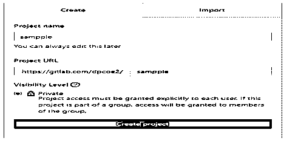
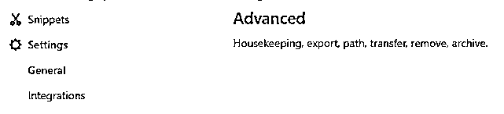
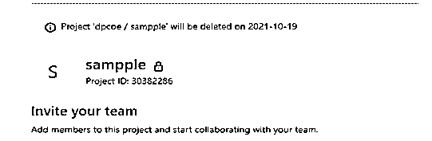
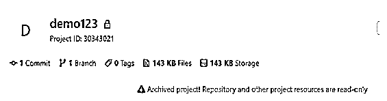
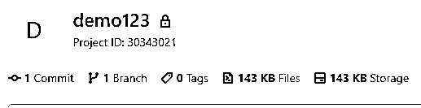
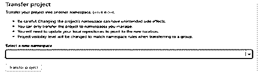

# GitLab 删除存储库

> 原文：<https://www.educba.com/gitlab-delete-repository/>

## GitLab 删除存储库的定义

成功开发软件后，有时开发者需要从 GitLab 中删除一些资源库，那么这时候开发者就可以删除资源库了。删除存储库无法删除所有上游存储库。基本上，在 GitLab 中，我们需要任何一个权限来删除存储库，这样我们要么拥有 admin，要么拥有项目所有者，然后我们就可以执行删除操作。项目创建后，我们有一个编辑选项卡；在编辑选项卡中，我们有一个删除存储库选项。但是重要的一点是，一旦我们删除了存储库，我们就不能恢复被删除的存储库。

### 什么是 GitLab 删除存储库？

你可以删除任何仓库或分支，如果你是一个协会的所有者或拥有仓库或分支的管理员授权。删除分叉仓库不会删除上游存储库。

<small>网页开发、编程语言、软件测试&其他</small>

只有拥有协会所有者权限或保管库管理员权限的个人才能删除协会档案。允许个人删除或移动这个协会的保险库的可能性很小，只有协会所有者可以删除协会档案。删除公共回购不会删除归档的任何分支。关于删除存储库的两件重要的事情如下。

删除档案将永久删除排放连接和组同意。这个活动不能散。删除私有或内部存档将删除商店的所有分支。

### 如何创建和删除 GitLab？

现在让我们看看如何创建和删除 GitLab 存储库，如下所示。

首先，让我们看看如何创建一个 GitLab 存储库，如下所示。

幸运的是，创建一个 GitLab 项目是相当清楚的。本质上，在屏幕最高点的项目菜单下选择新的项目，一个一页的向导将引导你完成交互。承诺包括:

1.什么是项目名称
2。各自项目的 URL 是什么
3。项目描述
4。项目的可见性级别

对于 GitLab 项目的创建，我们需要遵循如下一些步骤。

1.首先，我们需要登录 GitLab。

2.之后，我们需要点击 create project 按钮，并填写所需的信息:项目的名称、项目的 URL 以及私有或公共项目的可见性等。

3.之后，我们需要点击“点击”按钮“创建项目”按钮。

下面的截图显示了我们在项目创建过程中需要填充的参数，如下所示。

项目创建成功后，看起来如下图所示。

现在让我们看看如何从 GitLab 中删除项目，如下所示。

当设计师删除 GitLab 项目时，他们不应该轻视它。总监删除 GitLab 项目后，所有相关资产将永久删除，并且无法重新建立。

要删除项目，我们需要单击高级设置选项，在高级设置中，我们有删除项目选项。页面上的继续选项是一个红色按钮，上面写着删除项目。按下这个按钮并键入，为了冒险，你会看到所有相关资产从服务器上永久删除。

现在让我们看看在 GitLab 上删除存储库的不同步骤，如下所示。

首先，我们需要选择我们想要删除的项目。这里我们需要删除示例项目，如下图所示。

现在选择常规设置选项，在常规设置中，我们有高级设置选项，如下图所示。

点击最后的“高级”按钮后，我们必须删除项目选项，如下图所示。

现在点击删除项目按钮。成功删除项目后，显示如下截图所示的信息。

### 使用帮助和高级设置

现在让我们看看 GitLab 存储库的用途、帮助和高级设置，如下所示。

保险库是你的事业所在的额外房间。它可能是你电脑上的一个信封，也可能是 GitHub 或其他基于互联网的主机上的一个额外的空间。您可以将代码文档、文本记录、图片或任何类型的记录保存在档案中。

高级设置位于常规设置选项下，它提供不同种类的功能，如下所示。
高级设置的第一个用途是归档项目:归档项目用于为所有用户创建一个只读存储库，这意味着它表明这个特定的存储库没有被主动维护。存档的项目也可以不实现，但只有项目所有者和管理员可以实现。归档项目功能如下图所示。

第二个选项是未存档项目:在这个特性中，我们可以取消存档项目，如下图所示。

在这个特性中，我们可以改变项目的路径:在这个特性中，我们可以根据我们的需求很容易地改变存储库的路径。更改路径功能如下图所示。

我们也能够按照要求转移项目。我们使用下面的屏幕截图展示了 Transfer project 选项卡。

我们在高级设置选项卡中有更多的功能，根据我们的要求，我们可以使用任何我们想要的选项。

### GitLab 删除存储库示例

删除保管库需要管理员访问权限。如果使用 OAuth，则需要 delete_repo 扩展。如果一个协会的所有者安排协会阻止个人删除协会拥有的商店，你将得到一个 403 禁止响应。

对于 javascript，我们可以编写如下代码。

`await joahn.request('DELETE /repos/{owner}/{repo}', {
owner: 'Johan',
repo: 'demo123'
})`

**解释**

在执行上述代码后，我们将遵循如下截图所示的结果。

### 结论

我们希望通过这篇文章，您可以了解更多关于 Gitlab 删除库的信息。从上面的文章中，我们已经了解了 Gitlab 删除存储库的基本思想，我们还看到了 Gitlab 删除存储库的表示。从本文中，我们了解了如何以及何时使用 Gitlab 删除存储库。

### 推荐文章

这是一个 GitLab 删除资源库的指南。这里我们讨论定义，什么是 GitLab 删除库，如何创建和删除 GitLab？.您也可以看看以下文章，了解更多信息–

1.  [GitLab 替代方案](https://www.educba.com/gitlab-alternative/)
2.  [什么是 GitLab](https://www.educba.com/what-is-gitlab/)
3.  [Bitbucket vs Gitlab](https://www.educba.com/bitbucket-vs-gitlab/)
4.  [Gitlab CI vs Jenkins](https://www.educba.com/gitlab-ci-vs-jenkins/)

