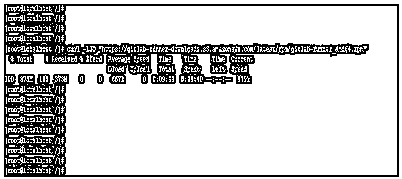
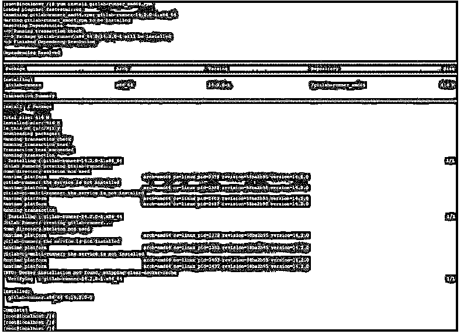
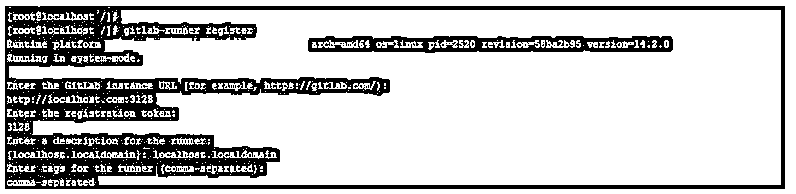
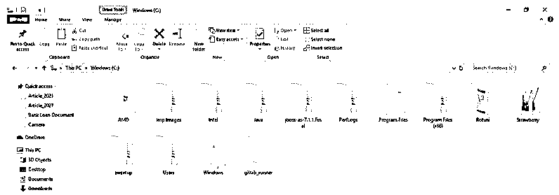
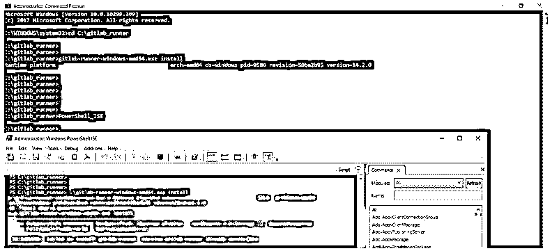
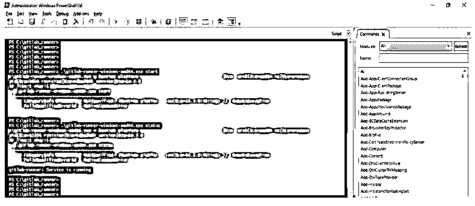
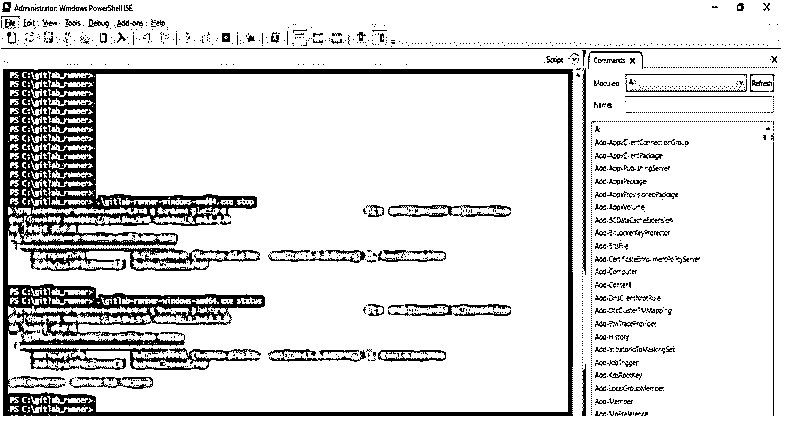

# GitLab Runner

> 原文：<https://www.educba.com/gitlab-runner/>

## GitLab Runner 简介

Gitlab runner 是一个与 Gitlab 一起使用的应用程序，可以在我们管理的任何系统上安装 gitlab runner。我们也可以将它安装在另一台机器上，出于性能和安全性的原因，该机器与 gitlab 实例是分开的。在使用不同的机器时，我们可以使用不同的操作系统和工具，如 Docker 和 Kubernetes。基本上，它是一个开源工具，它是用 GO 语言编写的，我们可以在一个二进制文件中运行它，所以我们不需要任何特定的要求。

基本上，gitlab runner 是在运行我们发送给 gitlab 的作业后，用于在多台机器上运行我们的作业的实例。此外，我们已经将结果发送到不同的服务器、本地机器和用户。我们可以在安装后将其注册为特定用户，也可以注册为共享用户。我们可以通过使用共享或特定的跑步者来服务我们的工作。

<small>网页开发、编程语言、软件测试&其他</small>

以下是服务于 gitlab 转轮工作的类型:

*   特定跑步者
*   共享跑步者

当多个项目的工作和相同的需求时，共享的跑步者是有用的。我们可以用一个小的或者只有一个跑步者来处理多个项目。我们也可以在很多项目中使用多个运行器，但是维护和更新并不容易。特定的运行人员习惯于部署相同需求的某个或特定的项目。如果我们对我们的项目有一定的要求，那么在算法名称中使用特定的 runners 作为先进先出(FIFO)来组织过程和数据。通过使用特定的注册令牌，我们可以注册特定的跑步者。安装应用程序后，我们可以注册 gitlab runner。运行者只不过是用来运行 CI/CD 工作的代理。注册 gitlab 的运行程序后，我们可以在机器和 gitlab 之间建立通信。

基本上，gitlab runner 在我们安装 gitlab runner 的同一台机器上运行时间处理作业。我们可以在容器或云中运行 runner 流程作业。我们还可以在 Kubernetes 集群中运行 runner 进程作业。注册跑步者后，我们需要选择执行人。执行者用来决定工作的环境。如果我们想在 PowerShell 中运行 CI/CD 作业，那么我们需要在服务器上安装 gitlab runner。此外，为了运行 CI/CD 作业，我们需要注册用于执行 docker 的 runner。有一个简单的配置，用于在虚拟机上安装 gitlab runner，在虚拟机上安装之后，我们可以在另一个虚拟机上使用它。

### 如何安装 GitLab Runner？

下面我们已经在 Linux 系统上安装了 gitlab runner。下面是在 Linux 系统上安装 gitlab runner 的步骤如下:

1.首先我们需要从 gitlab runner 网站下载 rpm 包。我们可以使用 curl 命令下载相同的内容。

**代码:**

`# # curl -LJO "rpm package name and download path"`

**输出:**

2.下载软件包后，使用 rpm 或 yum 命令安装该软件包。

**代码:**

`# yum install gitlab-runner_amd64.rpm`

**输出:**

3.安装 gitlab runner 后，注册 gitlab runner。

**代码:**

`# gitlab-runner register`

**输出:**

### 使用 PowerShell 安装 GitLab Runner

下面是在 windows 环境下使用 PowerShell 安装 gitlab runner 如下:

以下是安装 gitlab runner 的步骤。

1.为 gitlab runner 安装创建一个文件夹。我们在“C”目录下创建了一个名为“gitlab_runner”的文件夹。

C:\gitlab_runner

2.创建文件夹后，下载 gitlab runner 的二进制文件。我们可以下载 gitlab runner 二进制文件作为 windows 系统的变形。我们已经下载了 gitlab runner 的 64 位二进制。

3.下载 gitlab runner 的二进制文件后，提供对 gitlab 目录的写权限。

4.然后在命令提示符下运行 PowerShell_ISE 命令来连接 PowerShell ISE。

**代码:**

`> PowerShell_ISE`

**输出:**

5.打开 PowerShell 窗口后，从 cmd 或 PowerShell 在 windows 上安装 gitlab runner。

**代码:**

`gitlab-runner-windows-amd64.exe install`

**输出:**

*   在上面的例子中，我们已经从 cmd 安装了 gitlab runner。但是打开 PowerShell 之后会显示 gitlab runner 已经安装在机器上了。
*   我们可以使用 cmd 或者使用 PowerShell 来安装 gitlab runner。
*   在使用 PowerShell 安装时，我们需要给出可执行的命令。

6.启动 gitlab runner——我们必须使用 PowerShell 启动 git lab runner，如下所示。

**代码:**

`> .\gitlab-runner-windows-amd64.exe start
> .\gitlab-runner-windows-amd64.exe status`

**输出:**

7.停止 gitlab 运行程序——我们已经使用 PowerShell 停止了 gitlab 运行程序，如下所示。

**代码:**

`> .\gitlab-runner-windows-amd64.exe start
> .\gitlab-runner-windows-amd64.exe status`

**输出:**

### GitLab 转轮的特点

以下是 gitlab runner 的功能:

*   使用 gitlab runner，我们可以同时运行多个任务。
*   我们可以对使用它的多个服务器使用多个令牌。
*   使用它，我们可以限制每个令牌的并发作业。
*   我们可以使用它在本地运行作业。
*   我们可以通过使用 docker 容器来运行作业。
*   它是用 GO 语言写的。
*   使用它，我们可以连接到远程 SSH 服务器。
*   它将支持 windows PowerShell 和 bash。
*   它将支持 Linux 和 Windows 环境。
*   它将允许我们定制作业运行环境。
*   使用它我们可以自动配置 gitlab。我们不需要在配置后重启。
*   使用 SSH 运行环境和 docker 很容易使用和设置。
*   我们可以很容易地在 windows 和 Linux 系统上配置和安装 gitlab runner。

### 结论

GitLab Runner 是一个与 GitLab 一起使用的应用程序，用于逐个运行作业。我们也可以将它安装在另一台机器上，出于性能和安全性的原因，该机器与 GitLab 实例是分开的。我们可以在任何 windows 和 Linux 系统上安装它。

### 推荐文章

这是 GitLab Runner 的指南。这里我们分别讨论使用 PowerShell 安装 GitLab runner 的介绍、安装和功能。您也可以看看以下文章，了解更多信息–

1.  [GitLab 替代方案](https://www.educba.com/gitlab-alternative/)
2.  [什么是 GitLab](https://www.educba.com/what-is-gitlab/)
3.  [服务器类型](https://www.educba.com/server-types/)
4.  [ShareX 替代方案](https://www.educba.com/sharex-alternative/)

