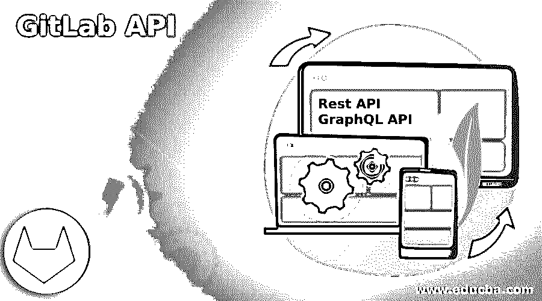
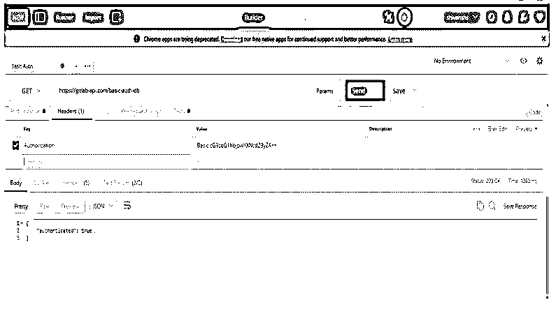
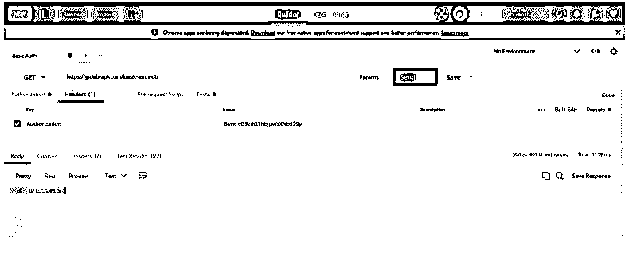
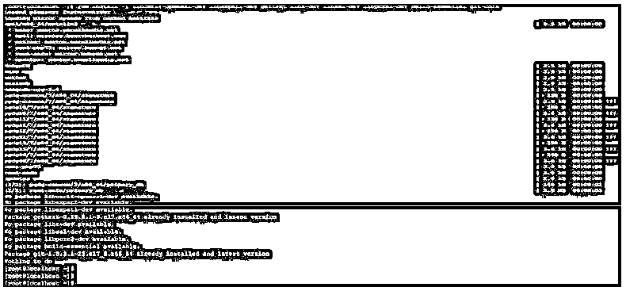
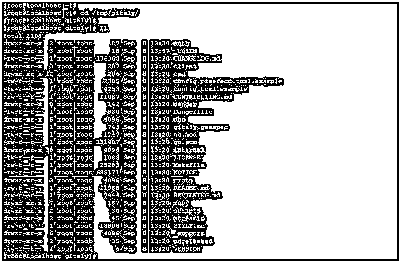

# GitLab API

> 原文：<https://www.educba.com/gitlab-api/>

## GitLab API 简介

GitLab API 有两种类型，第一种是 REST API，第二种是 GraphQL API，与 REST 和 GraphQL API 相比，REST API 在程序中非常容易使用。此外，rest API 非常容易理解并在我们的程序中使用，它将根据我们正在执行的每个操作来定义端点。我们可以使用 GitLab API 来获取可公开访问的信息，我们还可以验证来自公共访问的 API 请求。有多种方法可以验证我们的请求。

### 什么是 GitLab API？

GitLab 是一个非常强大的 API，用于管理我们的应用程序，我们可以通过使用这个 API 来管理我们的整个 GitLab 实例。我们可以通过使用 GitLab API 来创建我们的项目。为了测试 API 的端点，我们使用了 postman 或 google chrome。我们需要使用三个资源名称作为一个组，项目和独立。

<small>网页开发、编程语言、软件测试&其他</small>

有两种类型可供选择。

*   Rest API
*   GraphQL API

GraphQL 只不过是一种查询语言，它允许客户请求他们需要的数据。我们可以通过较少的请求获得所有需要的数据。GitLab API 没有任何固定的数据模型和端点，GitLab 的新功能是在不改变断点的情况下添加的。Git 是 GitLab 中最有用的单片机。它是最受欢迎的产品，用于集中管理 gitlab 的存储库。GitLab repository 将提供许多功能。GitLab 将允许管理子组中的存储库，也允许我们使用模板。

我们还可以将安全性应用于每个组，还可以创建组结构。它为我们的自动化任务提供了便利。我们也可以使用不同的类型来创建请求。使用它，我们可以只提出我们需要的请求。使用 GitLab API，我们可以删除控制器特定的端点。使用它可以为单个项目维护不同的 API。我们只能为一个项目管理一个 API。它将包括 API 和 API 的版本。API 版本在 api.rb 文件中定义。我们可以在 GitLab API 上使用身份验证，假设我们没有使用任何身份验证，那么它将返回公共数据。

### 如何使用 API/Access 访问 GitLab API？

要使用 API，我们需要创建一个项目。我们已经创建了名为 gitlab-api 的项目。我们在项目中使用了 GitLab API 方法。

1.我们使用下面的网址如下。

在下面的例子中，我们检查数据库服务器的认证。我们正在核实回复是否属实。

https://gitlab-api.com/basic-auth-db

2.更改密码后，它会将状态代码显示为未授权。它将显示状态代码为未授权，因为我们使用了错误的密码。

https://gitlab-api.com/basic-auth-db

### GitLab API 的安装

1.首先，我们安装 GitLab 及其依赖包。我们需要用 git 安装依赖包。我们需要在安装时安装下面的依赖项。

*   libcurl4-openssl-dev
*   libexpat1-dev(利比亚民众国)
*   gettext
*   立兹巨人
*   libssl-dev
*   libpcre2-dev
*   构建-基本

在安装完所有的软件包之后，我们正在我们的服务器上安装 GitLab API。在下面的例子中，我们已经用一个命令安装了所有的包。

在下面的例子中，我们已经安装了软件包，所以它将显示它将已经安装。

在下面的例子中，我们可以看到，在 Linux 中使用 yum 命令安装软件包时，会自动安装依赖项包。

**代码:**

`# yum install -y libssl-dev libpcre2-dev build-essential libcurl4-openssl-dev libexpat1-dev gettext libz-dev git-core`

**输出:**

2.安装 GitLab 包后，为 git 的克隆创建一个目录。我们将在 tmp 目录中创建目录名 gitaly。

**代码:**

`# mkdir /tmp/gitaly`

**输出:**

3.创建文件夹后，克隆存储库 git。我们已经使用 GitLab API 编译了 git。

**代码:**

`# git clone https://gitlab.com/gitlab-org/gitaly.git -b 14-2-stable /tmp/gitaly/`

**输出:**

4.克隆后，我们可以检查所有文件都是在/tmp/gitaly 目录下创建的。

**代码:**

`# cd /tmp/gitaly/
# ll`

**输出:**

### 状态代码

在工作时，我们需要了解状态代码。状态代码就是发送请求时返回的值。它使用一个等同于 HTTP 状态码的状态码。

下面是发送 API 请求时返回的状态代码。

*   200–好的
*   201–已创建
*   400–错误的请求
*   401–未经授权

每个状态代码的描述如下:

**1。200–正常**

*   此状态代码显示删除、获取和上传请求成功。当请求资源时，它将以 JSON 的格式返回。

**2。201–已创建**

*   此状态代码显示我们的 post 请求成功。当我们尝试创建新资源时，会返回此状态代码。

**3。400–错误请求**

*   此状态代码表明我们已经错过了请求中所需的参数。

**4。401–未授权**

*   此状态代码表明我们没有通过执行此请求的身份验证。
*   如果我们没有发送任何秘密令牌或发送无效令牌，同时返回此状态。

### 结论

GitLab API 有两种类型，第一种是 REST API，第二种是 GraphQL API，与 REST 和 GraphQL API 相比，REST API 在程序中非常容易使用。它使用一个等同于 HTTP 状态代码的状态代码。

### 推荐文章

这是 GitLab API 的指南。这里我们讨论一下入门，如何使用 API/访问 GitLab API？安装和状态代码。您也可以看看以下文章，了解更多信息–

1.  [GitLab 替代方案](https://www.educba.com/gitlab-alternative/)
2.  [什么是 GitLab](https://www.educba.com/what-is-gitlab/)
3.  [服务器类型](https://www.educba.com/server-types/)
4.  [ShareX 替代方案](https://www.educba.com/sharex-alternative/)

