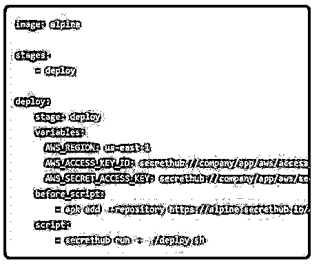
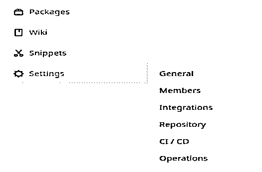
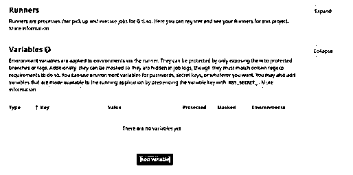
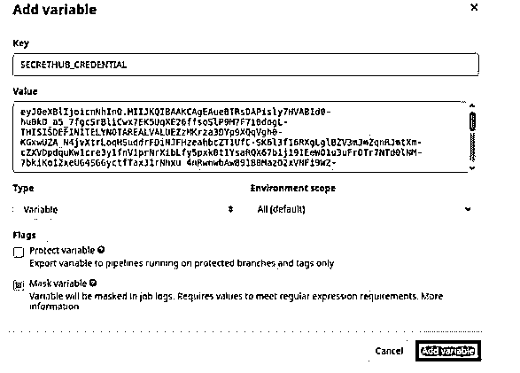

# GitLab CI

> 原文：<https://www.educba.com/gitlab-ci/>

## GitLab CI 简介

Gitlab 中内置了一个工具，用于开发人员持续集成和持续开发代码，他们可以在其中查找变更并从不同分支持续合并变更，该工具称为 Gitlab CI。YAML 文件在 Gitlab 中用于项目配置，因此该文件有助于定义针对一组作业运行的项目的约束，并且该文件被放置在项目的存储库中。该文件被放置为。gitlab-ci.yml 文件，并根据代码帮助编译不同环境的代码。我们可以在很多项目中定义它们。

### 什么是 Gitlab CI？

*   Gitlab 中的持续集成和开发有助于发现代码中的 bug 并纠正它，而无需花费更多的开发时间。CICD 还确保生产代码符合我们应用程序开发的所有代码。Gitlab 中还提供了 Auto DevOps，它有助于自动构建和部署我们的任何应用程序，而无需我们持续监控应用程序的运行状态。
*   应该基于 CICD 过程创建管道，其中键值对可以用于重置和重用有助于更快部署的变量。这个 CICD 概念还帮助我们将文件和代码部署到我们选择的任何环境中，因为它是自动部署的，不需要太多的部署监控。此外，我们可以在存储代码的地方创建工件，以便我们可以在不同的环境中进行部署时重用相同的代码。
*   所有依赖项都可以缓存到文件夹中，这有助于在执行作业时重用依赖项。这有助于在任何环境下更快地执行代码，因为依赖关系保存在 Gitlab 中。我们可以在应用程序中设置 Gitlab runners，它会自动执行脚本，有助于加快部署。我们还可以通过将流水线与各种具有特定需求的工件连接起来，来提高流水线的效率。这有助于开发人员根据自己的目的选择管道，并使流程更加简单高效。
*   我们可以创建用于各种目的的测试场景和测试用例，从而提高生产部署的效率。这有助于我们解决 bug(如果有的话),并在没有解决的时候发现新的问题。我们可以按照我们的要求安排管道和进行测试。在这里，我们可以在管道中设置 SSH 密钥，以便持续集成到系统中。Git 子模块可用于在进行部署时设置和配置作业。在调度管道时，我们可以使用应用程序中的 API 来触发管道，从而简化流程。
*   如果有不同的管道，并且流程属于相同的项目和相同的工件，我们可以进行合并请求来组合流程，并且我们可以将项目与应用程序中的任何 Kubernetes 集群集成。我们可以创建一个 Google Kubernetes 引擎来管理同一个应用程序中的集群和项目。

### 如何在 GitLab CI 中管理秘密？

*   CI 需要一些存储敏感信息的机密来执行和完成项目部署工作。从 API 令牌、sas 密钥或可从服务提供商获得的数据库信息等任何信息。作业需要这些机密来完成部署，因此不能忽略此步骤。
*   Gitlab 的第一个服务提供商是哈希公司的 Vault，第一个秘密引擎是 KV-V2。HashiCorp 的 Vault 有助于使用用户界面或 API 在密钥库中安全地存储秘密和密钥。HashiCorp 提供了专用服务器和 IP 地址，专门用于保护 Vault 中的静态基础设施。动态基础设施的安全性由系统中基于软件的加密提供。

### 管理 Gitlab 机密的步骤

以下是管理 GitLab 机密的步骤:

<small>网页开发、编程语言、软件测试&其他</small>

#### 1.记下秘密

我们应该把秘密写在任何记事本上，或者我们可以使用 Secrethub 来做同样的事情。我们应该在 secrethub 中创建一个存储库和目录来启动存储秘密的过程。Gitlab CI 使用前面讨论过的 yml 文件，因此我们应该存储该文件。gitlab-ci.yml 到存储机密的存储库。我们应该在 Gitlab 中安装 secrethub 来帮助存储秘密。秘密值存储在这里。/deploy.sh，运行此命令时，run 替换机密并将其放入存储库中。访问密钥和密钥 ID 显示文件存储的路径。

#### 2.Gitlab 配置我们

我们可以在应用程序中使用环境文件，以将其用于各种环境的部署。这有助于在应用程序中模板化文件，并使过程变得容易。设置 Gitlab 配置包括在应用程序中提供秘密和在系统中包装秘密的步骤。

#### 3.Secrethub 服务帐户

应该创建服务帐户，以便任何人都可以获得访问权限来读取机密。应该运行 Init 命令来显示服务帐户的凭据。我们可以在下一步中设置权限，以根据存储库读取机密。剪辑标志也可以用来存储命令到记事本和使用它的秘密。

#### 4.在 Gitlab CI 中添加凭据

在 Gitlab 项目页面中，打开设置，在那里我们可以看到应用程序中的 CI/CD。我们可以在页面上看到变量。打开相同的，其中添加变量是一个选项。在可变密钥中添加秘密，并在值部分添加在使用 permission-read 命令时生成的秘密凭证。我们应该屏蔽该值，并且我们可以根据部署中的要求来设置环境范围。我们应该在这个页面上保存变量。现在秘密在 secrethub 的帮助下存储在 Gitlab 项目中。

### 结论

Gitlab CI 有助于任何类型的测试，因为这有助于开发人员在应用程序中加快过程。我们还可以在应用程序中链接 dockers 和 Kubernetes 来管理流程，我们可以使用存储在云中的各种存储库，并使流程更加高效和交互式。

### 推荐文章

这是 GitLab CI 的指南。这里我们讨论一下入门，如何在 GitLab CI 中管理秘密？以及管理 Gitlab 机密的步骤。您也可以看看以下文章，了解更多信息–

1.  [GitLab 替代方案](https://www.educba.com/gitlab-alternative/)
2.  [什么是 GitLab](https://www.educba.com/what-is-gitlab/)
3.  [服务器类型](https://www.educba.com/server-types/)
4.  [ShareX 替代方案](https://www.educba.com/sharex-alternative/)

