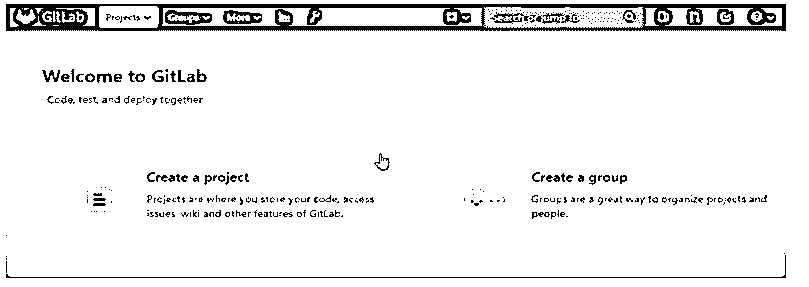
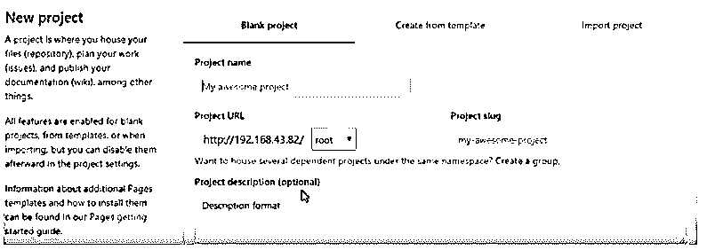
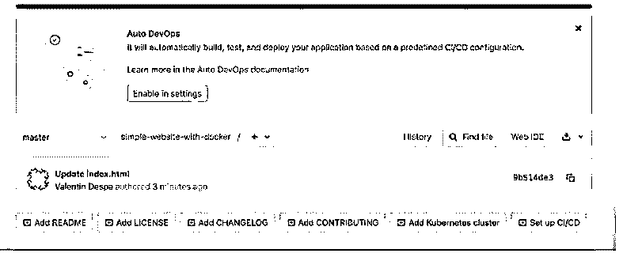
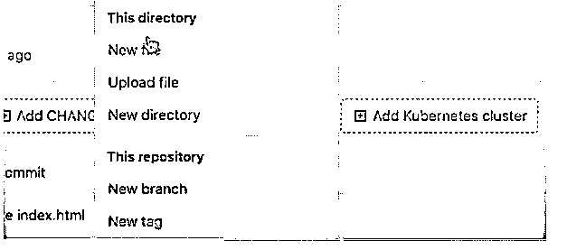
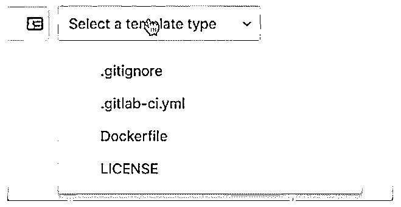

# gitlab docker

> 原文:# t0]https://www . educba . com/gitlab 坞站/

## gitlab docker 简介

基本上，GitLab 向用户提供不同类型的服务，其中 GitLab docker 是 GitLab 提供的服务之一。通常 GitLab docker 是一个图像，它是 GitLab 提供给用户的整体视图。基本上，整体视图意味着它在一个容器中提供所有需要的服务，而不是像 Kubernetes 这样的任何其他应用程序。GitLab docker 允许邮件传输代理，但是我们可以将它添加到一个单独的容器中来发送邮件。对于这个问题，我们还有另一个选择，就是直接在 GitLab 容器上安装一个邮件传输代理。

### 什么是 gitlab docker？

*   Docker 是一个用于制作、传送和运行应用程序的开放平台。Docker 让你把你的应用程序限制在你的机构之外，这样你就可以快速地传递编程。使用 docker，您可以像管理应用程序一样管理您的结构。通过利用 docker 的快速传输、测试和发送代码的策略，您可以从根本上减少编写代码和运行代码之间的延迟。
*   GitLab docker 是一个电子 DevOps 生命周期设备，它利用 GitLab 创建的开源许可，提供了一个替代 Git 库、问题跟踪以及一致的合并和组织管道亮点。这个开源编程项目是由乌克兰设计师 Dmitriy Zaporozhets 和 Valery Size 完成的。
*   代码最初是用 Ruby 编写的，后来在 Go 中对某些部分进行了修改，最初是作为一个源代码，高管们在一个编程进步的团队中一起工作。后来，它发展到一个涵盖产品改进生命周期的协调安排，后来发展到整个 DevOps 生命周期。当前的创新栈包含了 Go、Ruby on Rails 和 Vue.js。
*   它遵循一个开放中心的改进模型，其中中心的有用性是在开放源代码(MIT)许可下交付的，而额外的有用性，例如，代码所有者、众多的问题指定者、可靠性检查和一些知识是在限制性许可下交付的。

### 如何用 Docker 安装 GitLab

我们需要按照不同的步骤安装 docker，如下所示:

<small>网页开发、编程语言、软件测试&其他</small>

首先，我们需要在容器中运行 GitLab runner。基本上 docker 也支持 windows，所以这里我们会看到 Ubuntu 和 Linux 的安装。

对于 Gitlab runner 的安装，我们需要使用如下命令:

`gitlab-runner <command with different option…..>`

第二步，我们需要安装 Docker 映像并启动实际的容器。在这一步中，我们需要在 docker 的容器中运行 GitLab runner，如果没有设置配置，那么它将重新启动 docker 容器。

现在让我们看看如何使用本地系统卷重启 runner 容器。

要重启 runner 容器，我们需要配置下面提到的一些其他资源:

他们提到了从 GitLab 官方网站放的所有资源。

`docker run -d –specified name of gitlab-runner --restart always \
-v /srv/gitlab-runner/config:/etc/gitlab-runner \
-v /var/run/docker.sock:/var/run/docker.sock \
gitlab/gitlab-runner:latest`

我们还有一个重启 runner 容器的选项，那就是我们可以使用 Docker volume。

在这个选项中，我们需要遵循如下相同的步骤:

1.首先，我们需要使用以下命令创建 docker 卷。

**代码:**

`docker volume create gitlab-runner-config`

2.第二步，我们需要启动 GitLab runner 容器。

3.在最后一步，我们需要注册新的跑步者。

注册之后，我们需要使用以下命令配置运行器并重启 GitLab 运行器。

`docker restart gitlab-runner`

因此，我们能够按照要求读取 Gitlab runner 日志。

### 创建您的第一个项目 GitLab Docker

下面给出了我们如何创建 gitlab docker 项目，如下所示:

成功安装后，我们需要使用以下命令启动 docker。

**代码:**

`sudo docker run --detach \
--hostname (specified hostname ) \
--name gitlab \
--restart always \
--volume $GITLAB_HOME/config:/etc/gitlab \
--volume $GITLAB_HOME/logs:/var/log/gitlab \
--volume $GITLAB_HOME/data:/var/opt/gitlab \`

之后，我们需要使用有效凭证登录 GitLab，在成功登录 GitLab 后，它会显示不同的选项，如下图所示。

**输出:**

之后，点击创建新的项目表，并填写所需的详细信息，如下图所示。

在这个表单中，我们需要填写我们想要的项目名称，点击公共，如果我们想写描述，我们可以写。最后，单击创建项目按钮。成功创建 docker 项目窗口后，如下图所示。

之后，我们可以使用命令行指令添加我们想要的不同文件。

### GitLab 坞站步骤

下面给出了 GitLab docker 的逐步解释:

下面的截图显示了 docker 的主页，如下所示。

第二步，我们需要创建新的 docker 文件，方法是单击+按钮，然后单击新文件，如下图所示。

在下一步中，我们需要使用新的文件选项创建 GitLab 管道，并分配我们想要的名称，如下图所示。

这里我们可以根据需要添加不同的模板。之后，我们需要更新 docker 文件并点击 docker build，如下图截图所示。

### 结论

从上面的文章中，我们了解了 Gitlab docker 的基本思想，也看到了 Gitlab docker 的表现形式。从这篇文章中，我们看到了如何以及何时使用 Gitlab docker。

### 推荐文章

这是一个 GitLab Docker 的指南。这里我们讨论 GitLab docker 的介绍，安装，创建你的第一个项目&步骤。您也可以看看以下文章，了解更多信息–

1.  [GitLab 替代方案](https://www.educba.com/gitlab-alternative/)
2.  [什么是 GitLab](https://www.educba.com/what-is-gitlab/)
3.  [服务器类型](https://www.educba.com/server-types/)
4.  [ShareX 替代方案](https://www.educba.com/sharex-alternative/)

