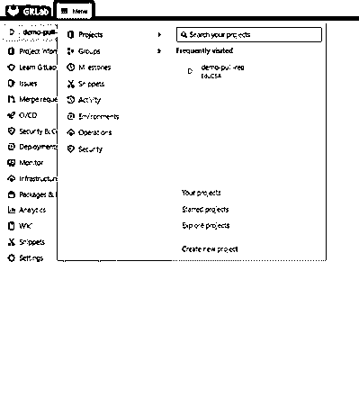
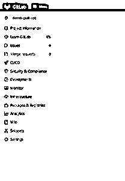
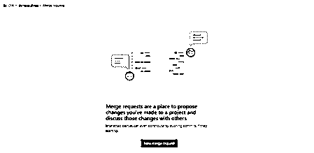
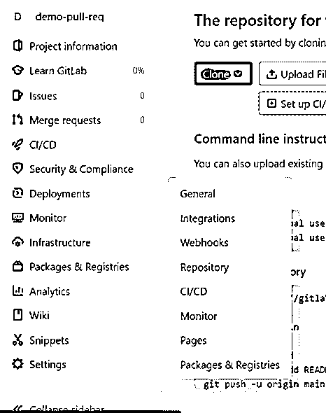
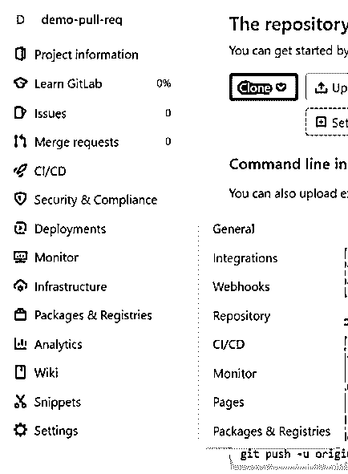
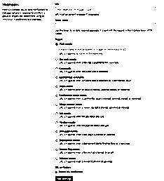
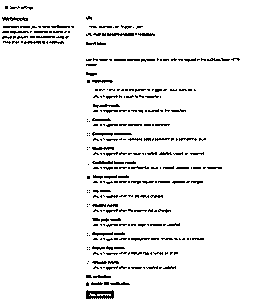

# Gitlab 拉取请求

> 原文：<https://www.educba.com/gitlab-pull-request/>

## Gitlab 拉取请求简介

Gitlab pulls request 被定义为一个事件，该事件使作为代码贡献者的用户能够从 Gitlab 中的存储库的维护者那里寻求请求，以便维护者可以检查代码，然后保存将代码合并到项目中的路径。这段代码可以包含一个新特性、一个错误修复或者任何其他用于提高性能的小调整，等等。Gitlab 是一个基于 web 的 DevOps 生命周期管理工具，它还引入了负责使管理更顺畅的元素管理。

### 什么是 Gitlab 拉取请求？

顾名思义，在本文中，我们将研究什么是 Gitlab pull 请求，它是如何使用的，以及在 Gitlab 中使 pull 请求成为可能的一些要素。到目前为止，我们已经知道了发出拉请求的时间。需要注意的一点是，拉请求可以与合并互换使用，甚至联合创始人也提到合并请求是拉请求的正式命名版本。在一个理想的场景中，为 repo 创建了一个 fork，在这里我们需要根据用例进行一些修改，当变更完成时，还要完成所有执行的测试，最终将它发送给被分叉的存储库的所有者进行审查。发送它进行审查的方式是通过拉请求。一旦变更被审查并且所有者认为需要合并，请求被批准并且变更被合并到主分支。

<small>网页开发、编程语言、软件测试&其他</small>

这样，我们就完成了拉请求的整个周期，但是在下一段中，我们将看看在 Gitlab 中执行拉请求的整个周期的方法。

### Gitlab 流程及其问题

为了理解 Gitlab pull 请求，我们需要理解 Gitlab 流的概念。Gitlab flow 是一组明确定义的最佳实践，用于处理 Git 提供的分支策略和工作流。Gitlab 试图解决的问题是，组织最终会有各种各样的工作流，这些工作流没有明确的定义，很难解释，从而导致问题跟踪系统出现问题。Gitlab 通过提供基于特性的开发和分支以及问题跟踪的好处解决了上面提到的问题。

根据我们上一段的理解，Gitlab flow 是 Git flow 的改进版本，因为 Git flow 要求开发人员使用 develop 和 master 分支。关于这一要求，许多工具默认使用 master，因此涉及大量的分支切换。此外，git 中热修复和发布分支的概念是多余的，对于实践连续交付是不必要的。因此，通过 Gitlab 流，我们试图创建一个简单且包容的工作流。

现在有了上面讨论的基于特性的开发和分支，gitlab 流程包括了现有的 Git 工作流和一个跟踪问题的系统，因此提供了一种透明、简单和有效的 Git 工作方式。这为使代码和问题跟踪器之间的关系更加透明铺平了道路。首先，代码库的变更将从问题跟踪系统中的问题创建开始。在特定用例的编码完成之后，问题就产生了，开发人员可以打开一个合并请求。执行所有审核后，将与主文档合并，并且将创建一个合并提交事件以供将来参考。使用 Gitlab 流，可以将主分支合并到生产分支中。工作流程只是在下游，这意味着在生产之前一切都要经过测试。

谈到 Gitlab 流程的问题:

1.  这个过程变得比 git 流复杂，因为它就像 Git 流的包装器。
2.  Gitlab 流程的另一个问题是，当生产中需要维护多个版本时。

### Gitlab 拉取请求批准

在拉取请求中，最大的指针是关于批准。在 Gitlab 的免费版本中，所有拥有开发人员和更高权限的用户都可以批准合并请求，但是在 premium 和 ultimate 版本中，有额外的灵活性。对于付费版本，在合并之前需要创建关于批准者的数量和类型的规则。另一个好处是可以灵活地提供一个用户列表作为所有者，甚至可以在文件级的粒度上提供批准列表。

### Gitlab 拉取请求示例

以下是 Gitlab 拉取请求应遵循的步骤:

*   **步骤 1** :我们需要登录账户，找到项目。
*   第二步:顶部的栏由一个菜单组成，在这个菜单下我们需要点击项目。

*   **步骤 3:** 在左侧面板上点击合并请求

*   **步骤 4:** 现在我们点击顶部的新合并请求。

*   **步骤 5:** 我们需要填写源和目的地，检查比较分支并继续，然后填写所有必要的内容，最后单击创建合并。

### 启用拉取请求

在这一特定部分，我们还将了解如何启用拉取请求以及屏幕截图，以便于读者一步一步地了解相同的过程。步骤如下:

*   **步骤 1** :我们需要登录到构成存储库的帐户。
*   **步骤 2** :我们需要转到相应的项目，在该项目上我们需要启用拉取请求。
*   **步骤 3** :到达左侧后，我们会看到一个设置选项，我们需要将鼠标悬停在该选项上，然后单击列表中的 webhooks 选项。

*   **第四步**:点击列表项后，会打开一个新页面，如下所示:

在此页面上，我们需要首先填写 URL 以及所需用例的秘密令牌，然后检查提到“合并请求事件”的单选按钮，如下所示:

*   **第 5 步**:一切就绪后，我们点击 Add webhook 完成整个过程！

### 结论

使用 Gitlab pull request，一旦 pull request 被审查，并且所有的元素都被集成到主代码中，变更的合并将在存储库中发生。至此，我们看到了一篇关于 Gitlab pull 请求的内容丰富的文章！

### 推荐文章

这是 Gitlab 拉取请求的指南。这里我们讨论在 Gitlab 中执行拉请求的整个周期的方法。您也可以看看以下文章，了解更多信息–

1.  [什么是 GitLab](https://www.educba.com/what-is-gitlab/)
2.  [GitLab 替代方案](https://www.educba.com/gitlab-alternative/)
3.  [Git 是什么？](https://www.educba.com/what-is-git/)
4.  [GIT 简介](https://www.educba.com/introduction-to-git/)

