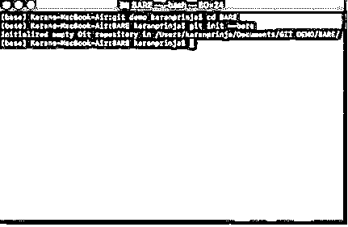
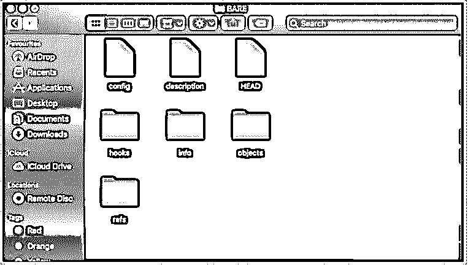
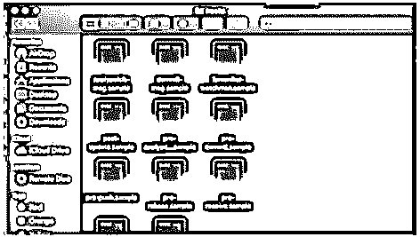
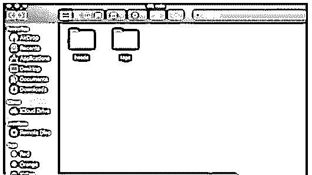
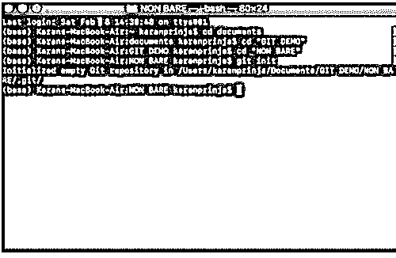
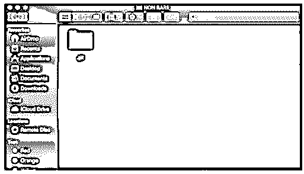
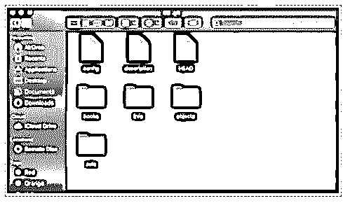

# Git 储存库设置

> 原文：<https://www.educba.com/git-repository-setup/>


## Git 存储库设置简介

下面的文章提供了一个关于 Git 仓库设置的概要。我们都知道 Git 是我们代码的版本控制工具。但这是我们存储的代码。它一定藏在某个地方？存储代码的地方称为 Git 存储库。可以使用提供服务的网站(如 GitHub)在线创建 Git 存储库，也可以在我们的本地驱动器上创建。GitHub 是付费服务，如果用户数量大的话。

### GIT 存储库设置的类型

基本上有两种类型:

<small>网页开发、编程语言、软件测试&其他</small>

#### 1.空白储存库

顾名思义，Bare Repository 是一个空的存储库，除了与 Git 相关的文件之外什么都没有。困惑如果我们只有基本的 Git 文件，我们的代码会去哪里？?因此，让我们启动 Git，在本地驱动器上创建我们的第一个空存储库。

我们可以使用以下命令创建一个空的 git 存储库:

```
git init —bare
```

导航到所需的文件夹并运行命令。导航到文件夹 BARE 并运行命令。




如果该命令已成功执行，您将收到消息。已初始化空的 Git 储存库。

现在导航回您已经初始化为空存储库的文件夹，您将看到一组文件。




下面给出了初始化空的 Git 存储库时生成的一组文件。

*   **config:** 这包括关于我们拥有的存储库的基本信息。
*   **描述:**这包括 git 存储库的名称。您可以编辑这个文件并将其命名为您的 git 存储库
*   这是 git 的主要部分。随着我们继续提交，文件的内容会不断变化。它指向我们在代码中的当前位置
*   **钩子:**这些是当某个事件发生时被激发的脚本。假设您提交了一个代码，并希望在提交之后/之前执行一个活动。

这就是钩子的用武之地。文件夹中有一些钩子脚本的例子。

这些是 shell 脚本。




*   **info:** 如果你有一些不想被版本控制的文件，我们可以使用 info 文件夹。除此之外，任何附加信息都在这里。
*   **objects:** 这个文件夹包含了我们提交的所有对象。所有的信息都放在这个文件夹里。所有的提交、标记和检查都在这个文件夹中
*   **ref:** 参考存储在该文件夹中创建的目录中。

下面是 ref 文件夹。




从上面的信息中，您可以看到我们在空的存储库中只有 git 相关的文件。git 存储库中没有工作树。

我们的代码基本上以 BLOB 的形式存储在裸存储库中。

#### 2.非裸存储库

我们已经在上一节中看到了什么是裸存储库，现在我们将看到什么是非裸存储库以及我们如何创建它。我们用来创建非空存储库的命令如下:

```
git init
```

请注意，在上面的命令中，我们没有使用创建非空存储库时使用的空标志。

导航到要创建存储库的文件夹，然后运行命令。




请注意创建裸存储库和非裸存储库时所得到的消息的区别。在非空存储库的情况下，您会在 <path>/中获得消息初始化空 Git 存储库。git/。而在非空存储库的情况下，您只能在<path>中获得初始化空 Git 存储库的消息。</path></path>

现在打开您刚刚创建的非空存储库文件夹。起初，你不会注意到文件夹中有任何东西。查看。git 文件夹你必须启用查看隐藏文件和文件夹选项。启用该选项后，您将能够看到。git 文件夹，其中将有相同的 git 文件。







的内容。git 文件夹类似于我们在上面的裸 git 存储库中看到的那个文件夹

### 裸存储库与非裸存储库

*   现在问题来了，什么时候使用裸存储库，什么时候使用非裸存储库？
*   裸库完全是空的，它没有你的工作树。当你想与团队中的其他人合作，而不想使用 GitHub 等服务时，它基本上是合适的。简而言之，任何共享存储库都应该是一个空存储库。如果您想同时执行推和拉操作。
*   而非裸存储库只有在您希望跟踪您在计算机上所做的更改时才有意义。另一个值得注意的特性是，您不能将您的更改推送到空存储库，您必须对配置文件进行更改才能实现这一点。

### **结论**

在上面的文章中，我们学习了不同的 Git 仓库以及如何创建它们。裸存储库和非裸存储库的使用取决于您创建存储库的用例。如果是供您个人使用，那么您应该选择非裸存储库，如果您正在创建存储库来跟踪代码或文件中的变更，那么就使用裸存储库。

### 推荐文章

这是 Git 存储库设置指南。在这里，我们讨论了简介、类型和裸存储库与非裸存储库。您也可以看看以下文章，了解更多信息–

1.  [GitHub 克隆](https://www.educba.com/github-clone/)
2.  [去重复位](https://www.educba.com/git-reset-hard/)
3.  [什么是 GitLab](https://www.educba.com/what-is-gitlab/)
4.  [GIT 指数](https://www.educba.com/git-index/)


