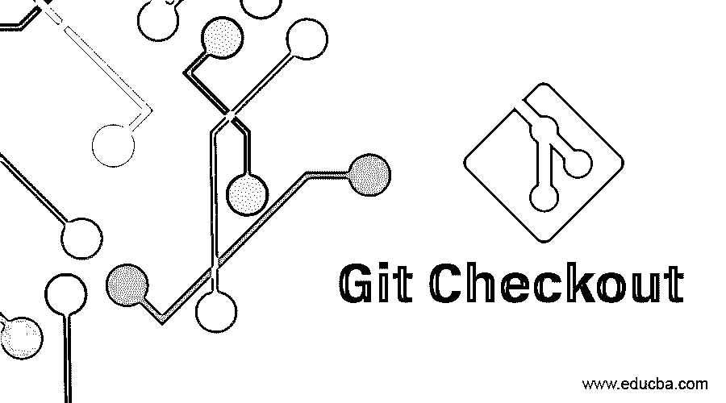

# Git Checkout

> 原文：<https://www.educba.com/git-checkout/>




## 什么是 Git Checkout？

*   这是 git 功能的一个非常有用的命令，它使用三个主要组件文件、提交和分支。
*   该过程检查先前的提交和文件，其中当前工作文件夹被更新以在所选分支上获得相等性。
*   这是当前活动分支上的一个交换路径，用于恢复文件。
*   它允许你去你当地的分支机构。它仅限于本地分支，适用于通过远程分支创建新的本地分支。
*   它主要用于在不同的分支上交换，并使其中一个分支成为头分支。

### git 结账怎么做？

*   它用于更新头，目的是通过使用以下命令将一个指定分支设置为当前分支:

```
git checkout <branch>
```

*   下一步是在那个分支上工作；您需要切换，在更新索引和文件的帮助下，在您当前的工作树中，指向指定分支的头。
*   如果您的工作分支未被识别，但它已经存在，因此在一个远程中识别该分支及其等效的匹配名称被定义为:

```
git checkout –b <branch> --track <remote>/<branch>
```

*   这将通过特定的提交来完成，如下所示:

```
git checkout specific-commit-id
```

一旦上面的命令运行，我们就可以通过使用命令 git log 来获得特定的提交 id。它将帮助您通过特定的提交进行检查。

*   git 签出功能的另一个特性是用现有分支进行签出，如下所示:

```
git checkout branch_name
```

考虑到您当前工作的存储库，其中包括预先存在的分支。所以这有助于你在这些分支之间切换。

<small>网页开发、编程语言、软件测试&其他</small>

*   还可以使用一个简单的命令对一个新分支进行签出，如下所示:

```
git checkout –b new branch_name
```

如果您想要添加新的特性，您可以使用相同的命令在您的主分支中创建一个新的分支，这个命令已经在上面的语法中执行了。一旦创建了这个分支，就可以使用 git checkout 命令打开它。

```
git checkout –b <new_branch_name>
```

*   **检出分支:** git 检出特性允许您在使用命令 git 创建的分支之间移动。
*   该命令的主要功能是不断更新工作文件夹中的所有文件，并使它们与存储在该特定分支中的版本相匹配，该分支负责记录该分支上的所有新提交。
*   有时它会与 git 克隆混淆。但是这两个命令之间的区别在于，git clone 用于从其当前工作的远程存储库中获取代码，在那里它用于在本地系统上存储的代码版本之间进行切换。
*   **切换分支:**这是 checkout 的一个特性，用来指示一个指向<分支名称>的指针，只需运行一个命令:

```
git checkout<branch_name>
```

*   它将 checkout 命令的所有详细描述的历史存储到 reflog 中
*   **Git 签出远程分支:**Git 签出远程分支的主要功能是访问所有同事的代码，以便更好地协作和审查。
*   在下一步，当开发人员修复 bug 或更新他们的代码，涉及一些新功能时，他们将创建一个新的分支，以安全模式保存所有更新，而不是对现有代码的任何更改。
*   在这种情况下，我们不想创建新的本地分支。因此，我们将继续在远程版本上保存我们的更改。所以在这个场景中，我们将使用 git checkout 远程分支方法。
*   获取 git checkout 远程分支的第一步是:

```
git fetch origin
```

*   下一步是检查您实际需要的分支:

```
git checkout –b branch_name origin/branch_name
```

*   因此，在这个远程分支的帮助下，所有在同一软件上工作的开发人员都可以在安全模式下进行自己的更改，而无需在当前工作项目中添加任何不必要或不稳定的代码。
*   它提供了提交的最佳特性，我们可以小规模提交，现在可以多次共享完成的工作。这是避免大型合并冲突的最佳方式。
*   尽量避免提交未完成的工作；一旦你完成了你的工作，验证它，然后提交所有的修改。这是最有效的方法，可以避免大型合并过程中发生的冲突。它也记住了一件事，我们不会提交小块的不工作的代码。现在，在实际测试完成之前，不要提交任何代码。如果我们在没有测试的情况下共享这些代码，可能会产生冲突。因此，更好的方法是对代码进行测试，然后提交更改。

### git 检验示例

*   运行该命令时，首先我们需要检查所有显示的分支，因此我们调用以下命令:

```
git branch
```

它将显示所有呈现的分支的列表。

*   现在我们正在创建一个新的分支:

```
git checkout –b checkout_demo
```

在运行上面的命令时，它将创建一个名为 checkout_demo 的新分支，在 checkout 函数的帮助下，它切换到一个新创建的分支。

*   下一步是使用 git fetch 获取所有数据
*   现在我们正在检查现有的分支机构
*   远程分支:

它将通过更新所有远程分支的提交过程更改来帮助您检查新的本地分支。

### 结论

*   以上所有内容得出结论，它是用来在活动分支和其他存储分支之间进行切换的。
*   此功能用于创建新分支、切换分支和与远程分支结账。
*   它还更新 head 以将指定的分支设置为当前分支。

### 推荐文章

这是 Git 结账的指南。在这里，我们已经详细讨论了 git 检验、如何进行 git 检验以及示例。您也可以浏览我们推荐的其他文章，了解更多信息——

1.  [什么是 Git 分支？](https://www.educba.com/what-is-git-branch/)
2.  [GitHub 命令](https://www.educba.com/github-commands/)
3.  [GIT 命令](https://www.educba.com/git-commands/)
4.  [Git 术语](https://www.educba.com/git-terminology/)


