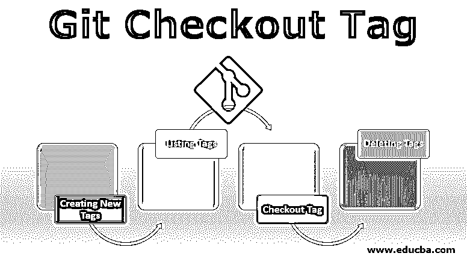

# Git Checkout Tag

> 原文：<https://www.educba.com/git-checkout-tag/>

## Git 标签简介

在进入 Git Checkout 标签的细节之前，让我简单介绍一下 Git 以及它为什么如此流行和有用。Git 是一个分布式控制工具，被产品经理、开发人员和数据科学家用来管理程序的源代码开发和历史。本文将进一步了解 Git 的标记概念，以及如何以及何时使用 git tag 命令。

### 什么是 Git 标签？

标签是指向 Git 历史中某些特定点的引用。主要用于对过去某个特定的时间点进行快照，并标记发布版本(如 v0.0.1)。就像一根不变的树枝。他们也没有额外的提交历史。让我们从学习如何创建新标签开始。

<small>网页开发、编程语言、软件测试&其他</small>

### 创建新标签

要创建新的标签，您可以执行以下命令:

`git tag <tag_name>`

要创建一个新的标签，用一个语法上相似的标识符替换<tag_name>,该标识符在创建标签时标识存储库点。一种常见的方法是使用版本号，如 git tag v2.5\. Git 主要有两种标签——轻量级标签和带注释的标签。上面的例子是一个轻量级标签。带注释的标签和轻量级标签在它们可以存储的元数据总量方面与先前的标签不同，前者存储更多的数据，包括电子邮件、日期和标签名称。前者是公共的，而后者是私有的。轻量级标签就像提交的“书签”,基本上是一个指向提交的名称，因此可以用于创建相关提交的快速链接。</tag_name>

创建轻量标记和带注释标记的命令分别是:

`git tag <tag_name>`

`git tag -a <tag_name>`

### 列表标签

要列出 repo 中存储的标签，可以使用以下命令:

`git tag`

这将给出标签列表作为输出:

v 1 . 12 . 0
v 1 . 12 . 0-rc1
v 0 . 13 . 0
v 1 . 13 . 0-rc1
v 0 . 13 . 1
v 2 . 14 . 0
v 0 . 14 . 0-rc1
v 1 . 14 . 2
v 0 . 12 . 0
v 0 . 12 . 0-rc1
v 1 . 12 . 0-RC2

要获得特定的标签列表，可以将-l 与通配符表达式一起传递给命令:

`git tag -l *-RC*`

v 0 . 12 . 0-rc1
v 1 . 13 . 0-rc1
v 0 . 14 . 0-rc1
v 2 . 14 . 0-RC2
v 0 . 15 . 0-rc1
v 1 . 10 . 0-rc1
v 14 . 0 . 0-RC . 2
v 14 . 5 . 0-RC . 3

上面的例子展示了-l 选项和通配符表达式-RC 的使用，该表达式返回一个所有标签的列表，这些标签具有带有前缀的规范给定模式，以前用于识别候选版本。

### 结账标签

假设你有一个项目，你想在上面标记特定的点。要签出一个标签，它应该本地存在于您的存储库中。为此，您必须将所有标签提取到您的本地存储库中。

`git fetch –all`或`git fetch --all --tags –prune`

获取所有标签后，您可以使用命令签出标签。

`git tag -a <tag_version_name> -m`

如果您想在一段时间后进行测试，您必须首先提交您当前更改，以确保您可以自由地检查新的活动，而不会丢失以前的工作。这是通过使用:

`git checkout tags/<tag_name>`

您还可以在签出该标记的同时创建一个新的分支，这样当前的分支就不会被覆盖。下面给出的命令用于此目的。

`git checkout tags/<tag_name> -b <branch_name>`

要退出当前分支，可以通过发出以下命令返回到另一个分支。

`git checkout <another_branch_name>`

请注意，您只需给出该分支的名称，就可以切换到不同的分支，这与必须插入前缀“tags/”的标记不同。

git checkout 命令可用于查看存储库的状态，如下所示:

`git checkout v1.4`

上述命令将通过将存储库放入一个未附加或未耦合的 HEAD(状态)中来检出 v1.4 标签，这意味着所做的任何更改都不会更新标签，从而创建一个新的分离提交。现在，这个新分离的提交将不属于任何先前的分支，因此只能由提交直接到达。这告诉我们，每当您想要在断开的 HEAD 状态中进行更改时，生成一个全新的分支是一个很好的实践。

如果在一个示例中有两个标签，比如版本 1.0 和版本 1.1，那么您可以通过执行以下任何命令来检查它们:

`git checkout B ...
git checkout version 1.1 ...
git checkout tags/version 1.1 ...`

所有上面提到的命令将做同样的事情，因为标签只是一个给定提交的指针。

### 删除标签

顾名思义，删除标签是用来删除一个指定的标签，可以很容易地使用下面提到的命令。

`git tag -d <tag_name>`

绕过 **-d** 选项，git 标签和要删除的标签名称，您可以删除已识别的标签。

`git tag`

v1
v2
v3

`git tag -d v1
git tag`

v2
v3

在给定的例子中，git 标签首先用于显示标签列表，即 v1、v2 和 v3；然后，执行删除命令来删除 v1 标签。这将从服务器上删除已删除的标签。

### Git 结账标签的优势

*   它用于创建、修改和删除标签。
*   它可以用来列出本地存储库中的所有标签。
*   它也有助于检查远程分支机构。
*   它有助于管理和处理发布。
*   保持存储库和流程的整洁和可读性。

### 结论

Git 有许多用途，被开发人员、产品经理和数据科学家广泛使用。它的命令非常有效，非常有用。总之，标记是一种额外的机制，用于捕获 Git repo 的历史。它传统上用于制作与软件发布版本相对应的语义标识符标签，但它主要用于创建、修改和删除标签。

### 推荐文章

这是 Git Checkout 标签的指南。这里我们讨论基本含义，创建新的标签和不同类型的标签，以及它们的优点。您也可以浏览我们推荐的其他文章，了解更多信息——

1.  [Git 术语](https://www.educba.com/git-terminology/)
2.  [什么是 Git 分支？](https://www.educba.com/what-is-git-branch/)
3.  [GIT 命令](https://www.educba.com/git-commands/)
4.  [GIT 版本控制系统](https://www.educba.com/git-version-control-system/)
5.  [Git 生命周期的三个阶段以及工作流](https://www.educba.com/git-life-cycle/)

