# 如何安装 Github

> 原文：<https://www.educba.com/install-github/>

## 如何在 Windows 上安装 Github？

Git for Windows 旨在提供一套精简的原生工具，带来成熟的 Git SCM 功能。

### 安装 Github 的步骤

下面是在 windows 上安装 GitHub 的详细步骤

<small>网页开发、编程语言、软件测试&其他</small>

**第一步:**导航至 https://git-scm.com/downloads git 官方网站下载页面，下载 windows 版 Git 客户端。

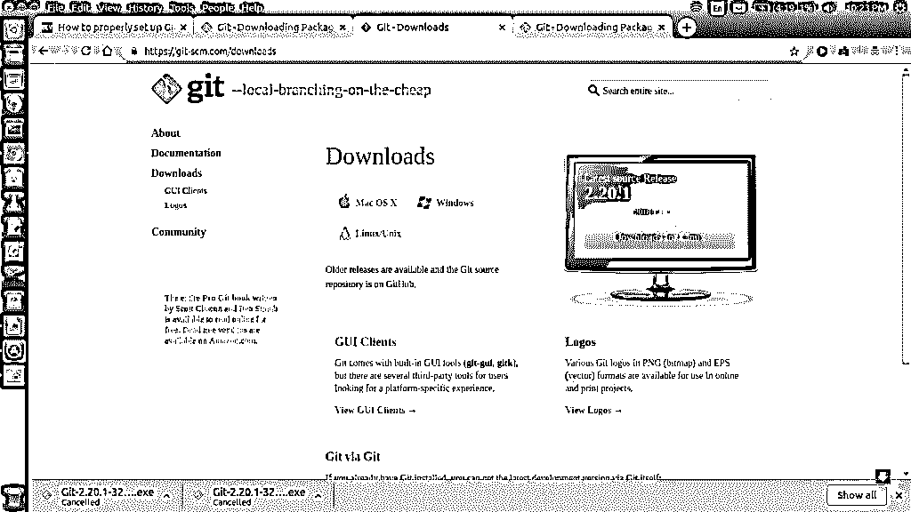

**步骤 2:** 通过运行安装程序文件，向导将继续执行通常的以下步骤:

–欢迎屏幕

–许可协议

–安装文件夹

–选择要安装的组件。

–开始菜单配置

除此之外，向导还会进一步处理配置细节，这将在后续步骤中解释。

**第三步:**添加路径环境

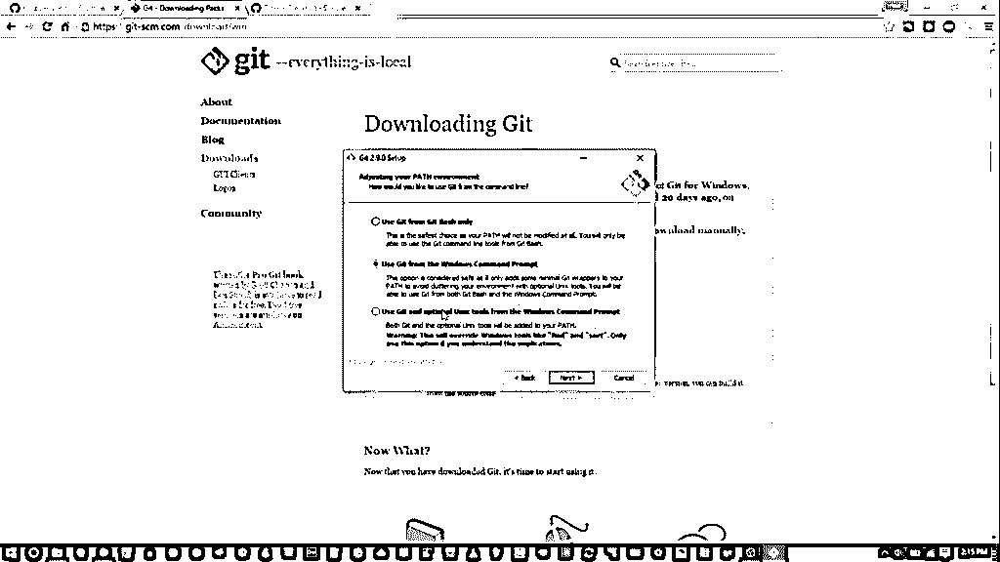

默认情况下，安装程序会选择“仅使用 Github Bash 中的 Github”。

“在 windows 命令提示符下使用 Github”将阻止用户使用 Unix 命令，并允许您在 Windows 提示符下运行。

“在 windows 命令提示符下使用 Github 和可选的 UNIX 工具”支持在 Windows 提示符下使用 Github，同时[借助一些 UNIX 命令](https://www.educba.com/cheat-sheet-for-unix/)

**步骤 4:** 配置行尾转换

在这一步，我们指定 GitHub 应该如何处理换行，因为不同的操作系统会有不同的换行。

Windows 和 MacOS 使用\r\n 而 Linux 只使用\n，它们通常分别表示为 CRLF(回车换行)和 LF(换行)。

目前，我们将采用第一种方案。

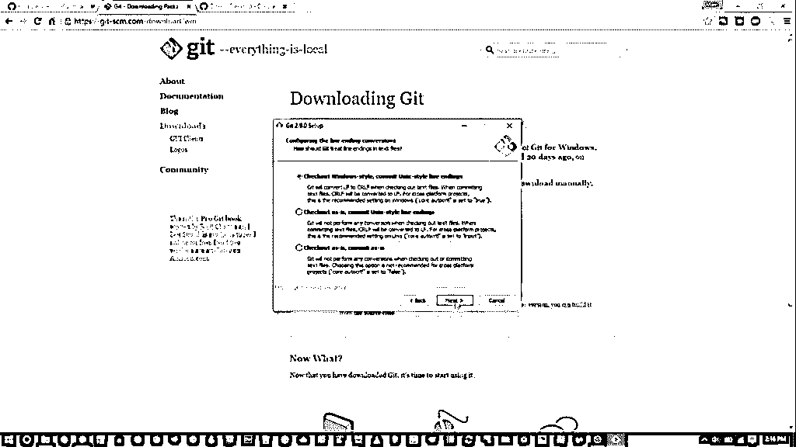

**第 5 步:**配置终端模拟器，以便与 Git Bash 一起使用。

我们有两个选择:

–使用 MinTTY

–使用 Windows 操作系统的默认 cmd.exe。

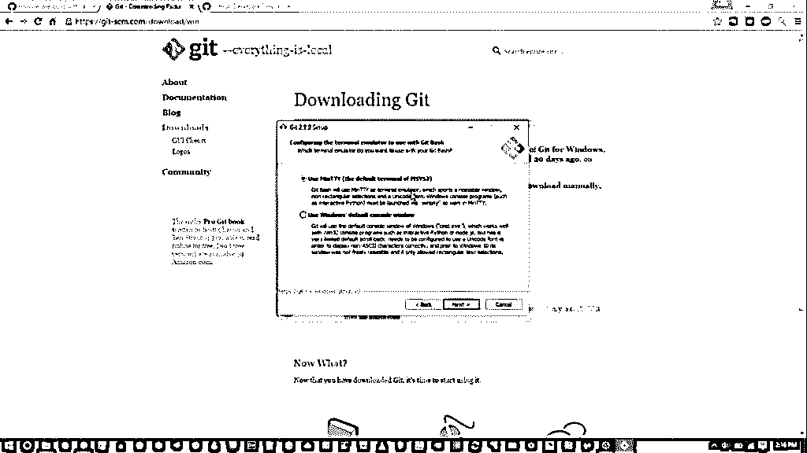

如果您对 Linux 命令行感到满意，推荐使用前一个选项，否则选择第二个。正如向导所解释的那样，控制台窗口有一些限制，例如[固定窗口宽度](https://www.educba.com/windows-interview-questions/)，回滚是有限的，并且只显示到特定范围，以便在命令历史中导航，并且需要显式配置来使用非 ASCII 字符，而 MinTTY 没有任何这样的限制。

**第六步:**配置额外选项。

该步骤包括两个选项:

–文件系统缓存

–Git 凭证管理器

步骤 6.1)

文件系统缓存:启用缓存将提高应用程序性能

步骤 6.2)

Git 凭证管理器:GCM 的功能是将凭证存储在 Windows 凭证管理器中，以避免重复授权和验证

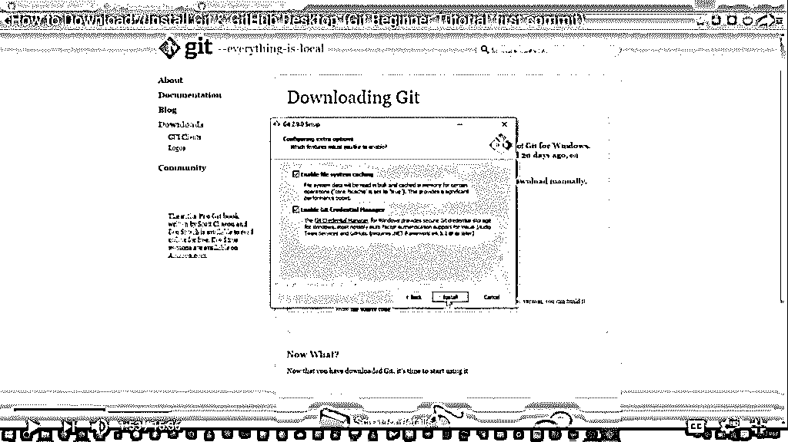

安装完成后，单击“完成”退出安装。

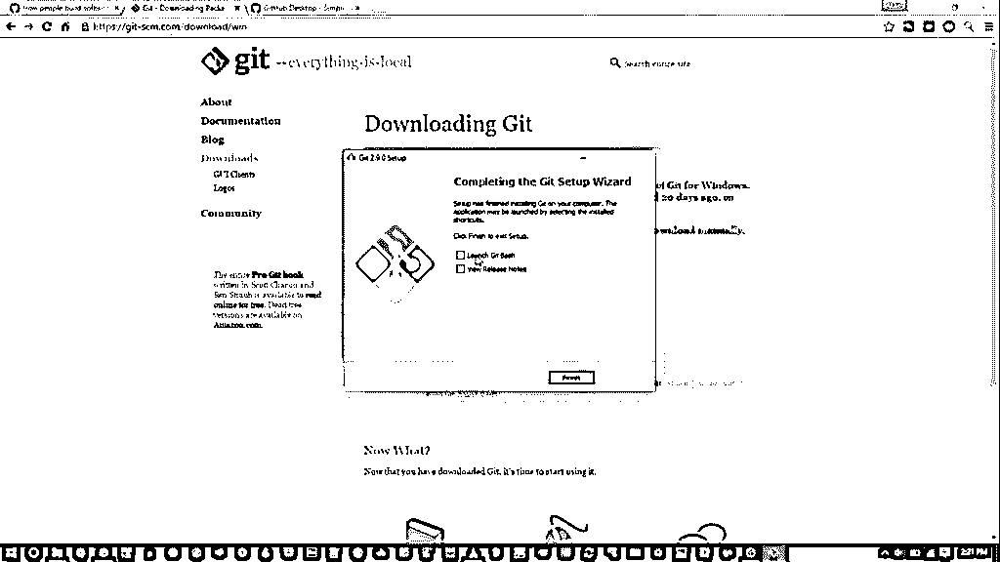

在设置好之后，我们需要对它进行测试，以确保软件已经安装，并且可以很好地运行 Github。要进行检查，请打开控制台并运行命令 git–version，这将返回 git 版本，如下所示:

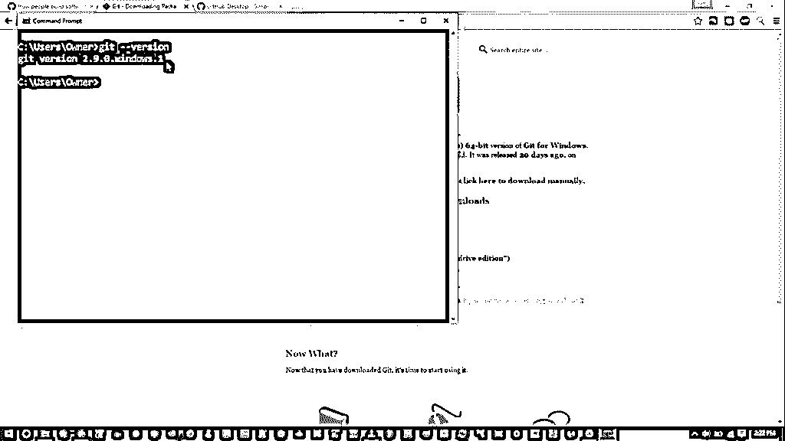

注意:git -- help 提供关于 Git 的帮助/手册信息。

### 为 Windows 设置基于 GUI 的 GitHub(GIT 桌面)

GitHub Desktop 是一个图形桌面应用程序，支持添加文件和其他相关的 git 操作。

这款图形用户界面辅助应用可以在[https://desktop.github.com/](https://desktop.github.com/)下载

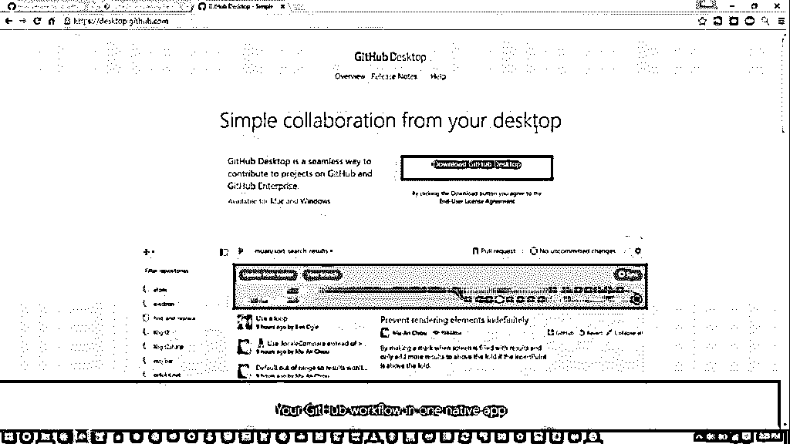

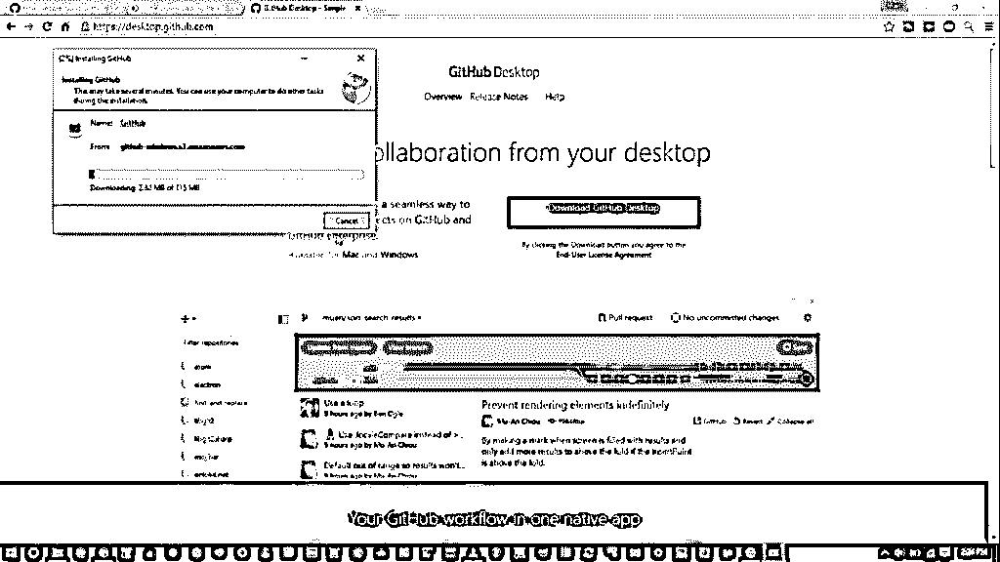

您可以在本地使用 GitHub 桌面客户端，而无需连接到远程存储库。

使用 GitHub 桌面应用程序，初始化存储库、暂存文件和发出 commit 非常简单

**第一步:**登录

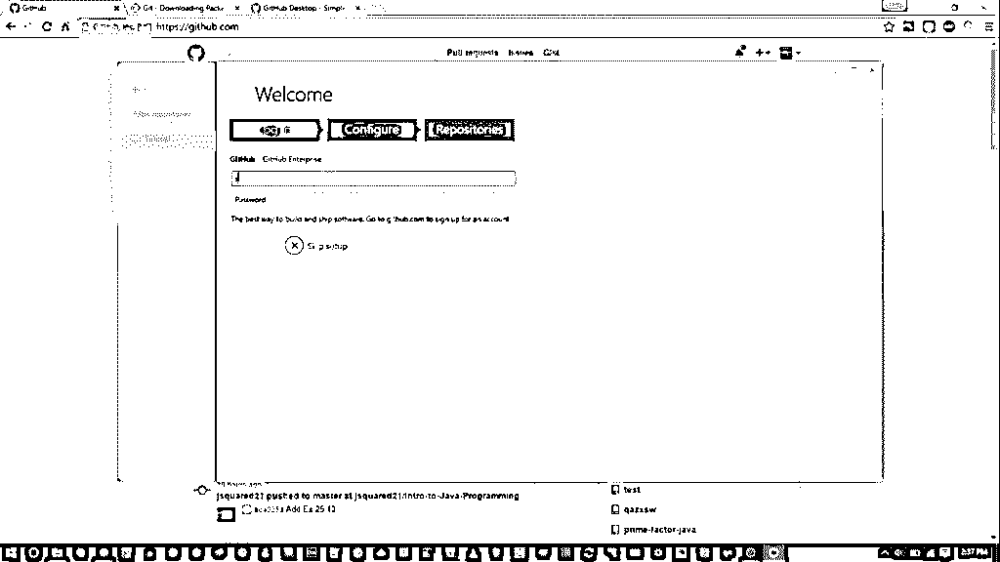

输入 GitHub 凭证

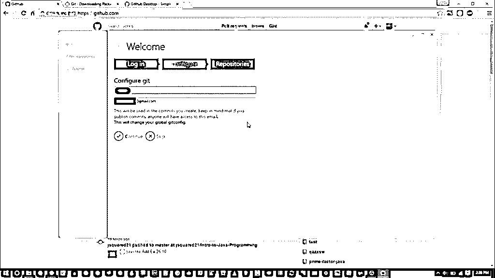

如果你没有 GitHub 账户，你可以在 http://github.com 注册一个

**第二步:**配置

系统会提示您输入全名和邮件 id。

使用当前帐户进行的提交将与给定的名称和邮件 id 相关联。

**第三步:**存储库

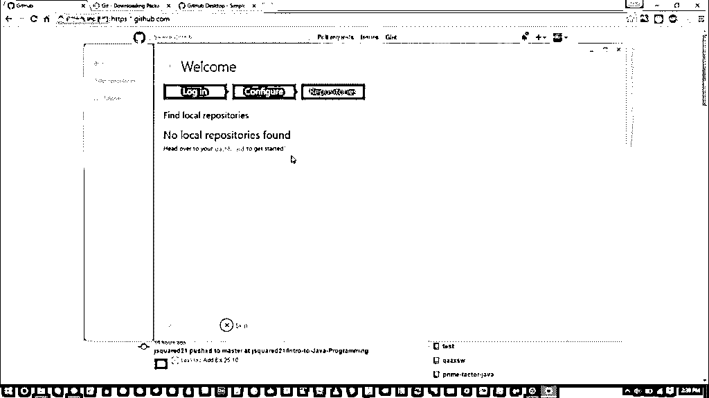

导航到 github.com 并创建一个新的存储库，如下所示:

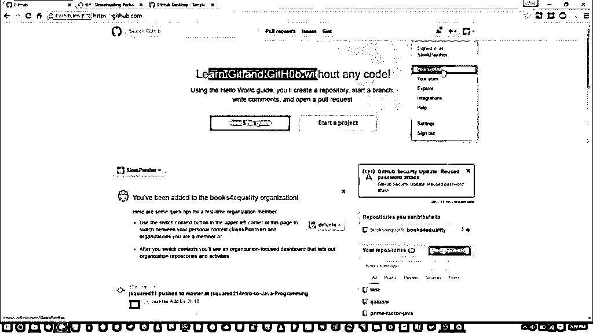

指定存储库的名称和可见性

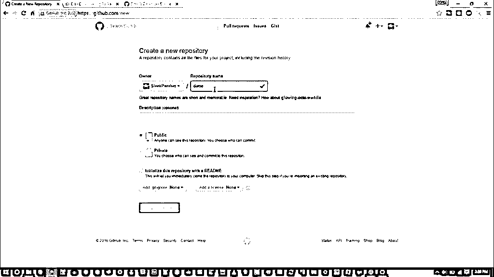

创建存储库后，单击“在桌面上设置”,这将启动应用程序。

选择存储库的所需目录/文件夹。

### 如何安装 Github for Linux？

以下命令将帮助您下载和安装 Github for Linux:

**sudo apt-get 安装 git**

上面的[命令是针对 Ubuntu](https://www.educba.com/ubuntu-commands/) 的，适用于 Ubuntu 16.04 到 Ubuntu 18.04 LTS。与 windows 不同，GitHub 并不特别支持基于 GUI 的 Linux 桌面客户端，但您可以选择一些第三方专有工具 GitKraken 或 GitBlade 或 Cycligent Git Tool。此外，存储库还有一个活动分支，提供预构建的 Linux 二进制文件，可以从

**https://github.com/shiftkey/desktop**

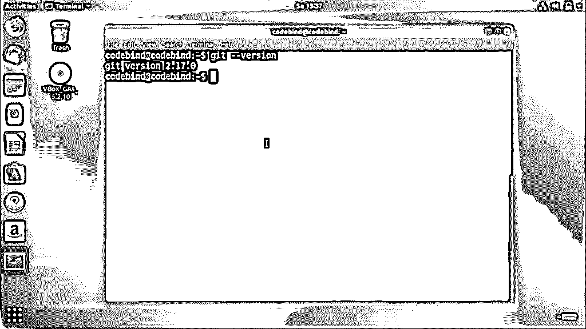

在这里，我们将演练命令行 Git 配置

### 配置 GitHub

安装 GitHub 后，使用以下两个命令，将“user_name”替换为您的 GitHub 用户名，将“email_id”替换为您用来创建 Github 帐户的 email-id。

**git 配置–全局用户名“用户名”**

**git 配置–全局用户电子邮件" email_id"**

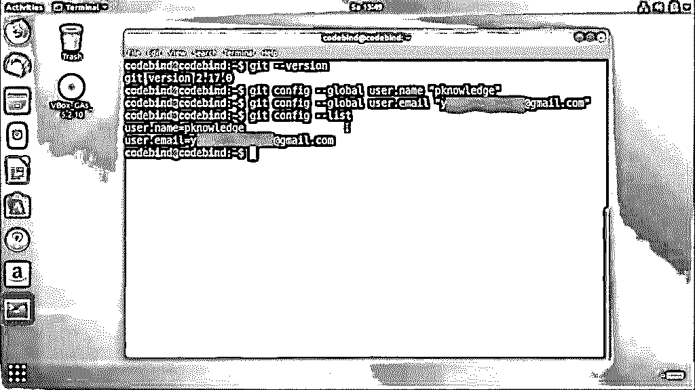

如果你没有 GitHub，你可以在 http://github.com 注册一个

### 创建本地存储库

在您的系统上创建一个文件夹。这将作为一个本地存储库，稍后将登陆 GitHub 网站。为此，使用以下命令:

**git 初始化测试 Git**

成功创建存储库后，将显示以下内容:

**初始化/home/codebind/testGit/中的空 Git 储存库。git/**

根据您的系统，该行可能会有所不同。所以在这里，testGit 是创建的文件夹，而“init”使文件夹[成为 GitHub 存储库](https://www.educba.com/github-commands/)。将目录更改为这个新创建的文件夹:

**cd testGit**

git 的已配置帐户凭证可以在. gitconfig 文件中找到。

一旦建立了帐户，您就可以创建工作区目录并继续 git 操作。

**代码绑定@代码绑定:-$mkdir gitWorkspace**

**码绑定@码绑定:-$cd gitWorkspace/**

**代码绑定@代码绑定:-/gitWorkspace$**

### 如何在 MacOS 上安装 Github

在多种方法中，在 MacOS 上安装 Github 最简单的方法可能是通过 Xcode 命令行工具。您可以输入以下命令:

**$ git–版本**

如果没有安装 Git，它会提示您安装它。

如果您想要更新的版本，您也可以使用二进制安装程序来安装它。Git 网站提供了一个 macOS Git 安装程序，地址是[https://git-scm.com/download/mac](https://git-scm.com/download/mac)。

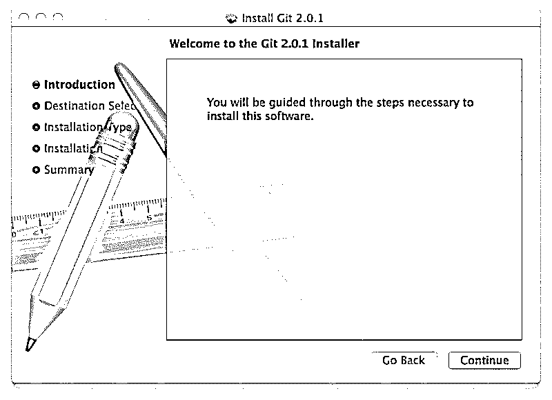

[Git tool for mac](https://www.educba.com/git-tools/) 还提供命令行环境。你可以从 http://mac.github.com 的 [Mac 网站](https://www.educba.com/linux-vs-mac/)的 GitHub 下载

### 推荐文章

这是如何安装 Github 的指南？.这里我们讨论了在 Linux 和 macOS 上安装 Github 的基本指令和不同步骤。您也可以阅读以下文章，了解更多信息——

1.  [吉拉 vs Github](https://www.educba.com/jira-vs-github/)
2.  [JIRA 面试问题](https://www.educba.com/jira-interview-questions/)
3.  [什么是 Hub？](https://www.educba.com/what-is-hub/)

