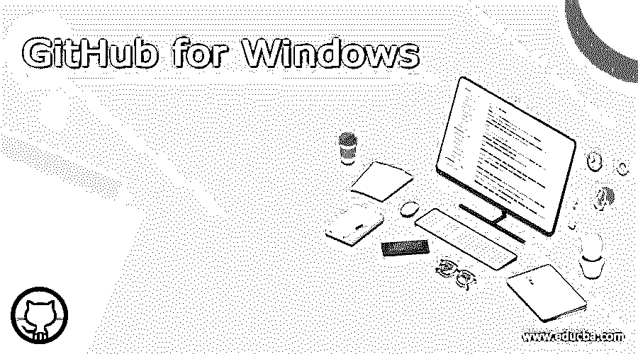

# GitHub for Windows

> 原文：<https://www.educba.com/github-for-windows/>

## GitHub for Windows 简介

GitHub 是一个软件开发人员的协作平台，在这个平台上，他们可以编写代码，并将世界各地的开发人员编写的不同代码集成在一起。这是一个版本控制系统，如果不同版本的代码是由开发人员编写的，所有的版本都可以保存，而旧版本可以在需要时使用。GitHub 遵循软件即服务(SaaS)的商业模式，是一个开源的代码管理系统。这有助于我们保存项目的源代码，通过使用它的历史，我们可以通过 GitHub 跟踪整个项目的发展。

### 什么是 GitHub for Windows？

*   我们不需要去 GitHub 网站做我们的编码或者创建我们的项目。我们需要在系统中下载 GitHub for Windows 应用程序，我们可以在该应用程序中访问 GitHub 的所有功能。开发者可以修改或改编来自任何公共存储库的代码来改进软件，GitHub 不会为此收费，但如果代码修改来自任何私人存储库，GitHub 会向开发者收费，并且有几个面向开发者的付费计划。所有的存储库都有对应于每个项目的文件，重要的是要注意它也有相同文件的旧版本。这有助于开发人员了解代码如何从一个版本变化到另一个版本。
*   GitHub 中提供了社会化编码，其中为代码库提供了一个 web 接口，以及所有需要的协作工具。一个面向软件开发人员的社交网站叫做 GitHub，在这个网站上，他们可以互相关注他们的项目工作，评论他们的代码开发，提出修改建议，并就新项目或代码进行交流。他们的工作也会收到更新，并根据新的进展对其他人的工作进行评级。
*   GitHub 在协作和版本控制方面帮助很多人，因此，由于其直观性，它对非程序员也变得有用。如果编程较少，其他人可以使用 GitLab，因为它是作为 GitHub 的替代产品推出的。GitHub 中提供了在 Windows 中克隆的选项，我们可以将代码复制到我们选择的任何其他存储库中，并查看代码。此外，我们可以通过恢复更改来回滚更改或完全忽略新的开发。

### GitHub 在 Windows 中是如何工作的？

开发人员在 GitHub 中使用一些术语，如 Pull request、merge 和 Fork。Fork 也称为分支，用于将其他开发人员的工作复制到他们自己的帐户中。我们可以称之为从一个人的知识库复制到我们自己的知识库。在这里，我们可以通过保持原始代码不变来修改代码。如果开发人员发现更改是好的，他们可以通过创建一个拉请求来与原始所有者共享它们。这将向开发人员发送通知，他们可以查看更改。

<small>网页开发、编程语言、软件测试&其他</small>

如果他们发现更改是好的，他们可以进行合并，将代码合并到他们的存储库中。这种合并被称为提交，这意味着变更被链接到旧的项目。旧版本仍然可用，任何人都可以看到相同代码的旧版本。

如果我们正在开发自己的项目，请登录 GitHub 并创建一个项目。这里创建了存储库，然后继续在同一个存储库中创建分支。将代码添加到分支中，并提交更改。如果有任何进一步的更改要做，修改它并提交到项目。创建一个拉请求并合并所有更改。这样项目就完成了。如果在同一个项目上需要做任何更改，我们可以在一个 pull 请求的帮助下修改代码并再次合并它。我们也可以在同一个存储库中创建新的项目。

GitHub 提供学生包，包括所有支持和编程工具以及云资源，帮助学生免费使用 GitHub。

### GitHub for Windows 的特性

1.GitHub Gist:如果我们想与他人共享代码或注释，Gist 是一种共享的方式，因为他们充当版本自动化的存储库。这可以作为一个秘密或公共的仓库。秘密要点只对那些有访问它的 url 的人可见。我们可以将代码拖放到 Gist 中，代码就被复制了。

2.GitHub 流:这类似于 Git 流，其中代码可以合并，但是在 GitHub 流中，主分支和发布分支被合并到主分支中。在这里，即使是功能分支中的修补程序也被视为单独的分支。

3.GitHub Pages:这是一个可以看到我们所有项目和代码的网站。在这里，我们应该编辑更改并执行拉取请求，这些更改在这些页面上是可见的。这是一个面向所有人的静态网站。

4.Web Flow:通过 GitHub 的 Web 界面可以很容易地管理存储库，在这里我们可以很容易地创建文件夹。我们应该为新文件夹使用文件扩展名和/并且它是用给定的文件夹名称创建的。有一个 url shortener 来缩短 url，以便与任何人分享，这可以通过 Git.io 来完成。

### GitHub 桌面的逐步安装

1.安装 GitHub 一定要有 64 位系统。转到 https://desktop.github.com/，点击 Windows(64 位)下载。

2.该文件将被下载到下载文件夹中。双击文件夹中的安装文件。

3.安装完成后，GitHub 将在系统中启动。

### 结论

使用 GitHub 在软件开发人员中很常见，因为他们的代码在版本控制系统中是安全的，他们可以在需要的时候访问这些代码。GitHub 通过给不同的开发者不同版本的相同代码，改变了开发者的生活，这种说法并不鲜见。

### 推荐文章

这是一个 GitHub for Windows 的指南。这里我们讨论入门，什么是 GitHub for Windows？功能，逐步安装，以便更好地理解。您也可以看看以下文章，了解更多信息–

1.  [GitHub 克隆](https://www.educba.com/github-clone/)
2.  [GitLab vs GitHub](https://www.educba.com/gitlab-vs-github/)
3.  github vs SVN
4.  [GitHub 替代品](https://www.educba.com/github-alternatives/)

