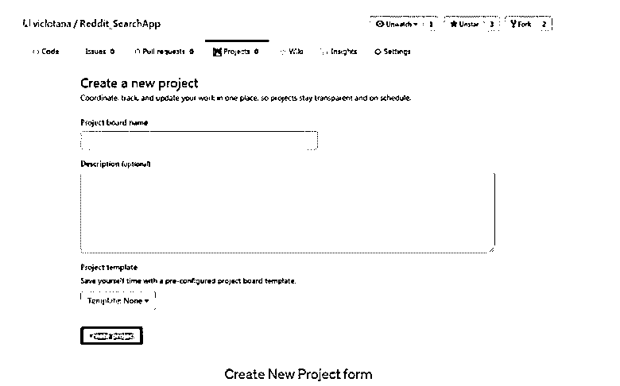

# Github 项目

> 原文：<https://www.educba.com/github-projects/>

## Github 项目简介

项目是 GITHUB 的附加功能，而且是 GITHUB 系统和库的一部分。GITHUB 存储库是声明 GITHUB 项目的关键元素。GITHUB 项目是存储库的一部分。这些项目有助于问题管理，有助于组织问题，并将它们设置在看板风格的板上。因此，它有助于提高利用率和优先级，这是 GITHUB 项目的主要优势之一。可以轻松地跟踪项目的进度，甚至可以验证和跟踪与项目相关的总体进度。可以执行工作流级别的自动化，甚至可以检索用户级别的反馈。

### 趋势 Python 项目

GITHUB 存储库上的一些关键的 python 趋势项目如下:

<small>网页开发、编程语言、软件测试&其他</small>

**Manim** :对于数学视频，允许以编程方式创建相应的动画，它基本上在 Python3.7 上执行。基于 Python 的程序生成所创建的动画。

**气流**:工作流设计流程。这些管道允许编写的代码可以动态执行。Python 2.5 用于这个过程。可以在这里执行工作流的计划和管理。这里，它与第一个基本看板非常相似，没有太大的区别，唯一要考虑的主要区别是，在这些系统中，卡片可以自动从一种状态移动到另一种状态。

GPT:GPT 2 是一个以变形金刚为主的全语言版本。总共 50 亿个参数，这些参数可以是这样的，以非常容易的目标熟练地预期在一些文本内容内的后续单词、给定的所有前面短语的确切列表。GPT-2 生成人工文本内容样本，以响应以任意输入启动的版本。它是一个大规模的无监督语言版本，可以产生文本内容的清晰段落，可以进行初步的学习理解和小工具翻译。它还可以进行查询回答和总结。它可以产生特殊质量的临时人工文本内容样本。

### 如何分享一个项目板？

共享选项是 github 项目的主要优势之一。项目可以在公共网络或用户的私有网络中共享。共享一个项目可以在用户中获得大量的项目可见性。下面解释了如何共享项目的过程，

*   加载目标项目后，在项目选项卡中选择共享，然后在其中选择更改共享选项。
*   然后相应的 github 的选项必须添加到项目的菜单中。
*   接下来点击共享> GitHub
*   在 github 的 repository 框中选择对话框并提及新资源库的 url。
*   现在，项目的源代码将指向 GITHUB 中的一个新存储库，它形成了远程级别的存储库。

### 如何创建项目板？

项目板有助于获得 GITHUB 中的项目管理特性。这些项目板有两种类型。这些构成了项目委员会的基本分类。这意味着项目板以两种不同的方式划分，

*   存储库项目板:与一个特定的存储库相关联，他们还能够将附加的注释与它们相关联。它还提供了在多个存储库之间共享这些注释的灵活性，并且它们也可以在特定存储库的范围内获得。
*   组织范围的项目委员会:这些是组织级别的委员会；这些板提供了将多达 5 个甚至更多的存储库引入到单个特定项目板的灵活性。这些是这些板的优点。

要创建新的项目板，我们可以使用“项目”部分中的“创建项目”选项。下面解释了一组详细的步骤，

*   首先，我们需要导航并进入项目部分。因此，创建项目的过程只能在项目板的项目部分中实现。该项目部分将有可能创建预期的项目。
*   接下来，我们需要使用上面显示的模板来提及项目委员会名称和与项目相关的详细描述。所以这里可以给出板项的描述和项目名称。
*   特定的项目流模板可以与项目相关联。这种关联可以通过点击项目上的模板选项来实现。
*   最后，选择项目模板将成功创建项目。

项目选择的一些关键步骤如下:

基本看板:它包含与项目相关的所有列、待办步骤、进行中的步骤和已完成的选择。上面显示的模板提到了项目委员会名称和与项目相关的详细描述。所以板子的描述和项目名称。

自动化看板:这里它与第一个基本看板非常相似，没有太大的区别，唯一要考虑的主要区别是在这些系统中，卡片可以自动从一种状态移动到另一种状态。同样，这里的待办事项、进行中和完成栏是相关联的。

带评审的自动化看板:这里非常类似于第一个基本看板，没有太大的改动，唯一要考虑的主要区别是在这些系统中，卡片可以机械地从一种状态移动到另一种状态。同样，这里的待办事项、进行中和完成栏是相关联的。此处的一个重要补充是能够参与拉动式请求流程，并且可以灵活地提出审查请求，这是一个连贯的优势。这里可以创建 Bug 级别的优先级是这些项目的更大优势。

### 结论–Github 项目

本文解释了什么是 github 项目，如何创建 github 项目，以及从 GITHUB 共享项目的步骤。

### 推荐文章

这是 Github 项目指南。这里我们讨论什么是 github 项目以及如何创建 GITHUB 项目。您也可以看看以下文章，了解更多信息–

1.  [GitHub 克隆](https://www.educba.com/github-clone/)
2.  [GitHub 命令](https://www.educba.com/github-commands/)
3.  [GitLab 替代方案](https://www.educba.com/gitlab-alternative/)
4.  [GIT 仓库](https://www.educba.com/git-repository/)

