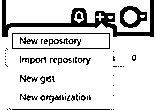

# GitHub 知识库

> 原文：<https://www.educba.com/github-repository/>

## GitHub 资源库的定义

GitHub repository 被定义为 GitHub 平台中的一个位置，对应于项目及其各自版本的文件和代码作为修订历史的一部分被存储、管理和使用。人们可以在存储库内部讨论和管理整个项目的工作。存储库充当一个平台，在这个平台上，人们可以在团队成员之间甚至跨职能团队执行协作工作。存储库也用于收集用户反馈、软件缺陷报告、任务组织。GitHub repository 使用的另一个有趣的功能是在存储库中问答问题，甚至发布项目公告。在本文中，我们将深入探讨 GitHub 资源库中的不同元素！

### 什么是 GitHub 资源库？

拥有一个存储库可以是个人级别的，甚至可以是在组织中的其他人之间共享所有权的级别。还可以通过改变存储库的可见性来限制对 GitHub 中存储库的访问。即使是 GitHub 的免费版本，人们也可以使用完整的功能集与多个存储库和无限的合作者一起工作。即使使用私有库，人们也可以在 GitHub 中工作，但只能使用受限的特性集。

<small>网页开发、编程语言、软件测试&其他</small>

### 创建新的存储库

现在我们已经非常熟悉 GitHub 存储库的概念，在这一节中，我们将讨论在 GitHub 中创建新存储库的过程。如果个人有足够的权限创建存储库，则不仅可以在个人帐户中创建存储库，还可以在组织帐户中创建存储库。在创建存储库时，所有者可以选择在组织内限制存储库的权限，以便考虑组织中数据保护背后的直觉。在本节中，我们将通过 web 界面一步步地了解在 GitHub 中创建存储库的方法，但是也可以使用 GitHub 命令行界面来创建存储库。可以深入 gh repo create 命令来进一步理解这一点。

*   第一步:打开 https://github.com/网站，登录账户。
*   第 2 步:查看右上角的+号，单击它展开列表，然后单击 New Repository。

*   步骤 3:如果已经存在一个存储库，并且我们需要创建一个具有相似目录结构的存储库，我们可以从下拉菜单中选择一个模板。只有当个人或组织拥有的存储库模板可以引导到新的存储库时，此选项才可见。

*   步骤 4:如果选择了一个模板，可选地，用户也可以通过选择选项“包括所有分支”来选择选项，如包括来自所有其他分支的文件作为模板的包括的一部分，而不仅仅是默认模板。

*   第 5 步:下一步是根据所有权要求从下拉列表中选择所有者。如果帐户拥有相同的权限，可能会出现多个所有者名称。

*   步骤 6:在存储库名称下，我们需要输入存储库的名称，并确保该名称能够解释代码包含的内容。尽管这是一个可选的主题，但是有一个占位符用于放置存储库的描述。

*   步骤 7:下一步是选择存储库的可见性。可用的 3 个选项(取决于账户类型)是公共、内部和私有。在下面的截图中，内部选项不存在，因为帐户是个人的，而不是组织的。

*   第八步:接下来选择适当的选项，如添加自述文件，添加。gitignore，根据你需要在库中做什么来选择一个许可证。

*   步骤 9:最后一步，单击 Create repository，完成存储库的创建。

### 列出 GitHub 存储库

既然我们已经清楚了一个新的存储库是如何创建的，那么我们现在将看看如何列出用户或组织所拥有的存储库。有两种方法可以实现:

1.使用 GitHub API:在 API 的帮助下，我们可以在不同的应用程序中创建 GET 方法，例如使用 JavaScript 中的 octokit 模块。

2.使用命令行界面:在命令行中执行 gh repo list [ <owner>] [flags]命令，以获取所传递的所有者参数的存储库列表，并匹配相应的标志。</owner>

3.Web UI:在 web UI 中，左侧面板上的 https://github.com/，我们还可以看到存储库列表。

### 参数 GitHub 存储库

在使用 GitHub API 时，有各种参数可用于涵盖特定的用例。其中一些重要的是:

1.类型:这是为了指定需要返回的存储库的类型。
2。排序:有选项，即。创建、推送、更新、全名，使用这些信息可以对列表进行排序。
3。方向:该选项允许升序或降序排序。
4。Per_page:该选项允许发送输入来限制每页的输入数量。

### 存储库的设置和特性 GitHub

可以对存储库中的设置进行建模，以便根据结构的需要定制存储库。用户可以许可存储库、显示赞助商按钮(如果有的话)、启用社交媒体预览、主题分类等等。通过定制，GitHub 还允许启用、配置或禁用某些功能。下面列出了一些功能:

1.禁用
2 的问题。禁用存储库中的项目板
3。在 GitHub 设置
4 中管理资源库的操作。启用或禁用存储库讨论
5。存储库的安全性和分析设置管理

### 使用文件 GitHub 存储库

在 GitHub 存储库中，处理文件包括 3 个动作，即:

1.管理文件:像添加、移动到编辑、重命名、删除文件这样的所有操作都驻留在这个用例中。

2.使用文件:这包括在 GitHub 中导航代码，跟踪文件中的变化，生成文件的永久链接，处理非代码文件。

3.管理大文件:这个动作负责管理 GitHub 中的大文件所需的所有进程。

### 结论

GitHub 中的 Repository 是分布式版本控制平台 GitHub 中的一个集中位置，用于使用户能够协作和适应开源项目的文化，并强调分叉代码、共享思想等等。

### 推荐文章

这是一个 GitHub 库的指南。这里我们讨论定义，什么是 GitHub 库，代码实现的例子。您也可以看看以下文章，了解更多信息–

1.  [GitHub 克隆](https://www.educba.com/github-clone/)
2.  [GitHub 替代品](https://www.educba.com/github-alternatives/)
3.  [如何安装 Github](https://www.educba.com/install-github/)
4.  [GitHub 命令](https://www.educba.com/github-commands/)

