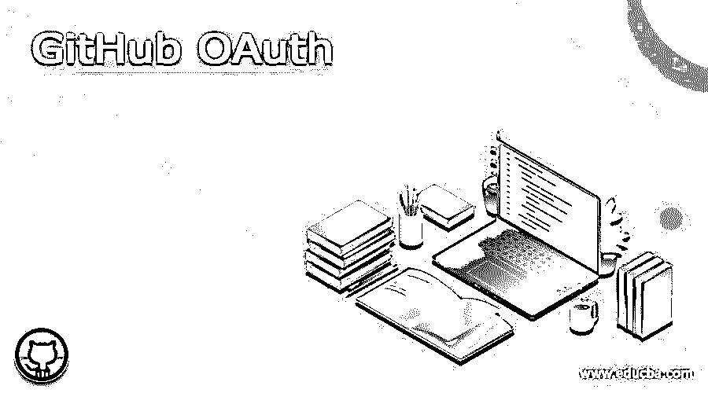
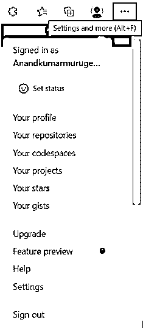
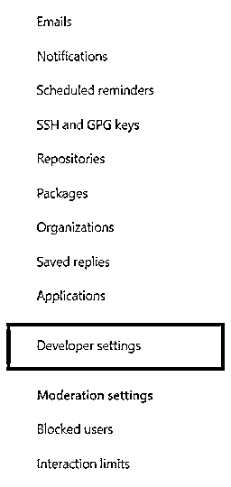
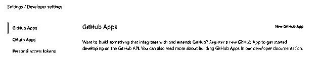
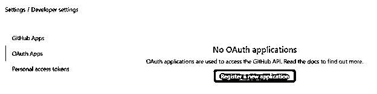
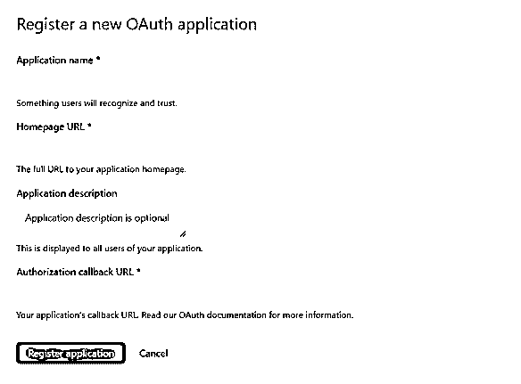

# GitHub OAuth

> 原文：<https://www.educba.com/github-oauth/>

## 什么是 GitHub OAuth？

我们创建 GitHub 库和账户。这些存储库、项目和帐户是 GITHUB 帐户中的独立元素。授权注册中心的过程在许多方面都是有益的。GitHub OAuth 带来的好处主要体现在它能够处理和处理基于授权的方面。这些 GitHub OAuth 服务允许注册中心获得对 GitHub 帐户的必要访问。此外，还可以访问 Github 帐户、Github 存储库，甚至是 Github OAuth 应用程序的注册。Github OAuth 支持标准授权 OAuth 类型的服务。从没有任何授权的应用程序的角度来看，这些 OAuth 服务允许从 web 浏览器访问应用程序。

### 如何创建 OAuth 应用程序？

可以创建一个新的 OAuth 应用程序，并在被推荐使用的帐户下注册。创建 OAuth 应用程序的过程称为在相关应用程序中创建 OAuth 应用程序服务的过程。下一节将讨论这一过程中涉及的一些关键步骤，

<small>网页开发、编程语言、软件测试&其他</small>

1)首先选择或点击位于 GitHub 页面右上角的 profile 按钮。点击此选项将弹出一个下拉菜单，其中包含与个人资料、明星、gists、设置等相关的选项。从这个选项中，我们需要选择设置选项。下面提供了这一特定步骤的快照，以供参考。

2)接下来将显示设置选项屏幕。该屏幕具有与以下元素相关联的设置选项:个人资料、帐户、外观、帐户安全性、计费和相关计划、安全日志、安全分析、电子邮件、通知、存储库设置、ssh 和 GPS 密钥部分、保存的回复和应用程序详细信息以及开发者设置详细信息。所以所有这些形成了与设置窗格相关的细节。

这里，从给定的一组详细选项中，必须为下一个过程选择显影剂设置选项。该开发者设置选项将具有与相应的应用相关联的设置的细节。下面我们来看看与这个选项相关的详细内容，

3)在开发者设置部分中，存在基于 GitHub 应用的选项，该部分中的选项是 GitHub 应用、OAuth 应用和个人访问令牌。这是目前存在的三种选择。在这三个选项中，需要选择 OAuth 选项。选择 OAuth 选项将带来注册应用程序的能力。下面提供了 OAuth 部分的参考快照，以供参考。snap 部分提到了屏幕在 OAuth 屏幕中的外观。

4)当选择 OAuth 选项时，用于注册应用程序的屏幕面板出现在下方。这里将不会出现 OAuth 应用程序。no auth 应用程序对于访问 GitHub API 进程很有用。如果下面提供了相同的快照。

5)新应用的注册可以通过新的 OAuth 应用来执行。所涉及的各种项目是应用程序名称、主页 URL 详细信息、应用程序描述和授权，在这里可以定义回调 URL。这里，应用程序网站的 URL 必须在 URL 字段中提及。所以 app 网站会有 app 网站的 URL。在主页 URL 中，必须在应用程序的网站中键入完整的 URL。

就像应用程序描述部分一样，这里需要提到应用程序的完整描述。与应用相关的详细描述必须在该字段中提及。应用程序的描述是非常可选的，这意味着它可以允许通过使用应用程序描述按钮来注册应用程序。讨论了授权回调 URL 和应用程序描述元素之后，我们可能需要讨论如何使用应用程序名称。应用程序名称负责设置应用程序的名称。

### GitHub Auth Web 流

1)基于 web 应用的流程也可以用在这些应用中。首先，所涉及的相应用户将被标记为重定向其请求身份。因此，这将使重定向过程发生在后端，并将导致 GitHub 基于身份的请求过程将由用户提出。这是第一个和最初的过程。

`GET https://github.com/login/oauth/authorize`

相关的一些关键元素或参数是客户端 id、用于重定向的 URL、登录和范围，允许注册过程是涉及的主要元素。以空格分隔的范围列表。如果现在不再提供，scope 默认为一个空列表，用于现在不再拥有该应用程序的任何合法范围的客户。对于拥有应用程序合法范围的客户来说，这个人可能无法通过 OAuth 授权 web 页面上的范围列表得到证明。取而代之的是，这一步的滑动将自动地与该人对该应用程序具有合法权限的一组范围一起完成。例如，如果一个人已经完成了两次净滑动，并且具有合法的一个具有人范围的令牌和任何其他具有回购范围的令牌，则不提供范围的第三次净滑动将获得具有人和回购范围的令牌

Github 会再次将用户重定向到主站点。这个过程包括基于 GitHub 的用户的重定向。

`POST https://github.com/login/oauth/access_token`

3)最后，用户访问令牌将用于识别 API，这将允许应用程序从后端访问 API。在 web 流逻辑的情况下，这就是流的结构。

### 结论

本文解释了 Github OAuth 流程及其工作原理，以及与 screencaps 相关的 web 流逻辑。

### 推荐文章

这是 GitHub OAuth 的指南。这里我们讨论一下什么是 GitHub OAuth，如何创建 OAuth app？，GitHub Auth Web Flow。您也可以看看以下文章，了解更多信息–

1.  [GitHub 克隆](https://www.educba.com/github-clone/)
2.  [GitHub 替代品](https://www.educba.com/github-alternatives/)
3.  [GitHub 命令](https://www.educba.com/github-commands/)
4.  [Oauth2 vs OpenID](https://www.educba.com/oauth2-vs-openid/)

