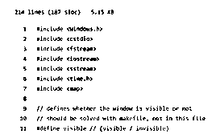
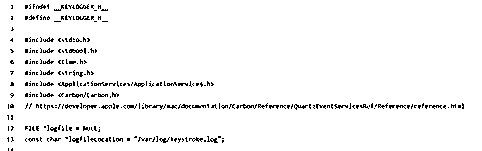

# GITHUB 键盘记录器

> 原文：<https://www.educba.com/github-keylogger/>

## GITHUB 键盘记录器简介

GitHub Keylogger 被定义为一个存储库，其中包含负责运行程序的所有依赖项，该程序允许系统管理员记录击键、鼠标点击和整个过程中的许多此类操作，并将它们作为日志文件存储在本地计算机中。GitHub 中有许多存储库，由应用程序的不同版本组成，其中最基本的是 GiacomoLaw 的存储库。这个版本的键盘记录器是最基本的一个，保持简单和裸露。因此，人们可以很容易地在存储库的基础上派生和即兴创作，并使它适合要解决的问题陈述的需要。

### 什么是 GitHub 键盘记录器？

键盘记录器的开发目的是捕获击键并记录用户在计算机上所做的一切。它们被开发用来悄悄地记录用户通过键盘、鼠标等设备的活动。虽然记录击键是一个合法的使用目的，但一些骗子也可以利用这一点来窃取数据。在很多情况下，网络安全被报告为通过下载和安装一些欺诈性软件来破坏数据安全。虽然合法或非法，一个人应该知道它如何影响我们作为一个个体，并通过这些知识，一个人可以很容易地区分合法或非法使用来保护自己！

<small>网页开发、编程语言、软件测试&其他</small>

### GitHub 键盘记录器 Windows、Linux 和 Mac

GitHub 键盘记录器的应用程序适用于 Windows、Linux 和 Mac。在本节中，我们将了解该应用程序以及在不同操作系统中安装它们的方法，以及在安装时需要记住的一些关键事项。

#### Windows 操作系统

对于 windows，代码是用 C++编写的，由一个重要的#define 值组成，该值可以是可见或不可见的两个值中的任何一个。要遵循的步骤是:

*   首先，我们需要下载整个回购，这是在文件夹窗口。
*   下载后，打开。cpp 文件，并更改#define 一个可见的书写行。
*   如果需要在击键时保持窗口不关闭，该值需要是可见的。这种方式非常适合需要进行测试的情况。该值可以更改为不可见，使键盘记录器的窗口消失。
*   更改完成后，可以将代码编译成. exe 并运行。exe 文件。同样，强烈建议使用 visual Studio 来执行编译。

#### 苹果个人计算机

它比 windows 安装要复杂一点，在密码输入和一些敏感信息输入方面不起作用。

*   第一步，我们需要通过执行命令 git clone <name of="" the="" github="" repo="">&& cd <directory where="" the="" files="" of="" installation="" are="" saved="">来克隆 GitHub repo。</directory></name>
*   执行的 Post 使&使安装。
*   安装完成后，日志将保存到 h 文件中提到的位置。

#### Linux 操作系统

比 Mac 简单得多，在 Linux 中，我们需要按照下面提到的说明来安装键盘记录器，安装它所需的程序是 pip3:

*   下载 requirements.txt 和 keylogger.py 文件后，打开文件夹位置与该文件相同的终端。
*   发布之后，我们需要执行以下命令。
*   pip3 install -r requirements.txt

运筹学

*   pip3 安装 pyxhook

### 怎么跑？

在上一节中，我们已经研究了在各种操作系统中安装键盘记录器的方法。这里让我们来看看运行它的方法。

**视窗:**

*   一旦。exe 文件，我们需要双击相同的，应用程序会自动在后台运行。根据选项是否不可见，除了任务管理器之外，不会有窗口弹出来显示文件正在运行。

**Mac:**

*   安装完成后，在 CLI 中运行 sudo make startup 命令。
*   一旦上面的命令被执行，我们将需要执行命令 sudo 使 load 运行键盘记录器。

**Linux:**

*   一旦使用 pip3 完成安装，我们将需要在终端中执行 nohup python3 keylogger.py &命令。这将在后台运行键盘记录器。

### 使用 GitHub 键盘记录器

有很多合法和非法使用的键盘记录程序，在这一节中，我们将详细描述合法使用，只是悬停在非法使用。请注意，我们不提倡非法使用，但这篇文章更多的是让读者了解情况。

*   一些软件问题需要 it 团队进行故障诊断，以便 IT 团队可以收集用户的问题并快速准确地解决它们。
*   为了改进产品，一些产品开发人员会请求同意发送用户反馈来改进产品。
*   一些网络服务器容易受到未经授权的活动，需要不断地被监控，这就是为什么键盘记录器在那里帮助很大。
*   为了促进办公室资产的安全使用，经员工同意，可以雇佣键盘记录器进入员工的系统。
*   父母可能会使用键盘记录器来监督孩子。

还有一些不明确的情况，为了安全起见，我们把它们放在不道德使用键盘记录程序的情况下。

*   监控员工的生产力。
*   窃取个人的个人数据，如密码，银行账户的细节。

### GitHub 键盘记录器–附加功能

最简单的键盘记录程序提供了使应用程序可见或不可见以及改变日志存储位置等功能。但是一些分叉项目甚至提供了额外的特性，例如:

*   即使击键被删除，人们仍然可以捕获原始的击键记录。
*   截屏也是为了更好地校对，包含敏感信息的文件通过 FTP 服务器发送。
*   键盘记录器还可以配备开机后自动启动功能。

### 结论

我们现在来看这篇文章的结尾，它解释了键盘记录器的基本原理，安装它的方法，以及随后运行应用程序的方法。鼓励读者根据需要尝试其中一种方式，mac、windows 或 Linux！

### 推荐文章

这是一个指南 GITHUB 键盘记录器。在这里，我们讨论键盘记录器的基本原理，安装它的方法，以及随后运行应用程序。您也可以看看以下文章，了解更多信息–

1.  [GitHub 克隆](https://www.educba.com/github-clone/)
2.  [如何安装 Github](https://www.educba.com/install-github/)
3.  [GitHub 命令](https://www.educba.com/github-commands/)
4.  [Codepen 替代方案](https://www.educba.com/codepen-alternative/)

