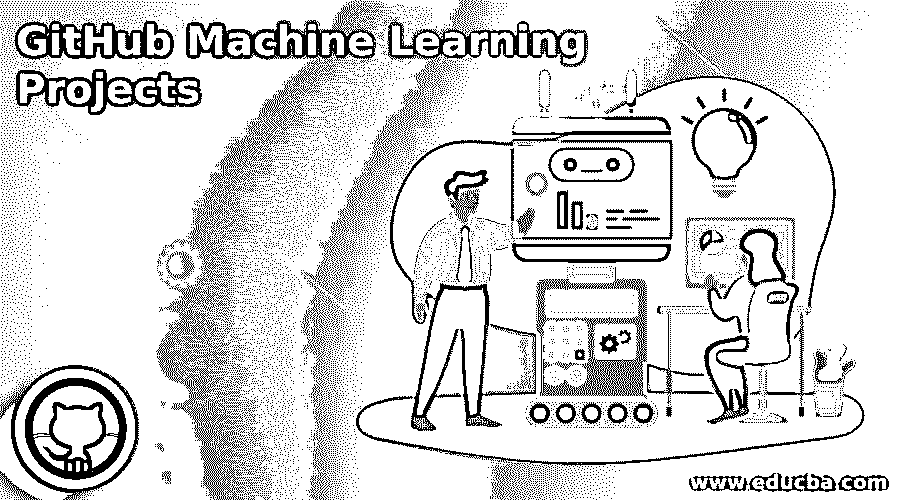

# GitHub 机器学习项目

> 原文：<https://www.educba.com/github-machine-learning-projects/>

## GitHub 机器学习项目简介

GitHub 托管了数以百万计的机器学习项目。除了作为一个代码版本系统和存储系统，GitHub 还提供了更多的东西，比如将人们与他们的同龄人、学生与他们的老师/未来的雇主、开发人员与他们领域的技术专家联系起来。因此，GitHub 为软件专业人员、初露头角的开发人员和学生提供了一个完美的平台，让他们可以使用其存储库中大量关于机器学习概念的信息，开发该领域的项目，并通过 GitHub 与社区共享。通过这种方式，学生获得知名度，找到工作；开发者跃上一个更高的位置，专业人士攀登一个新的高度。

### 什么是机器学习？

*   它是人工智能的一部分，开发者开发的系统或模型或算法从提供给它的数据中学习。
*   数据训练模型，无需任何额外的编码工作。
*   它从数据中识别模式，并开发自己的智能，在没有任何人工干预的情况下做出决策。

### 一些 GitHub 机器学习项目

GitHub 为下面列出的几个用例托管了几个项目:

<small>网页开发、编程语言、软件测试&其他</small>

#### 1.人脸识别系统

该系统在员工走过安全门时识别他们，并且它可以用作考勤，避免了任何签名或任何打卡等的需要。

**本项目中的各个步骤:**

*   这个应用程序是用几个 Python 库构建的，比如 dlib 和 face_recognition。
*   前端开发使用 Django 框架。
*   开发数据模型。
*   从所有可能的角度捕捉所有现有员工的照片。
*   使用上一步中存储的所有照片训练模型。
*   在门口安装网络摄像头，扫描员工的照片。
*   将扫描的照片与存储的照片进行比较，并显示结果。
*   如果有新员工加入，添加他的照片，用这个训练模型。
*   其准确率为 99.38%

#### 2.情感分析

这是一个与行业相关的主题，用于分析产品或服务的评论。评论可以通过物理或社交媒体进行，分析会对评论进行评级，无论它们是正面的还是负面的。因此，组织可以获得真实的反馈，并在需要的地方对产品或服务进行过程修正。

**涉及的步骤:**

*   通过从社交媒体网站下载的超集中随机抽取不同等级的评论样本来构建数据集
*   随机森林、多项式朴素贝叶斯、线性支持向量分类器(SVC)和逻辑回归等分类器模型用于构建数据模型并验证结果的审查数据。
*   来自用户的评论数据被作为输入，并使用相关的分类器通过数据模型进行验证。
*   所有评论的结果(正面或负面)会在短时间内公布。

#### 3.预测分析

它通过减少停机时间和提高性能，帮助组织控制成本并最大限度地提高现有资产的收益。预测分析可以预测前期所需的维护，避免故障，并预测任何资产的装载模式或使用方法，以提高任何资产的运营效率。

**方法:**

*   必须建立包含资产和相关实体数据的数据模型。
*   还需要用资产性能的历史数据来进一步扩充模型。
*   预测技术，如线性回归、岭回归、时间序列、方差分析、逻辑回归神经网络和决策树，用于预测故障和改善加载模式。

#### 4.聊天机器人

聊天机器人用一个自动化的过程取代了平凡和例行的活动，它们可以在面向客户的应用程序中全天候使用。此外，它可以使用自然语言处理来理解呼叫者的语言。

**步骤:**

*   开发机器人从用户那里获取查询并推断它们。
*   建立数据库，让机器人参考并回答查询。
*   按照程序逻辑，直接推导出答案，或者用从数据库中提取的数据伪造结果。
*   设计一种机制来回应用户的询问。
*   使用记号化、词干化和词条化 NLP 技术，用不同类型的声音和音节持续训练机器人。

#### 5.分类

数据科学家广泛采用这种方法将数据分层分组，以便进一步分析。但是，要对数据进行分类，必须清楚地了解数据及其特征。

**使用的技术:**

*   目标应用程序的数据应该用实时数据和历史数据构建。
*   为构建的数据预测类。
*   使用逻辑回归、正则化、随机梯度下降优化和线性分类器对数据进行分类。
*   浏览数据，应用技术并对数据进行分类。

### GitHub 机器学习知识库

以下 GitHub 库为几个机器学习项目提供了巨大的空间。使用 GitHub 提供的库、包和算法，已经开发了几个项目。

| **储存库** | **描述** |
| TensorFlow | 一个带有数据流图的开源库，有助于数据处理。图中的每个节点表示一个数学运算，边表示张量(数据数组)流动。这可以灵活地部署在任何计算环境中，而无需任何代码更改。 |
| 我是 NLTK | 使用自然语言处理的自然语言工具包。 |
| Scikit-Learn | 用 Python 开发的机器学习模块部署在 SciPy 上。 |
| Keras | 神经网络中的 Python API，它在 no / TensorFlow 中得到支持。它们在 R & D 地区使用较多，以达到更快的效果。 |
| Swift AI | Swift 开发的 ML 库。 |
| 模式 | 用 Python 开发的数据挖掘，NLP，ML 工具。 |
| 预测 | REST APIs 在这个开源 ML 框架中用于部署算法和预测结果查询。 |
| MXNet | 高效灵活的深度学习工具。 |

### 结论

GitHub 为开发者提供了一个创建 ML 项目的机会，给他们一个开发的平台，参考/知识来锐化它，托管它来获得更好的可视性。

### 推荐文章

这是 GitHub 机器学习项目的指南。这里我们讨论一下简介，GitHub 的一些机器学习项目，以及知识库。您也可以看看以下文章，了解更多信息–

1.  [GitHub 克隆](https://www.educba.com/github-clone/)
2.  [GitHub 替代品](https://www.educba.com/github-alternatives/)
3.  [GitHub 命令](https://www.educba.com/github-commands/)
4.  [什么是 GitLab](https://www.educba.com/what-is-gitlab/)

