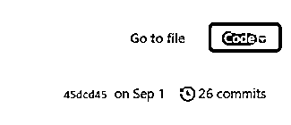
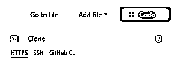
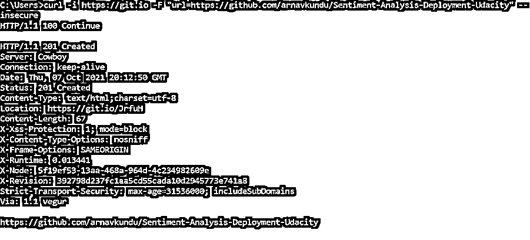

# GitHub URL

> 原文：<https://www.educba.com/github-url/>

## GitHub URL 简介

GitHub URL 被定义为浏览器用来检索 GitHub 上已发布资源的一种机制。URL 是统一资源定位器的首字母缩写，随着超文本、HTTP、HTTPS 的出现，URL 已被视为 web 上检索过程中的一个关键概念。从另一个角度来看，URL 是分配给 web 上特定资源的地址。从理论上讲，每个唯一的 URL 应该对应于网络上一个奇妙的资源。GitHub 是一个用于版本控制的主要平台，它允许用户在一个项目中进行协作，该项目有许多功能，需要多人参与。

### GitHub URL 概述

既然我们已经对 GitHub URL 有了基本的了解，现在我们来看看 GitHub URL 的组成部分是很重要的。为此，让我们剖析一个 URL 来理解它的组成部分，因为它将在理解随后的主题和描绘主题的清晰画面中发挥至关重要的作用。为了举例，让我们举一个 GitHub URL 的例子，那就是:

<small>网页开发、编程语言、软件测试&其他</small>

`https://github.com/eduCBA/name-of-the-project goes-here`

第一个组件是 scheme，它表示浏览器用于请求资源的协议。通常，网站使用 HTTPS 或 HTTP(HTTPS 的不安全版本)来访问网页。还有其他一些方案，虽然不太流行，但仍在各种公用事业中使用。mailto:就是这样一个例子，它打开了一个邮件客户端。

`https://github.com/eduCBA/name-of-the-project goes-here`

第二个组件是授权，它由两个子组件组成，即域名和端口。一般来说，在 GitHub URLs 中，我们不会经常看到端口，但在特殊情况下它们仍然会出现。GitHub 的领域仍然是 github.com。它通过://字符模式与方案分开。

`https://github.com/eduCBA/name-of-the-project goes-here`

下一个组件是保存资源的路径。这通常是保存和修改项目的帐户的用户名。这表示项目存储在谁的帐户下，类似于 windows 资源管理器文件系统中的文件夹位置。最后，该方法是由 web 服务器处理的抽象方法，没有物理上存在的位置。这个组件由/分隔。

`https://github.com/eduCBA/name-of-the-project goes-here`

本例中的最后一个组件是项目的名称，这是关于该项目的所有条目的位置。

`https://github.com/eduCBA/name-of-the-project goes-here`

### 如何使用 GitHub 网址？

存在于远程 GitHub 或 GitLab 中的文件用处不大，因为人们需要将存储库拉出来或者将其克隆到本地文件位置，以便可以在该位置执行修改。要执行该操作，需要 GitHub URL，下面是解释其用法的步骤。

*   需要点击感兴趣的 GitHub 库。
*   当一个人登陆到存储库页面时，他需要找到一个名为**代码**的绿色按钮，然后需要点击它才能看到 URL。

*   需要复制 GitHub URL。
*   使用 BASH shell 或 GitHub 桌面在本地系统上打开 git 客户端。
*   使用复制的 URL，在本地系统上克隆存储库。

对存储库进行后期克隆；在未来的任何时候都不需要 URL，直到位置发生变化或者 Git 为用户保存 URL 时发生了一些重置。

### GitHub URL 示例

到目前为止，我们知道 GitHub URLs 通常用于克隆存储库，URL 的状态有三种，HTTPS、SSL 和 GitHub CLI。

URL 的三种类型如下:

*   https://github.com/eduCBA/project-name.git 的 HTTPS
*   **SSH**:git @ github . com:eduCBA/project-name . git
*   **GitHub 命令行界面**:GH repo clone eduCBA/project-name

### 使用 curl 缩短 URL

在讨论使用 curl 缩短 URL 之前，我们需要了解 curl 是什么。curl 是命令行中的一个工具，它使开发人员能够在 url 语法的帮助下执行网络请求，并且受到 http、https、FTP 等常见协议的支持。Curl 是客户端 url 的缩写。为了使用 curl，在开始使用 curl 缩短 url 之前，需要在系统中安装 curl 并进行测试。缩短 URL 的语法如下。

`curl -i https://git.io -F "url=URL that needs to be shortened"`

使用上面的语法，我们可以创建一个末尾有任意文本的 URL，因为没有传递任何东西来使它成为一个自定义的缩写 URL。缩短后的版本看起来有点像 https://git.io/KgPIy.。为了让 URL 的最后一位表示有意义的内容，我们需要执行以下命令:

`curl -i https://git.io -F "url= URL that needs to be shortened " -F "code=custom text without spaces"`

使用上面的语法，我们前面例子中 URL 的 **KgPIy** 部分将被用双引号传递的自定义文本替换。

### 创建缩短的 URL

在这一节中，我们将一步一步地介绍如何缩短 URL。

1.  打开命令提示符(最好是在管理员模式下)。
2.  执行以下命令

`curl -i https://git.io -F "url=https://github.com/arnavkundu/Sentiment-Analysis-Deployment-Udacity"`

3.  如果存在 SSL 问题，请在末尾添加–不安全标志。
4.  按回车键，一堆信息会自动出现在 URL 的缩写部分，如下图所示。

### 结论

至此，我们结束了一篇关于 GitHub URL 的激动人心的文章，其中我们研究了 URL 及其用法的不同方面。我们鼓励我们的读者按照文章中解释的方式来尝试定制文本过程，以获得作为文章副产品的实践经验。

### 推荐文章

这是一个 GitHub URL 的指南。在这里，我们将讨论如何使用 GitHub URL 以及概述、示例和命令。您也可以看看以下文章，了解更多信息–

1.  [GitHub 克隆](https://www.educba.com/github-clone/)
2.  [GitHub 命令](https://www.educba.com/github-commands/)
3.  [GitHub 替代品](https://www.educba.com/github-alternatives/)
4.  [如何安装 Github](https://www.educba.com/install-github/)

