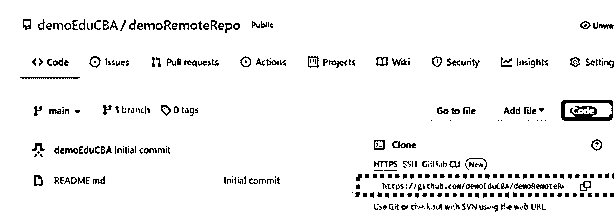

# GitHub 基础知识

> 原文：<https://www.educba.com/github-basics/>

## GitHub 基础知识介绍

GitHub 基础知识被定义为有助于理解基本功能和奠定必要基础的元素集合，并作为用户的起点，以便用户可以根据用户的要求深入研究 GitHub 的概念。GitHub 是一个广泛使用的版本控制工具，是软件开发人员协作平台的先驱。它促进了开源概念，或者换句话说，软件开发人员之间的社会编码概念，并为他们提供了 Git 代码库的 web 接口以及可以有效管理它的工具。

### GitHub 基础概述

*   到目前为止，我们确实知道 GitHub 对于一个为共同目标而工作的团队非常有用，例如，完成一个项目的特性。例如，一个分析团队正在建立一个端到端的数据流管道，然后以有规律的节奏训练模型并存储它。发布，使用存储的模型根据需求预测 KPI，并在 web UI 中显示结果。在这里，会有许多团队参与进来，并且每个团队都拥有构建特性的所有权。然而，这些功能共同实现了产品的梦想。
*   有人会说，为什么不使用常规的文件共享方式，即 Dropbox、Google Drive 或任何其他云存储设备。但是假设两个团队成员正在处理同一个文件，在常规的文件共享介质中，谁先保存文件谁就有优先权。随着 GitHub 解决了这个缺点，它已经成为软件开发社区中最受欢迎的工具之一，它避免了通过版本控制和分支方法上传的不同文件之间的任何混淆或混乱。

### GitHub 基础入门

GitHub 作为一个产品有很多可以提供的。它提供免费和付费给用户，用户可以决定使用哪一个。

<small>网页开发、编程语言、软件测试&其他</small>

*   免费账户
*   GitHub Pro 帐户
*   组织的免费帐户
*   GitHub 团队帐户
*   GitHub 企业帐户

首先概念是注册 GitHub。你可以去 www.github.com 创建一个免费账户，在右上角，你可以找到注册按钮。

在这里，我们将被要求输入一封电子邮件和一些后续的细节，以建立一个帐户的使用。一旦创建了帐户，就需要在计算机上安装 Git。Git 是 GitHub 版本控制方法的支柱，该应用程序有助于将所需文件从 PC 上的本地版本上传到 GitHub 的云系统。

接下来的几个要素是，我们将在随后的 3 个段落中详细了解其中一些要素:

*   存储库的创建
*   创建分支机构
*   更改提交到分支
*   打开拉取请求
*   合并拉取请求

### 如何使用 GitHub 基础知识？

*   在创建一个分支的过程中，当一个项目由多个版本组成并且是多方面的时候，分支可以一次编辑存储库的多个版本。有了最终的主分支，其他版本可以在提交到主分支之前单独编辑。
*   在向分支提交变更的上下文中，需要单击铅笔图标并进行必要的编辑。编辑完成后，需要通过在提交消息中提及这些更改来描述它们，然后单击 commit changes。
*   要将更改合并到另一个人的分支，用户必须打开一个拉请求。对于拉请求，相关方被通知将被合并为分支的一部分的变更。红色和绿色突出显示了两个文件内容的差异。要创建拉式请求，需要转到“拉式请求”选项卡，点击“新建拉式请求”按钮。然后，您需要找到进行更改的分支，查看与其他分支(比如主分支)的差异，然后单击“创建拉式请求”接下来，需要给拉请求加标题，并且需要描述变化。最后，单击 create pull request 完成任务。
*   在合并请求的接收端，需要点击“合并拉取请求”，点击“确认合并”合并完成后，可以删除该分支。

### 如何创建远程存储库？

为了创建远程存储库，用户需要在 windows 的原始存储库目录中运行 git remote add 命令。这个命令有两个参数，即关键字 origin 和一个远程 URL，可以在 web 版本的存储库中找到。

**网页版中 URL 的位置:**

**命令行:**

### GitHub 提交的特性

git commit 的命令是 Git commit，它创建存储库的快照。

该功能提供的特性如下:

*   **Revert:** 这个特性类似于撤销上一次提交。但是，它不会删除现有的提交，因此不会牺牲存储库的历史。
*   **重置:**在某些情况下，提交可能包含敏感信息，这些信息不可能是提交的一部分，因此需要删除，而不会在历史中留下痕迹。这就是 rest 特性帮助用户的地方。
*   Reflog: 这就像是作为恢复或重置的一部分的任何提交的日志文件，换句话说，就是 HEAD 指向的任何提交。

### 结论

张贴我们对 GitHub 基础知识的不同事实的了解，我们现在已经结束了这篇文章，并鼓励我们的读者尝试这里提到的基础知识，然后深入 GitHub 的高级部分，以充分利用 GitHub 的功能。

### 推荐文章

这是 GitHub 基础知识指南。这里我们讨论介绍，概述，如何使用 GitHub 基础知识？如何创建远程存储库？&功能。您也可以看看以下文章，了解更多信息–

1.  [GitHub 克隆](https://www.educba.com/github-clone/)
2.  [GitHub 替代品](https://www.educba.com/github-alternatives/)
3.  [GitHub 命令](https://www.educba.com/github-commands/)
4.  [什么是 GitLab](https://www.educba.com/what-is-gitlab/)

