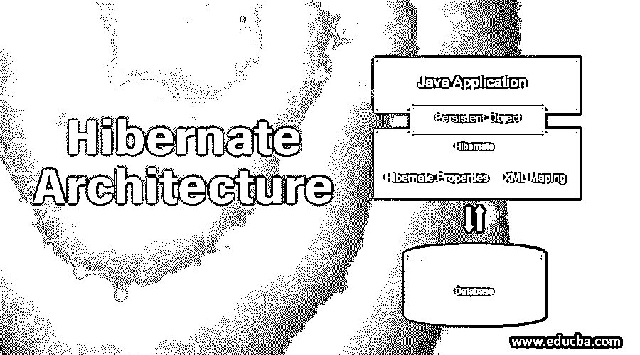
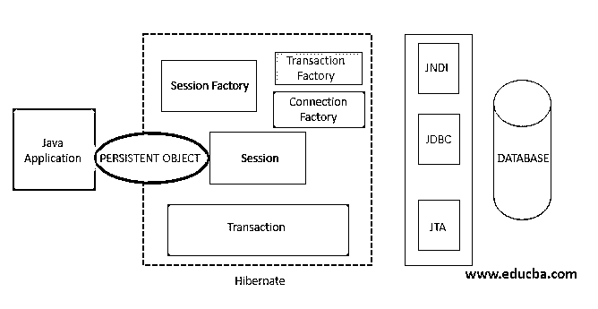
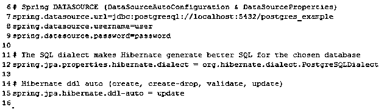
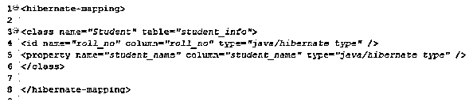
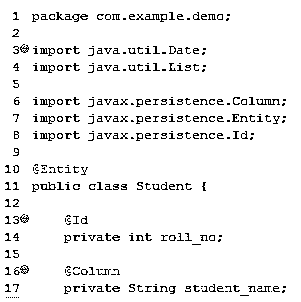
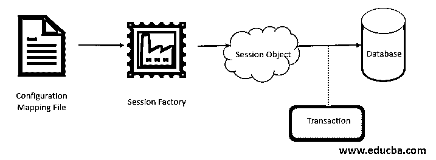

# Hibernate 架构

> 原文：<https://www.educba.com/hibernate-architecture/>

## Hibernate 架构简介

在进入 Hibernate 架构之前，让我们看看 Hibernate 为什么会出现，它为我们解决了什么问题。Hibernate 是一个 ORM(对象关系映射)工具，用于 java 编程语言开发基于对象的独立于数据库的持久性逻辑。Hibernate 为在数据库中检索和存储数据提供了一个抽象层。

### 为什么要冬眠？

JDBC (Java 数据库连接)是数据库相关的。更具体地说，使用 JDBC 编写从应用程序运行的查询取决于您使用的数据库。如果您使用 MySQL 或 Oracle，您的查询会有所不同。因此，如果在一个项目中，你需要改变你的数据库，这将需要改变代码，当然，我们不希望这样。然而，hibernate 使用独立于数据库的 Hibernate 查询语言。简而言之，hibernate 负责开发人员必须对 JDBC 做的大部分事情，例如，打开到数据库的连接，关闭连接，处理各种异常。

<small>网页开发、编程语言、软件测试&其他</small>

因此，让我们进入 Hibernate 架构，以便更好地理解 Hibernate 是如何让数据持久化变得如此容易的。

### Hibernate 架构

任何 ORM 的主要概念都是用操作对象来代替编写特定于数据库的 SQL 查询。

简单地说，

*   您创建了一个 POJO(普通旧 Java 对象)
*   使用 setters 为字段赋值
*   告诉 hibernate 持久保存这些对象

Hibernate 将 java 类映射到数据库表(这也涉及到将 Java 数据类型映射到 SQL 数据类型)。

因此，它消除了将 java 字段转换成 SQL 支持的数据类型的痛苦。Hibernate 会帮你做到。

它还将开发人员从结果集处理的痛苦中解脱出来。

#### Java 应用程序

在开发持久性逻辑时，我们需要获得 java 应用程序中一些资源的支持。让我们看看这些资源。

任何 Hibernate 应用程序的核心都在于它的配置，

*   配置文件
*   映射文件

**休眠配置文件**

我们定义了一些属性，这些属性告诉 hibernate 它必须与哪个数据库进行交互，以及使用哪个 JDBC 驱动程序。Hibernate 使用一个配置文件来获取所有这些信息。

虽然 Hibernate 能够生成数据库查询，但是我们可以指定方言来帮助它为所需的数据库生成更好的 SQL。

例如，下面是您通常会在 [spring boot 应用程序](https://www.educba.com/spring-boot-application/)中设置的属性

**休眠映射文件**

它保存了所有的类到表的映射定义。每个 ORM 工具都需要一个映射文件。我们用下面的方法告诉 Hibernate 一个对象的什么值必须存储在表的哪一列。

*   可扩展标记语言
*   [注解](https://www.educba.com/hibernate-annotations/)

spring 中 XML 映射文件的语法，

下面是我们如何注释实例变量的方法，该变量应该被映射到数据库中的一行的一列。

**域类**

众所周知，Hibernate 以开发基于对象的持久性逻辑而闻名。因此，域类是一个映射到数据库中一个表的 POJO。

**配置**

为了创建到数据库的连接，Hibernate 需要知道数据库的细节、类和其他细节。初始化应用程序时，会创建一次配置对象。它主要负责将 Hibernate 引导到应用程序。配置对象使用配置文件和 hibernate 映射文件来执行以下步骤:

*   加载这些文件。
*   检查这些文件是否格式正确且有效。
*   创建这两个文件的内存元数据。
*   返回包含此元数据的对象。

#### 会话工厂

会话工厂用于创建会话对象。它是由配置对象创建的。它提供了一个抽象层，所以我们不必担心会话对象是如何创建的。它是一个线程安全的全局工厂类，用于创建会话。使用配置对象，我们可以访问从配置和映射文件创建的内存数据。

从那里，它获得 JDBC 属性——驱动程序名、数据源 URL、用户名、密码等。使用这些属性，它将创建连接对象，表示到数据库的连接。

使用这些连接，可以创建一个连接池。来自配置对象和连接池的所有信息都用于创建和返回会话对象。因此，会话工厂对象是一个重量级对象。每个会话工厂都被配置为使用指定的 Hibernate 方言之一来处理特定的数据库。

#### 会议

需要注意的一点是，它与 servlet 会话或 java 邮件会话无关。会话是我们数据库的入口。它创建了从我们的应用程序到数据库的桥梁。它是由会话工厂创建的。它接受连接对象并打开到数据库的连接/会话，并允许应用程序在数据库上执行持久化操作。

在 ORM 工具中，您使用面向对象的语义执行所有操作，如插入、删除和更新，这意味着您不再引用表、行和列。会话负责为您完成所有的持久化操作。

#### 交易

事务是一个短暂的对象，它代表一个工作单元，就像保存或删除数据库表中的对象一样。它通过使用 JDBC、JTA (Java Transaction API)等将应用从底层事务中抽象出来。

在内部，hibernate 使用 JDBC、JTA、JNDI (Java 命名和目录接口)为配置的数据库生成 SQL 查询。

### 结论

在本文中，我们研究了 hibernate 的分层架构如何帮助程序员在不了解 JDBC、JTA 和 JNDI 等底层 API 细节的情况下处理数据库。我们了解了 Hibernate 如何通过处理大部分样板代码(比如打开/关闭数据库连接)来简化我们的生活。希望这能让您对 Hibernate 架构有一个清晰的理解，这将让您开始在应用程序中使用 Hibernate 框架。

### 推荐文章

这是 Hibernate 架构的指南。在这里，我们讨论了 Hibernate 架构，以便更好地理解它是如何使 Java 应用程序的数据持久性变得更加容易的。您也可以阅读以下文章，了解更多信息——

1.  [什么是冬眠？](https://www.educba.com/what-is-hibernate/)
2.  [冬眠面试问题](https://www.educba.com/hibernate-interview-questions/)
3.  [什么是 Java Hibernate？](https://www.educba.com/what-is-java-hibernate/)
4.  [休眠工具](https://www.educba.com/hibernate-tools/)

