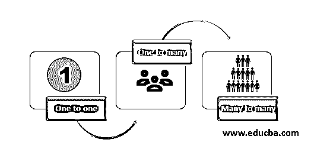

# 休眠映射

> 原文：<https://www.educba.com/hibernate-mapping/>


## Hibernate 映射简介

在关系数据库模型中，我们维护不同的关系来建立不同数据库表之间的链接。这些关系是一对一，一对多，多对多。hibernate 中也安装了类似的概念。在这里，hibernate 将 JAVA 语言链接到数据库表，通过这个链接，我们可以建立关系/映射。这些映射可用于在数据库中导航。这个映射是在 XML 工作表中定义的[。这通常是由编码人员编写的，但是也可以使用不同的工具来创建它。其中一些工具是 XDoclet、AndroMDA 和 Middlegen。](https://www.educba.com/what-is-xml/)

### Hibernate 映射的主要类型

主要有三种类型的映射。这些是:

<small>网页开发、编程语言、软件测试&其他</small>




1.  **一对一:**在这种关系中，一个属性映射到另一个属性，只保持一对一的映射。借助一个例子可以更好地理解这一点。例如，如果一个人只为一个部门工作。同一个人不能被另一个部门雇用，那么这种映射就叫做一对一。
2.  **一对多:**在这种关系中，一个属性映射到另一个属性，使得一个属性映射到许多其他属性。借助一个例子可以更好地理解这一点。例如:如果一个学生是不同小组的成员。像一个文化团体，体育俱乐部，机器人俱乐部同时存在。在那种情况下，学生和小组的关系被称为[多对一](https://www.educba.com/hibernate-many-to-one/)关系。
3.  **多对多:**在这种关系中，一个属性被映射到另一个属性，使得任意数量的属性可以链接到其他属性，而对数量没有限制。借助一个例子可以更好地理解这一点。例如，在图书馆，一个人可以借多本书，一本书也可以发给多本书。这种关系叫做多对多关系。这是一个复杂的关系，在实现之前需要对业务用例有很多了解。

### Hibernate 映射详细解释

如果我们仔细阅读代码，我们会发现在数据库中创建了一个表 EMP_ATTR，用于存储雇员属性，这些属性包含“名字”、“姓氏”和“薪水”等列。java 应用程序的数据存储在前端开发的这个表中。

基于代码编写的技术规范解释:

<hibernate-mapping>是包含<class>元素的根节点。类用于通过两个属性将 java 与数据库链接起来。类名“emp”是取自 java 代码的类名，而表“EMP_ATTR”是来自数据库的表名。<id>帮助将主键映射到唯一 id 的元素。</id></class></hibernate-mapping>

主键存在于数据库中，而惟一的 id 来自 java 类。 <id>name 来自 java，而 column 来自数据库中的一个表。 <id>type 属性具有 hibernate 映射样式，可以将 java 数据类型转换为 sql 数据类型。<generator>类用于自动生成主键。生成器元素是“本地”的。</generator></id></id>

这给 hibernate 一个指示，它可以选择任何设计好的算法，比如 Hilo、identity 或 sequence 算法，来创建一个主键。最后一个<property>类。这是将 java 类属性映射到数据库表中的列的定义类。name 属性指的是 java 类属性名，而 column 是数据库中一个表中的列。type 属性保存 hibernate 类型，当 java 类数据[被转换成 RDBMS](https://www.educba.com/what-is-rdbms/) (关系数据库管理系统)数据类型时，它将帮助系统确定数据类型。</property>

**Note:** This is a code to explain the hibernate mapping. It is not the actual code implementation.

**代码:**

这是 XML 文件的样子。它来自 hibernate.org，这是 Hibernate 的官方网站。

```
<?xml version = "1.0" encoding = "utf-8"?>
<!DOCTYPE hibernate-mapping PUBLIC
"-//Hibernate/Hibernate Mapping DTD//EN"
"http://www.hibernate.org/dtd/hibernate-mapping-3.0.dtd">
<hibernate-mapping>
<class name = "EMP" table = "EMP_ATTR">
<id name = "id" type = "int" column = "id">
<generator class="native"/>
</id>
<property name = "fName" column = "firstName" type = "string"/>
<property name = "lName" column = "lastName" type = "string"/>
<property name = "AnnualSalary" column = "AnnualSalary" type = "int"/>
</class>
</hibernate-mapping>
```

该文件以格式 <classname>.hbm.xml 保存。在这种情况下，该文件应该以名称 EMP_ATR.hbm.xml 保存。</classname>

### 休眠映射类型

因此，在前面的代码示例中，我们看到了 XML 文件中的 hibernate 映射类型。这些映射类型可以是多种类型:


1.  **原语:**这些类型映射具有定义为“整数”、“字符”、“浮点”、“字符串”、“双精度”、“布尔”、“短”、“长”等的数据类型。这些都存在于 hibernate 框架中，用于将 java 数据类型映射到 RDBMS 数据类型。
2.  **日期和时间:**这些是“日期”、“时间”、“日历”、“时间戳”等。像原语一样，我们有这些日期和时间数据类型映射。
3.  **二进制和大型对象:**这些类型是“clob”、“blob”、“Binary”、“text”等，Clob 和 blob 数据类型用于维护大型对象(如图像和视频)的数据类型映射。
4.  **JDK 链接:**位于前一类映射范围之外的对象的一些映射包含在此类别中。这些是“类”、“区域设置”、“货币”、“时区”。

### 结论

因此，hibernate 映射是一个可以通过使用 XML 文件建立映射来实现的概念。这些映射成为按照业务模型需求设计的数据库的基础。这有助于确定数据库中持久对象之间的关系。这种映射对于数据库设计至关重要，因为它成为前端应用程序在性能、准确性和速度方面的基础。

### 推荐文章

这是 Hibernate 映射的指南。在这里，我们讨论 hibernate 映射，包括详细的解释、类型和 Hibernate 映射的主要类型，以及示例代码。您也可以阅读以下文章，了解更多信息——

1.  [Hibernate 框架](https://www.educba.com/hibernate-framework/)
2.  [冬眠面试问题](https://www.educba.com/hibernate-interview-questions/)
3.  [休眠版本](https://www.educba.com/hibernate-versions/)
4.  [休眠验证器](https://www.educba.com/hibernate-validator/)


