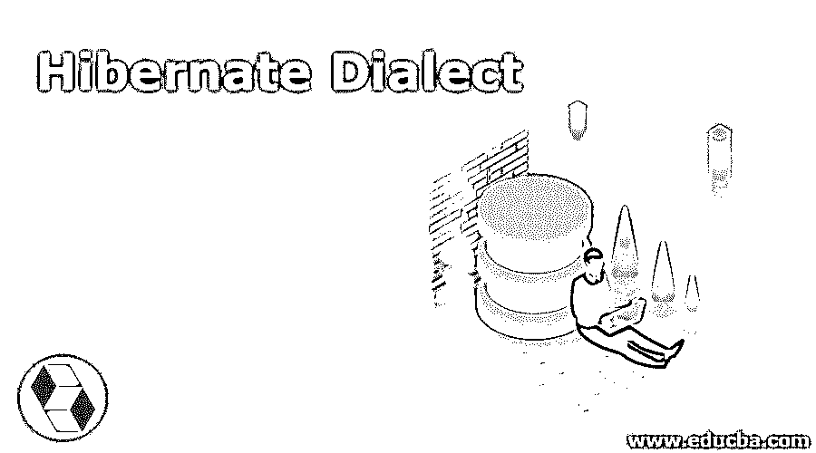
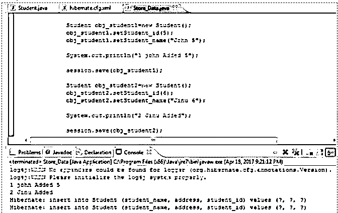

# 冬眠方言

> 原文：<https://www.educba.com/hibernate-dialect/>

## Hibernate 方言介绍

数据库用于通信的语言称为方言。每个数据库都有自己的方言，因为每个数据库都不一样。例如，Oracle 的查询语法随 MySQL 的不同而不同。Hibernate 是数据库不可知的。它适用于各种数据库。Hibernate 将知道该语言，以生成和翻译 HQL，并与相应的本地查询一起执行。我们不需要编写 SQL 查询，因为 Hibernate 独立于数据库，因此提供了数据库的方言。特定的数据库需要特定的方言来将查询 HQL 转换成特定的格式。

**语法:**

<small>网页开发、编程语言、软件测试&其他</small>

`<name of the property="dialect">;org.hibernate.dialect.MySQLDialect</property>`

### Hibernate 方言是如何工作的？

**org.hibernate.dialect** 是 Java 类中方言可用的包。这个包有助于将 java 中的应用程序映射到数据库。这个包包含了很多方言类。hibernate 框架支持这些功能，并更新了所有数据库的功能。 **hibernate.cfg.xml** 是一个用于与数据库交互的文件，在这里定义所需的数据库方言。hibernate 使用方言配置来检测用户正在使用的任何数据库。

正如我们所知，hibernate 的数据库是独立的，它提供了特定数据库的方言。

这是 hibernate 提供的几种方言。

PostgreSQLDialect、MySQLDialect、OracleDialect、MySQLInnoDBDialect 等。

下面是方言列表。通常有许多方言贯穿始终。下面给出的是在包 org.hibernate.dialect 中为 RDMS 定义的。它们是:

| **进步方言** | 与 Progress 9.1C 兼容的 SQL 方言 |
| **postgresplusdialct** | Postgres Plus 的 SQL 方言 |
| **Oracle9iDialect** | Oracle 9i 数据库的一种方言。 |
| **Oracle10gDialect** | Oracle 10g 就是使用这种方言的地方。 |
| **MySQLDialect** | MySQL 的一种方言。 |
| **MySQLMyISAMDialect** |  |
| **mysqlinnodb CT** |  |
| **HSQLDialect.ReadUncommittedLockingStrategy** |  |
| **额叶方言** | Frontbase 的 SQL 方言。 |
| **JDataStoreDialect** | JDataStore 的方言。 |
| **点基方言** | Pointbase 的方言。 |
| **DB2** | org . hibernate . dialect . db 2 dialect |
| **基点** | org . hibernate . dialect . pointbase dialect |
| **前基地** | org . hibernate . dialect . front base dialect |
| **火鸟** | org . hibernate . dialect . firebirddialect |
| **Mckoi SQL** | org . hibernate . dialect . mck oidialect |
| **Teradata** | org.hibernate.dialect.Teradata |
| **马里亚布** | org.hibernate.dialect.MariaDB |
| **TimesTen** | org.hibernate.dialect.TimesTen |
| **Derby 10.5 版本** | org . hibernate . dialect . derbytenfive |
| **DB2 AS/400** | org . hibernate . dialect . db 2400 dialect |
| **PostgreSQL 8.1** | org . hibernate . dialect . PostgreSQL 81 dialect |
| **PostgreSQL 8.2 及更高版本** | org . hibernate . dialect . PostgreSQL 82 dialect |
| **MySQL5** | org . hibernate . dialect . MySQL 5 dialect |
| **采用 InnoDB 的 MySQL 5** | org . hibernate . dialect . MySQL 5 innodb dialect |
| **带有 MyISAM 的 MySQL】** | org . hibernate . dialect . mysqlmyisamdialect |
| **甲骨文(任何版本)** | org . hibernate . dialect . Oracle dialect |
| **甲骨文 9i** | org . hibernate . dialect . Oracle 9 idialect |
| **甲骨文 10g** | org . hibernate . dialect . Oracle 10g dialect |
| **甲骨文 11g** | org . hibernate . dialect . Oracle 10g dialect |
| **赛贝斯 ASE 15.5** | org . hibernate . dialect . Sybase ase 15 dialect |
| **赛贝斯 ASE 15.7** | org . hibernate . dialect . Sybase ase 157 dialect |
| **微软 SQL Server 2000** | org . hibernate . dialect . SQL server dialect |
| **微软 SQL Server 2005** | org . hibernate . dialect . SQL server 2005 dialect |
| **微软 SQL Server 2008** | org . hibernate . dialect . SQL server 2008 dialect |
| **SAP 数据库** | org . hibernate . dialect . sapdb dialect |
| **Informix** | org . hibernate . dialect . Informix dialect |
| **HypersonicSQL** | org . hibernate . dialect . hsql dialect |
| **H2 数据库** | org . hibernate . dialect . H2 dialect |
| **安格尔** | org . hibernate . dialect . ingresdiaclet |
| **进度** | org . hibernate . dialect . progress dialect |
| **Interbase** | org . hibernate . dialect . interbase dialect |
| **Oracle10g** | org . hibernate . dialect . Oracle 10g dialect |
| **Oracle9i** | org . hibernate . dialect . Oracle 9 idialect |
| **甲骨文(任何版本)** | org . hibernate . dialect . Oracle dialect |
| **MySQL5InnoDBDialect** |  |
| **TeradataDialect** | Teradata 数据库方言。 |
| **SQL server 2008 方言** | 带有 JDBC 驱动程序 3.0 及更高版本的 Microsoft SQL Server 2008 的方言 |
| **postgresplusdialct** | Postgres Plus 的 SQL 方言 |
| **Oracle8iDialect** | Oracle 8i 的方言。 |

### Hibernate 方言示例

以下是一些例子:

**代码:**

`@Override
@SuppressWarnings("unchecked")
public String getRenderText(SessionFactoryImplementor sessionFactory) {
final Type type = expectedType == null
? heuristicType
: Number.class.isAssignableFrom( heuristicType.getReturnedClass() )
? heuristicType
: expectedType;
try {
final LiteralType literalType = (LiteralType) type;
final Dialect dialect = factory.getDialect();
return literalType.objectToSQLString( constantValue, dialect );
}
catch (Exception t) {
throw new QueryException( QueryTranslator.ERROR_CANNOT_FORMAT_LITERAL + constantExpression, t );
}
}`

这就是我们如何在配置文件中使用 Hibernate 方言。

**代码:**

`<?xml version="1.0"encoding="UTF-8"?>
<!DOCTYPE hibernate-configuration PUBLIC
"-//Hibernate/Hibernate Configuration DTD 5.3//EN"
"<a href="http://www.hibernate.org/dtd/hibernate-configuration-5.3.dtd">http://www.hibernate.org/dtd/hibernate-configuration-5.3.dtd</a>">
<hibernate-configuration>
<session-factory>
<property name="dialect">org.hibernate.dialect.Oracle9Dialect</property>
<property name="connection.url">jdbc:oracle:thin:@localhost:1521:xe</property>
<property name=" connection.driver_class " >oracle.jdbc.driver.OracleDriver< / property >
< property name = " connection.username " >root</property> //write your username
< property name="connection.password">root</property> //write your password
</factory - session >
</hibernate - configuration>`
**输出:**

### 结论

java 类包含了 java 数据类型语言和数据库数据类型之间的映射代码。方言抽象类是所有方言类的扩展。使用 hibernate 方言将 HQL 语句转换成特定的数据库语句。

### 推荐文章

这是 Hibernate 方言指南。这里我们讨论 Hibernate Dialect 是如何工作的，以及它的例子和代码实现。您也可以浏览我们推荐的其他文章，了解更多信息——

1.  [休眠版本](https://www.educba.com/hibernate-versions/)
2.  [冬眠注解](https://www.educba.com/hibernate-annotations/)
3.  [多对多冬眠](https://www.educba.com/hibernate-many-to-many/)
4.  [Hibernate EntityManager](https://www.educba.com/hibernate-entitymanager/)