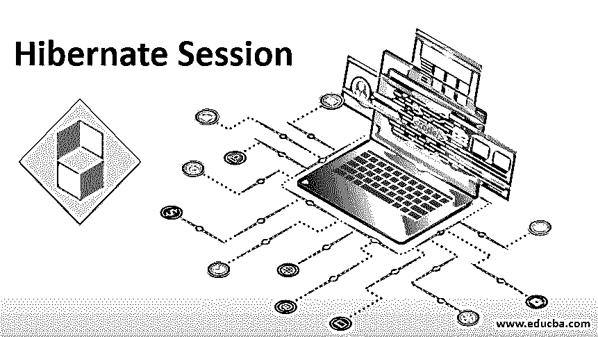

# 休眠会话

> 原文：<https://www.educba.com/hibernate-session/>




## Hibernate 会话简介

有许多面向对象的编程语言都有自己的语法和库，而另一方面，我们存储在后端的全部数据都是基于关系模型的，它们遵循完全不同的协议和语法。Hibernate 是弥合这一差距的中间件平台之一。这个中间件应用程序我称之为对象关系映射(ORM)。我们有各种各样的 ORM 工具，比如 Hibernate、IBatis、Toplink 等等。在本文中，我们将关注 Hibernate 及其会话。

### 什么是 Hibernate？

它是用于 [JAVA 编程语言](https://www.educba.com/java-programming-language-features/)将应用层的对象链接映射到数据库的 ORM 工具。它是为处理典型编程语言和关系数据库之间的阻抗不匹配而构建的。这是一个免费的 GNU 许可软件，可以很容易地从网上下载。

<small>网页开发、编程语言、软件测试&其他</small>

Hibernate 是 [JAVA 持久 API](https://www.educba.com/java-persistence-api/) 的扩展。它支持 Hibernate 查询语言(HQL)。Hibernate 的主要作用是通过 XML 结构或 JAVA 注释将 JAVA 对象和类链接到数据库类。类似地，JAVA 的数据类型应该与数据库的数据类型相匹配，这样在两个不同的系统之间就不会有通信错误。Hibernate 可用于通过查询提取数据。它可以[生成 SQL 调用](https://www.educba.com/what-is-sql/)，从而减少人工错误和开发人员的工作。为了便于使用，hibernate 中有不同的内置函数，例如:

load()、update()、get()、merge():如果我们确定对象存在，那么我们使用这个函数来加载 hibernate 对象，否则我们使用 get()函数。更新和合并功能用于基于已经存在的当前会话或事务的全新会话来更新数据库记录。还有很多类似的功能支持 hibernate。

### 什么是休眠会话？

它是应用程序和休眠程序之间的运行时接口，是按需创建的。换句话说，它提供了应用程序和数据库之间的连接。它提供了创建、删除、获取、更新等各种功能，通过使用会话方法对数据库进行操作，这些会话方法以四种状态存在，即:瞬时、持久、分离、删除。

Hibernate 就是为此而创建的。它平滑地将数据库连接到 java 语言，而不考虑任何数据库。它具有灵活的特性，因此提高了在不同平台上处理数据的灵活性。

### 休眠会话的方法

1.  **Save():** Save()方法生成主键并将记录插入数据库。它类似于 JPA 中的 persist()方法，但是它在分离的实例中的行为有所不同，即在数据库提交时创建重复记录。
2.  **Update():** Update()用于更新已有的数据库记录。如果在瞬态实例中没有找到或调用记录，它将返回一个异常。
3.  **saveourupdate():**根据传递的实体保存或更新数据库。它不会在瞬时状态下返回异常，但会在数据库操作期间使状态持久化。
4.  **merge():** 当通过将分离的实体更改为持久状态来使用 merge()时，来自分离的实体的值被更新到数据库。
5.  **delete():** Delete 方法以持久模式工作，从数据库中删除实体。如果在数据库中找不到记录，将返回异常。

### 如何创建 Hibernate 会话？

为了创建 hibernate 会话，我们必须将 hibernate 依赖项加载到与 database connector 一起使用的工具库中。一旦加载了这些库，我们就可以通过使用会话工厂创建会话来建立连接。

假设我们有一个包含两列的表:应该更新的雇员 Id 和雇员姓名。

**代码片段:**

Note: This is just a code snippet, not a whole program to explain the working of hibernating sessions.

```
import.org.hibernate.session // This way we hall import the hibernate class in the main program.
public class testclasshibernate //declaration of class.
{
public static void main( string[] args ) //The program;s main execution shall start from here.
{
testprogram = new program(); // Here the class is objectified and then this object is used as a reference to send the values like employee name and employee ID which needs to be imported into the database table.
program.setEmpId(101);
program.setEmpName(“User1”);
Configuration con = new Config().configure().addAnnotedClass testclasshibernate;
// Create session factory using configuration
SessionFactory sf1 = con.buildsessionfactory();
// Open session method gives the object of session.
Session s1 = sf.OpenSession();
// Opening Transaction
Transaction t1 = session.beginTransaction();
session.save(testprogram);
tx.commit();
}
}
```

### Hibernate 会话的优势

*   Hibernate 会话符合数据库的 ACID(原子性、一致性、隔离性和持久性)属性。
*   它的对象映射是一致的，因此减少了代码中许多潜在的错误和漏洞。
*   它是独立于数据库的，所以即使有任何数据库像 [mySQL 或 oracle](https://www.educba.com/mysql-vs-oracle/) 这个软件可以使用。
*   没有必要了解 SQL，只有关于它的基本知识可以帮助你理解它是如何工作的。
*   很容易建立联系，网上有很多指导。如果明智地使用，Java 被广泛地用于网络上的数据库，可以最大限度地利用这个软件。
*   当表有任何变化时，代码变化最小，因为一切都是通过类和对象处理的。大多数代码和功能都是通用的，因此更值得在对事务性数据有很大依赖性的应用程序中使用。
*   [Hibernate 支持](https://www.educba.com/hibernate-mapping/)多级缓存，从而提高编码效率。

### 结论

数据库数据和通过数据库外的任何编程语言处理的数据存在历史差异。为了解决这个问题，设计了一个新的解决方案，叫做“ORM”。以表格形式存储在数据库中的数据现在可以从数据库中检索，并且可以在编程语言中以对象的形式处理，因此消除了 SQL 查询的使用。

### 推荐文章

这是一个 Hibernate 会话指南。这里我们讨论什么是 hibernate 和 hibernate session？以及方法和优点。您也可以阅读以下文章，了解更多信息——

1.  [冬眠注解](https://www.educba.com/hibernate-annotations/)
2.  [休眠版本](https://www.educba.com/hibernate-versions/)
3.  [PHP 创建会话](https://www.educba.com/php-create-session/)
4.  [休眠验证器](https://www.educba.com/hibernate-validator/)


