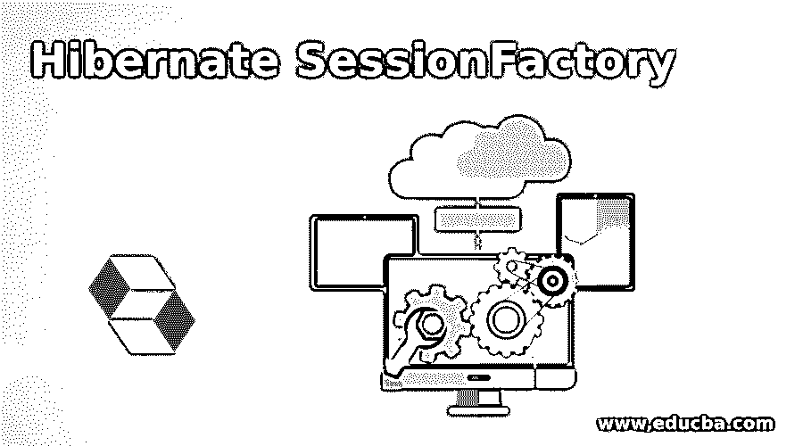
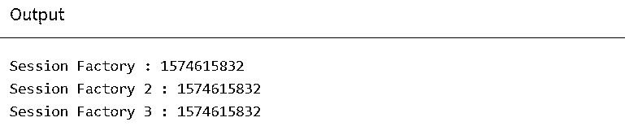

# 休眠会话工厂

> 原文：<https://www.educba.com/hibernate-sessionfactory/>

## Hibernate SessionFactory 简介

Hibernate SessionFactory 是一个接口。它可以通过提供配置对象来创建。这将包含从 hibernate.properties 文件或 hibernate.cfg.xml 文件中提取的所有数据库属性详细信息。会话对象由 SessionFactory 中的工厂组成，就像是一个工厂。在任何应用程序中，可以为每个数据库创建一个 sessionFactory 的实现。如果应用程序引用多个这样的数据库，那么需要为每个数据库创建一个 SessionFactory。这被认为是一个很重的物体。在应用程序启动期间，会创建并保留该文件以供使用。它是应用程序线程使用的线程安全对象。

**语法:**

<small>网页开发、编程语言、软件测试&其他</small>

Hibernate SessionFactory 到 getCurrentSession 的语法:

`< property name = " hibernate.current_session_class">thread</property>`

### Hibernate SessionFactory 是如何工作的？

如果将上述内容配置给线程，我们可能会得到下面标记的异常:

`Exception in thread "main" org.hibernate.HibernateException: No CurrentSessionContext configured!
at
org.hibernate.internal.SessionFactoryImpl.getCurrentSession(SessionFactoryImpl.java:1012)
at com.journaldev.hibernate.main.HibernateSessionExample.main(HibernateSessionExample.java:16)`

由于会话的对象属于 hibernate 上下文，我们不必关闭它。一旦 sessionFactory 关闭，session 对象也会关闭。hibernate 的会话对象从来都不是线程安全的。这就是为什么我们不应该在多线程环境中使用它，但可以在单线程环境中使用它。此外，打开一个新会话相对更快。

| 通过开始单元返回相关的事务对象。 | 事务开始事务() |
| 取消当前查询的执行。 | void cancelQuery() |
| 完全清除会话。 | 空清除() |
| 释放 JDBC 连接，并通过结束会话进行清理 | 连接关闭() |
| 使用给定分离实例的标识符，更新实例持久性。 | void update(字符串 entityName，对象 Object) |
| 使用给定分离实例的标识符，更新持久实例。 | 无效更新(对象对象) |
| 保存(对象)或更新(对象)给定实例。 | void saveOrUpdate(对象对象) |
| 通过首先分配一个生成的标识符，持久化给定的瞬态实例。 | 可序列化保存(对象对象) |
| 检查会话是否仍处于打开状态。 | boolean isopen() |
| 检查会话是否包含任何必须与数据库同步的更改。 | boolean isDirty() |
| 检查会话当前是否已连接。 | 布尔 isConnected() |
| 注意到与会话相关联的事务实例。 | 事务 getTransaction() |
| 从底层的特定数据库中，应该重新读取给定数据库的条件。 | 无效刷新(对象对象) |
| 返回此会话的 SessionFactory 创建者。 | session factory getsessionfactory() |
| 有了给定的实体和标识符名称，持久化实例的返回就完成了，如果没有看到这样的持久化实例，则 or 或无效。 | 会话 get(字符串 entityName，可序列化 id) |
| 从数据存储中删除持久性实例。 | void delete(字符串 entityName，对象 Object) |
| 从数据存储中删除持久性实例。 | 无效删除(对象对象) |
| 使用 SQL 查询中的给定字符串创建新实例的 SQL 查询 | SQLQuery createSQLQuery(String queryString) |
| 使用 HQL 查询中的给定字符串创建新实例的 HQL 查询 | 查询创建查询(字符串查询字符串) |
| 对于分配的集合和字符串筛选器，创建一个新的查询实例。 | 查询 createFilter(对象集合，字符串 queryString) |
| 与会话相关联地返回所提及的实体的标识符的值。 | 可序列化的 getIdentifier(Object object) |
| 对于指定的实体名称，创建实例条件查询。 | Criteria createCriteria(字符串实体名称) |
| 为指定的实体类或实体类的超类创建标准实例。 | 标准创建标准(类持久性类) |

### Hibernate 会话工厂示例

Hibernate SessionFactory 的示例如下:
`package com.onlinetutorialspoint.config;
import org.hibernate.SessionFactory;
import org.hibernate.cfg.Configuration;
public class HibernateUtility {
public static SessionFactory factory;
//to disallow creating objects by other classes.
private HibernateUtility() {
}
//maling the Hibernate SessionFactory object as singleton
public static synchronized SessionFactory getSessionFactory() {
if (factory == null) {
factory = new Configuration().configure("hibernate.cfg.xml").
buildSessionFactory();
}
return factory;
}
}
// The Main (main.java)
package com.onlinetutorialspoint.service;
import com.onlinetutorialspoint.config.HibernateUtility;
import org.hibernate.SessionFactory;
public class Main {
public static void main(String[] args) {
SessionFactory sessionFactory = HibernateUtility.getSessionFactory();
System.out.println("Session Factory : " + sessionFactory.hashCode());
SessionFactory sessionFactory2 = HibernateUtility.getSessionFactory();
System.out.println("Session Factory 2 : " + sessionFactory2.hashCode());
SessionFactory sessionFactory3 = HibernateUtility.getSessionFactory();
System.out.println("Session Factory 3 : " + sessionFactory3.hashCode());
}
}
Output : The factory method is declared with a synchronised keyword. The two threads call the factory method of factory at the same time, which makes it possible for creating objects of hibernate SessionFactory.`

**输出:**

### 结论

sessionFactory 对象表示单个数据库或数据存储。它是一个线程安全的对象。它只在应用程序启动时构建一次。一旦我们有了一个会话，我们就可以做所有的线程操作——创建、删除、修改、读取、更新等等。我们可以在应用程序中请求 sessionFactory 给我们尽可能多的会话。

### 推荐文章

这是 Hibernate SessionFactory 的指南。这里我们也讨论 hibernate sessionfactory 是如何工作的？以及不同的示例及其代码实现。您也可以看看以下文章，了解更多信息–

1.  [休眠版本](https://www.educba.com/hibernate-versions/)
2.  [休眠映射](https://www.educba.com/hibernate-mapping/)
3.  [休眠验证器](https://www.educba.com/hibernate-validator/)
4.  [休眠标准](https://www.educba.com/hibernate-criteria/)