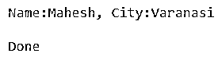
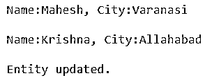

# Hibernate EntityManager

> 原文：<https://www.educba.com/hibernate-entitymanager/>

## Hibernate EntityManager 简介

Hibernate EntityManager，也称为 JPA EntityManager，有一个与程序数据库连接的重要方面。最昂贵的事务之一被认为是数据库连接。就 java 对象而言，ORM 有助于表示数据库关系。关系编程和 Oops 是 ORM 的两个概念。在 ORM 框架 Hibernate 中，程序员描述了对象在数据库中的表现方式。EntityManager 和 EntityManagerFactory 是 Hibernate 在实现中提供的 teJPA 接口。EntityManagerFactory 为连接同一个数据库提供了实例。

**语法:**

<small>网页开发、编程语言、软件测试&其他</small>

从 EnttityManagerFactory 创建 EntityManager。

`@PersistenceContext
EntityManager entityManager;`

容器负责事务的开始和回滚。

### Hibernate EntityManager 注释是如何工作的？

所有实例都具有相同的配置，以便使用实现默认定义的相同设置。可以为不同数据存储的连接准备许多实体管理器工厂。EntityManager JPA 用于在任何特定的应用程序中访问数据库。

还用于管理实体的持久性实例，通过标识主键查找实体，以及查询整体实体。

| **坚持** | 实例被管理和持久化。 |
| **合并** | 给定实体的状态被合并到持久性的当前上下文中。 |
| **移除** | 所有实体实例都将被删除。 |
| **冲水** | 将数据库与持久性上下文同步。 |
| **获取参考** | 抛出未找到实体异常。当实例第一次发生时会发生这种情况。 |
| **找到** | 搜索指定类和主键的 Ab 实体。如果找到，就返回。 |
| **setFlushMode** | 对于持久性上下文的所有对象，设置刷新模式。 |
| **锁定** | 使用指定的锁定模式类型，从数据库中锁定整个实例。 |
| **刷新** | 覆盖和刷新实例的状态。 |
| **清除** | 持久性上下文被清除。所有被管理的条目都被分离。没有被刷新和改变的实体不会被持久化。 |
| **分离** | 熟悉方法清楚。将引用分离的对象。 |
| **包含** | 查看实体是否属于当前持久性上下文。 |
| **获取锁定模式** | 例如，当前锁定模式。 |
| **setProperty** | 实体管理器属性集。 |
| **获取属性** | 实体管理器的提示和属性。 |
| **创建本地查询** | 实例查询是为执行本机 sql 语句语言而创建的。 |
| **创建命名查询** | 查询实例是由四个 Java 持久化执行创建的。 |
| **createQuery** | 创建查询实例是为了执行 Java 持久性查询语言语句。 |
| **createNamedStoredProcedureQuery** | 实例是为执行数据库中的存储过程而创建的。 |
| **createStoredProcedureQuery** | 实例是为执行数据库中的存储过程而创建的。 |
| **联合交易** | 指示 JTA 事务对于实体管理器是活动的。 |
| **isJoinedToTransaction** | 告知实体管理器是否链接到当前事务。 |
| **打开包装** | 允许访问提供者特定的 API 并返回对象。 |
| **getDelegate** | 为实体管理器返回提供程序对象，并返回。 |
| **关闭** | 实体管理器关闭了应用程序。 |
| **异戊二烯** | 查看实体管理器是否打开。 |
| 投币交易 | 返回资源级实体事务对象。 |
| **getentitymanager 系数** | 实体管理器带有一个实体管理器工厂。 |
| **getCriteriaBuilder** | 对于标准查询对象的创建，将返回标准生成器。 |
| **山羊元模型** | 持久性单元的元模型通过元模型接口访问并返回。 |
| **创建实体图** | 可变实体图被返回并在动态创建的实体图中使用。 |
| **获取实体图** | 返回命名实体图。 |
| **获取刷新模式** | 对于持久性上下文的所有对象，获取刷新模式。 |

persist()是 EntityManager 管理实体和持久化数据库的方法。我们应该通过实体来保存数据。

### Hibernate EntityManager 的示例

以下是 Hibernate EntityManager 的示例:

#### 示例#1

**代码:**

`package com.concretepage;
import javax.persistence.EntityManager;
import com.concretepage.entity.Employee;
public class JPAWriteDemo {
public static void main(String[] args) {
EntityManager entityManager = JPAUtility.getEntityManager();
entityManager.getTransaction().begin();
Employee employee = new Employee(1, "Mahesh", "Varanasi");
entityManager.persist(employee);
entityManager.getTransaction().commit();
entityManager.close();
JPAUtility.close();
System.out.println("Entity saved.");
}
}
package com.democlass_entitymanager;
import javax.persistence.EntityManager;
import com.concretepage.entity.Employee;
public class JPASelectDemo {
public static void main(String[] args) {
EntityManager entityManager = JPAUtility.getEntityManager();
Employee employee1 = entityManager.find(Employee.class, new Integer(1));
System.out.println("Name:"+ emp.getName()+", City:"+ emp.getCity());
JPAUtility.close();
System.out.println("Done");
}`

**输出:**

#### 实施例 2

**代码:**

`package com.democlass_entitymanager;
import javax.persistence.EntityManager;
import com.concretepage.entity.Employee;
public class JPAUpdateDemo {
public static void main(String[] args) {
EntityManager entityManager = JPAUtility.getEntityManager();
Employee emp = entityManager.find(Employee.class, new Integer(1));
System.out.println("Name:"+ emp.getName()+", City:"+ emp.getCity());
entityManager.getTransaction().begin();
emp.setName("Krishna");
emp.setCity("Allahabad");
entityManager.getTransaction().commit();
emp = entityManager.find(Employee.class, new Integer(1));
entityManager.close();
JPAUtility.close();
System.out.println("Name:"+ emp.getName()+", City:"+ emp.getCity());
System.out.println("Entity updated.");
}
}`

**输出:**

### 结论

在本文中，我们学习了 hibernate entityManager。研究了 API 中可用的方法类型。他们使用持久性上下文。

### 推荐文章

这是 Hibernate EntityManager 的指南。在这里，我们讨论 Hibernate EntityManager 注释是如何工作的，以及它的例子和代码实现。您也可以浏览我们推荐的其他文章，了解更多信息——

1.  [休眠版本](https://www.educba.com/hibernate-versions/)
2.  [冬眠注解](https://www.educba.com/hibernate-annotations/)
3.  [Hibernate 查询语言](https://www.educba.com/hibernate-query-language/)
4.  [冬眠发生器](https://www.educba.com/hibernate-generator/)