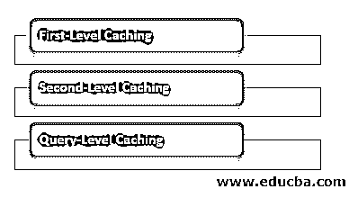

# Hibernate 中的缓存

> 原文：<https://www.educba.com/caching-in-hibernate/>

## Hibernate 中的缓存介绍

为了跟上世界快速发展的步伐，hibernate 提供了一种创新的方法，通过简单的缓存技术更快地从数据库获取数据。我们经常在互联网浏览器中遇到缓存，我们发现数据存储在缓存中，因此有助于更快地加载网页。缓存是将最常用的数据文件存储在临时快速处理内存中的一种方式。这项技术通过减少获取最常用数据的时间来提高系统性能。

谈到 hibernate 缓存，缓存是一个内存缓冲区，作为应用程序和数据库层之间的链接，用于存储最近使用的数据。这节省了时间，因为我们的应用程序不必访问数据库服务器来从表中获取数据，因为数据已经存在于缓存中。在 hibernate 中使用缓存之前，实现 org . hibernate . cache . cache provider 非常重要。Hibernate 使用多级缓存技术，称为一级和二级缓存。

<small>网页开发、编程语言、软件测试&其他</small>

### Hibernate 中的缓存类型

Hibernate 使用多级缓存来提供快速平滑的数据加载。

为了实现这一功能，hibernate 中提供了三种类型的缓存:

*   一级缓存
*   二级缓存
*   查询级缓存

#### 1.一级缓存

这种缓存也称为“会话缓存”。这是一个强制缓存，默认情况下在 hibernate 中存在。所有的请求对象都通过这个缓存。应用程序可以通过发送许多会话对象来利用该缓存。所有缓存对象都将被存储，直到打开一个会话。如果使用会话高速缓存命令了许多更新语句，数据库会尽量减少数据库的命中次数。一旦会话结束，该缓存也被清除，其持有的对象被持久化、提交或消失，而不进行任何更新，这取决于会话关闭的时间。

#### 2.二级缓存

这是针对前一种缓存类型的可选缓存，用于应用程序在一级缓存中找不到已检查数据的情况。如果一级缓存中的数据丢失，则在二级缓存中查找该数据实体。但是如果数据不存在于它们中的任何一个中，则从数据库中提取数据。

这里需要注意的重要一点是，每次从数据库中提取数据时，数据都会存储在一级和二级缓存中，当使用二级缓存提取数据时也会发生同样的情况，然后数据会存储在一级缓存中，以便以后有相同的查询时可以避免遗漏。它有一个全局范围，可以在使用会话工厂创建的不同会话中使用。一旦会话工厂关闭，所有相关的会话都将死亡，因此二级缓存中会话的对象也将消失。

#### 3.查询级缓存

这是一个可选的缓存，需要在设置中添加更多的物理缓存内存。如果我们有一些复杂的数据密集型查询定期运行，需要使用相同的参数获取数据，那么我们可以将此缓存添加到我们的系统中，以加快查询结果，因为这些结果已经存储在查询缓存中。

### Hibernate 中的缓存示例

下面是提到的例子:

创建 hibernate 缓存的端到端项目涉及多个文件，因为它需要创建配置文件和主文件。

在 hibernate 缓存上创建 java 项目的步骤应该包括以下步骤:

*   安装 eclipse Kepler 或任何装有 107 或以上版本 JRE 的 jboss 库的最新版本。
*   我们需要将所有的库链接到我们的“参考库”文件夹中的缓存。
*   创建 testhibernatecache.cfg.xml 文件。

这基本上是一个配置文件，所有代码都与基本连接相关，如下所示:

**代码:**

`<session-factory>
.. database connection properties...
<session-factory>`

*   创建 testhibernatecache.hbm.xml 文件。这个文件包含要用数据更新的表名和字段名。

这应该看起来像:

**代码:**

`<hibernate-mapping>
..<class name=””>...
..<id name=””>...
..<property name=””>...
</hiberntae-mapping>`

*   创建 testhibernatecache.java 文件。应该使用会话工厂中的服务注册配置来创建此文件。

它应该有所有必要的库导入，并应具有以下代码片段:

**代码:**

`public class HibernateSessFact {
private static SessionFactory sessionFactory;
static {
try {
Configuration config = new Configuration().configure();
StandardServiceRegistryBuilder serviceRegBuild = new StandardServiceRegistryBuilder();
serviceRegBuild.applySettings(config.getProperties());
ServiceRegistry serviceReg = serviceRegistryBuilder.build();
setSessionFactory(config.buildSessionFactory(serviceReg);
} catch (HibernateException exep) {
System.err.println("Error: “+ exep.getMessage());
}
}`

*   创建 testfetchfromdb.java 文件。然后我们应该有一个 POJO 文件，它是一个 java bean 文件，应该存在以实现我们的业务逻辑。例如，我们想从学校数据库中提取学生的名字。所以要提取的查询应该出现在这里。
*   创建 mainfirstlevelcahe.java 文件。这是包含所有一级缓存相关信息的主文件。在这里，一切都应该在会议中处理。

**例如:**

**代码**:

`import org.hibernate.Session;
import org.hibernate.boot.Metadata;
import org.hibernate.boot.MetadataSources;
import org.hibernate.SessionFactory;
import org.hibernate.boot.registry.*
public static void main(String[] args) {
final int ID_OBJ=2011
SessionFactory sessFact = HibernateSessionFactory.getSessionFactory();
Session sess = sessFact.openSession();
sess.beginTransaction();
sess.save(new School(ID_OBJ, "Test"));
sess.getTransaction().commit();
School load = (School) sess.get(School.class, ID_OBJ);
System.out.println("The name is: " + load.getName());
load.setName("Test2");
load = (School) sess.get(School.class, ID_OBJ);
System.out.println("The name is: " + load.getName());
sess.close();
}`

### 结论

在 hibernate 中使用缓存有很多好处。它减少了获取数据的时间，同时提高了系统性能。简单的内存一级缓存减少了大量的时间，这是 hibernate 设置的默认和强制设置。我们可以通过在 hibernate 中设置二级或查询级缓存来扩展这个特性。如果我们多次命中以获取具有相同参数的数据，并且在短时间内多次获取数据，这是最有效的。

### 推荐文章

这是 Hibernate 中的缓存指南。这里我们讨论 Hibernate 中的缓存介绍，以及缓存的类型和相应的例子。您也可以看看以下文章，了解更多信息–

1.  [休眠会话](https://www.educba.com/hibernate-session/)
2.  [Hibernate 框架](https://www.educba.com/hibernate-framework/)
3.  [什么是冬眠？](https://www.educba.com/what-is-hibernate/)
4.  [休眠标准](https://www.educba.com/hibernate-criteria/)