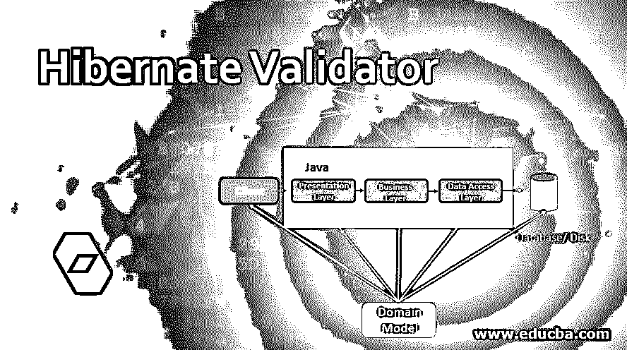
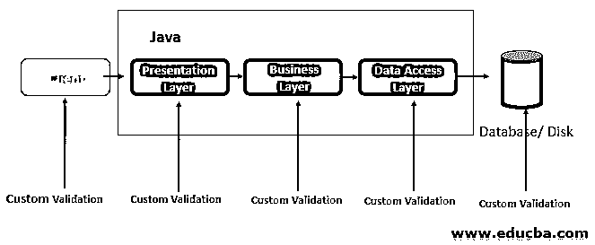
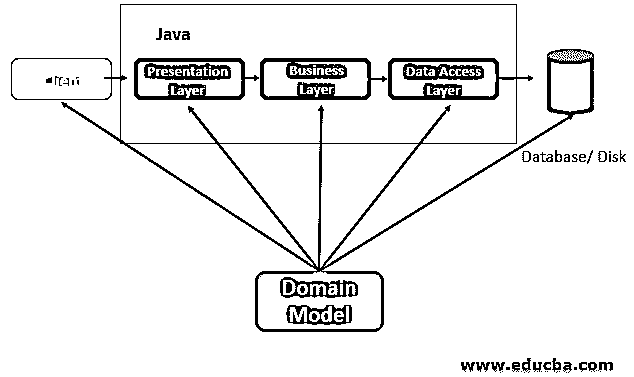

# Hibernate 验证程序

> 原文：<https://www.educba.com/hibernate-validator/>

## Hibernate 验证程序简介

所有应用层的一个共同任务是验证从表示层到持久层的数据。对每一层的验证中的逻辑实现通常是相同的，这通常容易出错且耗时。为了避免这种情况以及这种模型的重复，开发人员将一组验证逻辑开发到杂乱的域类中，域模型具有代码验证，这是关于类本身的元数据。Jakarta Bean Validation 2.0 拒绝实体的元数据模型和 API 的方法验证和定义。

### Hibernate 验证器是如何工作的？

使用 XML 可以扩展和覆盖元数据。API 既不依赖于特定的应用层，也不依赖于模型编程。它适用于富客户端 swing 以及服务器端应用程序的应用程序开发人员。

<small>网页开发、编程语言、软件测试&其他</small>

Jakarta Bean 验证的一个参考实现是 Hibernate 验证。Jakarta Bean Validation 和 Hibernate Validator 6 需要 Java 8 或更高版本。

从 Jakarta Bean 验证的参考实现开始。为了快速启动，我们需要:

*   阿帕奇人的胃
*   JDK 8
*   互联网连接

现在，让我们进入项目设置，向您的 pom 添加以下依赖项。以便在 Maven 项目中使用 Hibernate validator。

`<dependency>
<groupId>org.hibernate.validator<groupId>
<artifactId>hibernate-validator</artifactId>
<version>6.1.2.Final</version>
</dependency>`

对 Jakarta Bean 验证 API 的依赖是通过传递拉取的。当您的应用程序在 JBoss AS 上运行时，比如 Java EE 容器。容器已经提供了实现。Hibernate Validator 需要 Jakarta 表达式语言的实现，以评估违反约束消息中的动态表达式。当应用程序在 JBoss AS(一个 Java EE 容器)上运行时，容器已经提供了 EL 实现。作为对 POM 文件的依赖，您可以添加一个 java SE 环境。下面提供了一个实例供您参考，您可以在其中添加以下可以使用 Jakarta EL 的依赖项。，下面显示了使用 Jakarta EL 的依赖关系。

`<dependency>
<groupId>org.glassfish<groupId>
<artifactId>Jakarta.el</artifactId>
<version>3.0.3</version>
</dependency>`

在 Java EE 应用服务器上运行的应用程序通常不需要添加依赖项。

#### 1.安全管理器运行

Hibernate Validator 支持使用安全管理器运行。用户必须分配权限给 Hibernate 验证器的基本代码、Jakarta Bean 验证的 API、JBoss 日志和 classmate，以及 Jakarta Bean 验证的基本代码调用。下面解释了如何通过 Java 默认策略完成和实现的策略文件来完成。

将 Hibernate 验证程序用于策略文件和安全管理器的示例:

`grant codeBase "file:path/to/hibernate-validator-6.1.2.Final.jar"{
permission java.lang.reflect.ReflactPermission "suppressAccessChecks";
permission java.lang.reflect.RuntimePermission "accessDeclaredMembers";
permission java.lang.reflect.RuntimePermission "setContextClassLoader";
permission org.hibernate.validator.HibernateValidatorPermission "accessPrivateMembers";
//Only needed when working with XML description(validation.xml or XML constraint mappings)
permission java.util.PropertyPermission "mapAnyUriToUri", "read";
};
grant codeBase "file:path/to/jakarta.validation-api-2.0.2.jar"{
permission java.io.FilePermission "path/to/hibernate-validator-6.1.2.Final.jar", "read";
};
grant codeBase "file:path/to/jboss-logging-3.3.2.jar"{
permission java.java.PropertyPermission "org.jboss.logging.provider", "read";
permission java.java.PropertyPermission "org.jboss.logging.locale", "read";
};
grant codeBase "file:path/to/classmate-1.3.4.jar"{
permission java.lang.RuntimePermission "accessDeclaredMembers";
};
grant codeBase "file:path/to/validate-caller-x.y.z.jar"{
permission org.hibernate.validtor.HibernateValidatorPermission "accessPrivateMembers";
};`

#### 2.在 WildFly 中更新 Hibernate 验证器

WildFly 的应用服务器包含现成的 Hibernate 验证器。要将 API Jakarta Bean Validation 的服务器模块和 Hibernate Validator 更新到最新的版本，可以使用名为 idFly 的 path 机制。

可以使用下面给出的依赖项从 Maven Central 或 SourceForge 下载补丁文件:

WildFly Maven 依赖项，最终补丁文件:

`<dependency>
<groupId>org.hibernate.validator<groupId>
<artifactId>hibernate-validator-modules</artifactId>
<version>6.1.2.Final</version>
<classifier>wildfly-18.0.0.Final-patch</classifier>
<type>zip</type>
</dependency>`

#### 3.在 Java 9 上运行

作为对 Java 9 的最终支持的 Hibernate validator version–6 . 1 . 2，JavaPlatform (JPMS)的模块是实验性的。当没有提供 JPMS 模块描述符时，Hibernate 验证器可以用作 automatic 的模块。

#### 4.验证约束

使用验证器实例来执行约束的验证。

`package org.hibernate.validator.referenceguide.chapter01;
import java.util.Set;
import javax.validation.ConstraintViolation;
import javax.validation.Validation;
import javax.validation.Validator;
import javax.validation.ValidatorFactory;
import org.junit.BeforeClass;
import org.junit.Test;
import static org.junit.Assert.assertEquals;
public class TestCar {
private static Validator validator;
@BeforeClass
public static void setUpValidator() {
ValidatorFactory factory = Validation.buildDefaultValidatorFactory();
validator = factory.getValidator();
}
@Test
public void manufacturerIsNull() {
Carname car = new Car( null, "AB-CD-123", 4 );
Set<ConstraintViolation<Car>> constraintViolations =
validator.validate( car );
assertEquals( 1, constraintViolations.size() );
assertEquals( "should not be null", constraintViolations.iterator().next().getMssage() );
}
@Test
public void licensePlateTooShort() {
Carname car = new Car( "Maruthi", "D", 4 );
Set<ConstraintViolation<Car>> constraintViolations =
validator.validate( car );
assertEquals( 1, constraintViolations.size() );
assertEquals(
"size must be between 5 and 14",
constraintViolations.iterator().next().getMessage()
);
}
@Test
public void seatCountTooLow() {
Car car = new Car( "Maruthi", "AB-CB-123", 1 );
Set<ConstraintViolation<Car>> constraintViolations =
validator.validate( car );
assertEquals( 1, constraintViolations.size() );
assertEquals(
"must be greater > or = to 2",
constraintViolations.iterator().next().getMessage()
);
}
@Test
public void carIsValid() {
Carname car = new Car( "Maruthi", "AB-CD-123", 2 );
Set<ConstraintViolation<Car>> constraintViolations =
validator.validate( car );
assertEquals( 0, constraintViolations.size() );}
}`

### 结论

Hibernate Validator 是 2.0 Jakarta Bean Validation 的参考实现，Jakarta Bean Validation 是 JavaBean 的 API 和元数据模型，也是方法验证。注释是默认的元数据源，能够通过验证 XML 描述符来扩展和覆盖 dam。

### 推荐文章

这是一个 Hibernate 验证器的指南。在这里，我们还讨论了 hibernate validator 的介绍和工作原理，以及不同的例子和代码实现。您也可以看看以下文章，了解更多信息–

1.  [休眠版本](https://www.educba.com/hibernate-versions/)
2.  [冬眠注解](https://www.educba.com/hibernate-annotations/)
3.  [休眠映射](https://www.educba.com/hibernate-mapping/)
4.  [休眠标准](https://www.educba.com/hibernate-criteria/)

