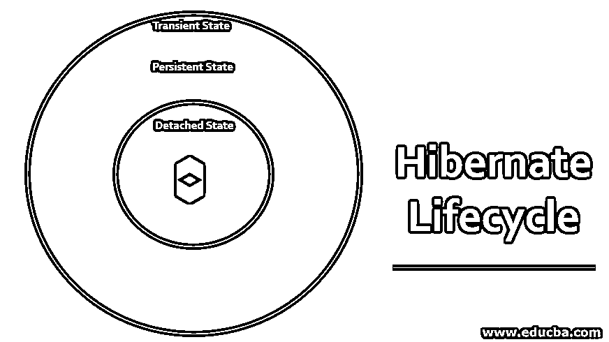
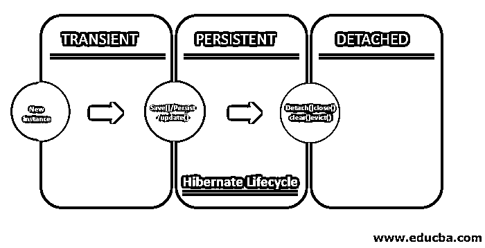

# 休眠生命周期

> 原文：<https://www.educba.com/hibernate-lifecycle/>

## Hibernate 生命周期简介

Hibernate 是一个对象关系模型，通过用对象处理函数替换直接数据库模型来处理阻抗不匹配，从而将面向对象的 JAVA 编程语言映射到关系模型数据库。Hibernate 不仅作为一个层来消除传统编程语言 JAVA 和关系数据库之间的差异，而且它还提供了一种会话管理机制。在 hibernate 中，我们在对象的整个生命周期中维护对象的状态，从而确保在所有平台上维护数据的一致性，包括相关的数据库和前端应用程序。hibernate 生命周期中的这些状态是:

### Hibernate 生命周期的状态

下面详细解释了 hibernate 生命周期中的这些状态。

<small>网页开发、编程语言、软件测试&其他</small>

**图表:**

hibernate 会话的生命周期可以分为三种状态，即:

#### 1.过渡状态

*   在这种状态下，数据对象不与 hibernate 应用程序连接。它是一个独立的对象，不连接到前端 JAVA 应用程序，也不连接到 hibernate。
*   在此对象连接到后端数据库服务器之前，我们无法对其进行任何更改。如果这个对象存在于数据库中，那么我们可以使用 get()或 load()函数调用它。
*   如果我们想创建一个新的实体，并独立地对它进行一些修改，那么我们可以在数据库之外创建这个实体，这个实体将被称为 transient。创建所需的连接后，可以在数据库中发布该实体。
*   这种状态下的数据保存在堆内存中，因为它还没有连接到 hibernate。一旦建立了 hibernate 连接，这些数据就会被提交到数据库中。

**举例:**

`StudentObject student= new Studentobject();
// This is where we are creating a new data entity but which is not yet connected to the database via hibernate. So it is in a transient date.
Student.Roll_number (25);
Student.name (“Meghna”);
Student.class (“12th standard”);`

#### 2.回归状态

*   通过 hibernate 在数据库和前端之间创建一个连接，可以将新创建的实体发布到数据库中。
*   一旦我们在 hibernate 和数据库之间建立了一个会话连接，那么对象就进入了被称为持久状态的状态。
*   我们可以使用不同的函数来实现这一点，比如 persist()、save()、saveOrUpdate()、Update()。
*   在创建这个连接之后，我们还可以更改数据库中存在的对象。请注意，只有当此连接处于活动状态时，我们所做的所有更改才会保存在数据库中。
*   Hibernate 确保当这个连接存在时，所有的实时更改都存储在数据库中。因此，对象是指数据库中的行。

**举例:**

`Session. Save(student);
Session.merge(student);
Session.Update(student);
Session.persist(student);
Session.saveOrUpdate(student);
Session.lock(student);`

#### 3.分离状态

*   当会话处于活动状态时，分离的对象将按上次保存时的原样存在于数据库中。
*   当我们从那时起断开会话时，更改将不会保存在数据库中。
*   我们在没有建立连接的情况下所做的所有更改都不会被记录并保存在后端。
*   像 detach()、close()、clear()、evict()这样的函数可以用来达到这种状态。

**举例:**

`Session.close(student);
Session.detach(student);
Session.evict(student);
Session.detach(student);`

**Note:** The above figure is the pictorial depiction of the lifecycle of hibernate objects.

**提示:**当我们想对现有的数据库做一些小的修改，并把它保存在不同的位置以供不同的用途时，我们可以使用分离状态。这样，我们可以在不同的位置保存相似的数据集。

### 要总结的要点

*   新创建的普通旧 JAVA 对象(POJO)将处于瞬态。处于这种状态的对象不以行的形式保存在数据库中的任何位置。顾名思义，它将是普通的 JAVA 对象。
*   当我们创建一个持久对象时，将建立唯一的 hibernate 连接。该对象将被表示为数据库中与前端有活动连接的一行。每当调用 commit()函数时，前端所做的任何更改都会保存在数据库中。
*   分离的对象是活动会话连接被撤销时的对象。在连接恢复之前，更改不会记录在数据库中。
*   有些对象被称为“已删除”。它们是通过 remove()函数传递的。一旦删除功能提交到数据库，它们将从数据库中删除。

### 结论

Hibernate 对象在其生命周期中具有简单的状态，以便维护所有对象、与应用程序相关联的应用程序上的数据的一致性。hibernate 的这一特性确保了数据不会被存储遗漏，从而提高了容错能力，并在 boom 上的 JAVA 应用程序的广阔时代提供了可伸缩的应用程序。

hibernate 会话及其生命周期是一种简单的技术，可以在更长的时间内保持数据库的完整性。它提供了足够的阻力来抵抗不必要的变化，这些变化是由像分离和瞬时这样的状态提供的。为了让 hibernate 工作，我们需要确保 JAVA 对象被很好地注释，否则 hibernate 将不能识别 JAVA 对象。

### 推荐文章

这是 Hibernate 生命周期的指南。在这里，我们讨论 hibernate 生命周期中包含的图表、示例和状态，以及要点。你也可以看看下面的文章来了解更多-

1.  [什么是 Java Hibernate？](https://www.educba.com/what-is-java-hibernate/)
2.  [什么是冬眠？](https://www.educba.com/what-is-hibernate/)
3.  [休眠与睡眠模式](https://www.educba.com/hibernate-vs-sleep-mode/)
4.  [春天 vs 冬眠](https://www.educba.com/spring-vs-hibernate/)

