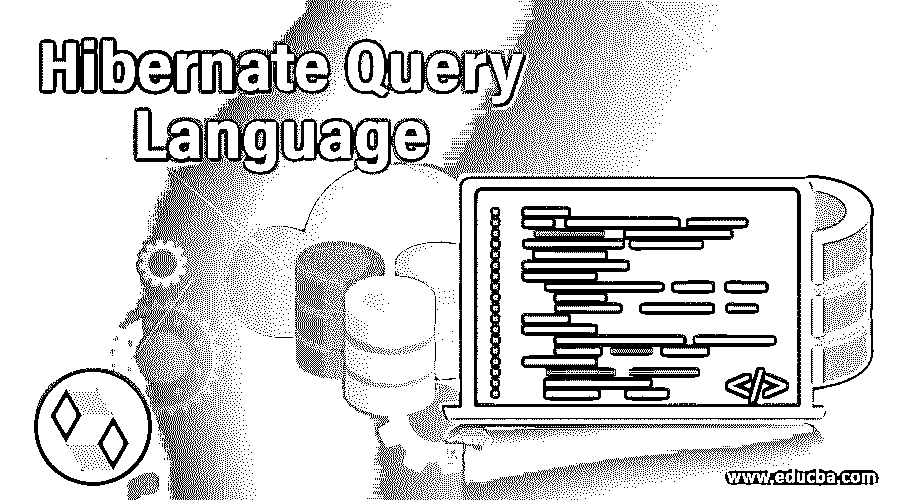

# Hibernate 查询语言

> 原文：<https://www.educba.com/hibernate-query-language/>

## 什么是 Hibernate 查询语言？

Hibernate 查询语言是一种面向对象的查询语言，它类似于结构化查询语言(SQL ),但与 SQL 不同，它处理持久对象而不是表。HQL 还允许您在原生 SQL 的帮助下编写 SQL 查询。然而，我们应该尽量编写 HQL 查询，因为它有很多优点。数据库独立性使得数据库的可移植性更加简单和高效。除此之外，它对于 Java 开发人员来说非常容易学习，并且支持多态查询和各种级别的缓存。

HQL 在内部将查询转换成 SQL，然后 SQL 再对表内容执行操作。因此，它被称为中介器或 ORM，即充当关系数据库中对象和表之间桥梁的对象-关系映射工具。当涉及到关键字或子句时，HQL 是不区分大小写的，但是当提到对象名或表的持久实体时，它是区分大小写的。

<small>网页开发、编程语言、软件测试&其他</small>

### 会话接口方法

查询对象可以通过使用 session 接口的 createQuery()方法获得。休眠的查询界面为我们提供了如下多种方法:

*   public int executeUpdate(): 我们可以执行像更新和删除这样的操作。
*   **public List list():** 它在从特定查询中检索结果时使用。
*   **公共查询 setFirstResult(int rowno):** 它有助于指定从哪个行号开始检索记录。
*   **公共查询 setMaxResult(int record count):**它有助于指定我们想要检索的行数。
*   **公共查询 setParameter(int position，Object value):** 它有助于指定查询的 JDBC 风格参数的值。
*   **公共查询 setParameter(字符串名，对象值):**它有助于指定查询的命名参数的值。

### FROM 子句

当你想把整个对象检索到内存中时，我们可以使用 FROM 子句，指明你想检索的对象的名称。例如，有一个名为 EDUCBA_DATA 的表，其中存储了技术名称、持续时间、会话和工具类型。我们已经准备了等效的持久对象，即包含属性名称技术、持续时间、会话和工具类型的表名称 educbaData 的实体。我们可以通过以下方式使用 HQL 查询和 educbaData 对象检索表 EDUCBA_DATA 的所有数据。

**代码:**

`String hqlString = "From educbaData";
Query hqlQuery = session.createQuery(hqlString);
List resultSet = hqlQuery.list();`

### AS 子句

它用于指定实体名称的替代名称或别名。例如，在上面的例子中，我们可以用下面的方法给我们的实体 educbaData 起一个别名。

**代码:**

`String hqlString = "FROM educbaData AS ed";
//OR can also be used without AS "FROM educbaData ed";
Query hqlQuery = session.createQuery(hqlString);
List resultSet = hqlQuery.list();`

### 选择子句

当我们只想检索实体的特定属性或表的列值时，我们使用 SELECT 子句来指定。假设，我们只想从表 EDUCBA_DATA 中获取技术和工具类型的名称，那么我们可以用下面的方式编写 HQL 查询。

**代码:**

`String hqlString = "SELECT ed.nameOfTechnology,ed.toolType FROM educbaData ed";
Query hqlQuery = session.createQuery(hqlString);
List resultSet = hqlQuery.list();`

### WHERE 子句

当我们必须获得满足某些特定条件的数据时，我们可以使用 WHERE 子句缩小结果集，这有助于我们指定特定属性应该满足的条件子句。假设我们想使用 HQL 查询只获取那些在 ToolType 列中有语言的技术名称。我们是这样做的。

**代码:**

`String hqlString = "SELECT ed.nameOfTechnology FROM educbaData ed WHERE ed.toolType='Language'";
Query hqlQuery = session.createQuery(hqlString);
List resultSet = hqlQuery.list();`

### ORDER BY 子句

如果我们想得到排序的数据，我们可以指定列名和升序或降序。我们还可以通过指定逗号分隔的属性名，基于 HQL 查询中的多个列进行排序。例如，可以通过以下方式根据技术名称按升序排列记录。

**代码:**

`String hqlString = "FROM educbaData ed ORDER BY ed.nameOfTechnology";
Query hqlQuery = session.createQuery(hqlString);
List resultSet = hqlQuery.list();`

默认情况下，排序按升序进行。现在，假设我们希望数据按照会话数量降序排列，然后按照技术名称升序排列，这可以通过以下方式实现。

**代码:**

`String hqlString = "FROM educbaData ed ORDER BY ed.sessions DESC,ed.nameOfTechnology";
Query hqlQuery = session.createQuery(hqlString);
List resultSet = hqlQuery.list();`

### GROUP BY 子句

当我们希望根据一些列对结果进行分组时，我们可以使用 GROUP BY 子句。它通常与聚合函数一起使用，以获得某些列/属性的汇总分组值。假设您想要获得基于 HQL 的工具类型字段分组的会话总数。我们可以用下面的方式来做。

**代码:**

`String hqlString = "SELECT ed.toolType, SUM(ed.sessions) FROM educbaData ed GROUP BY ed.toolType";
Query hqlQuery = session.createQuery(hqlString);
List resultSet = hqlQuery.list();`

### 使用命名参数

很多时候，我们会面临这样的情况，我们需要在运行时或外部提到字段的值。我们可以通过使用命名参数来做到这一点。我们可以通过以下方式获得 10 个会话的所有记录。

**代码:**

`String hqlString = "FROM educbaData ed WHERE ed.session = :sessionCount";
Query hqlQuery = session.createQuery(hqlString);
hqlQuery.setParameter("sessionCount",10);
List resultSet = hqlQuery.list();`

### 更新记录

通过使用 update 子句，我们可以使用 HQL 查询来更新一个或多个记录。我们可以使用下面的 HQL 查询将“Javascript”技术名称的会话计数更新为 35。executeUpdate 方法用于更新和删除，它返回执行操作时受影响的行数。

**代码:**

`String hqlString = "UPDATE educbaData SET sessions=35 WHERE nameOfTechnology = 'Javascript'";
Query hqlQuery = session.createQuery(hqlString);
int affectedRowCount = hqlQuery.executeUpdate();`

### 删除记录

我们可以在 HQL 查询中使用 delete 子句删除记录。如果我们想要删除会话计数小于 5 的记录，那么我们可以通过以下方式使用 executeUpdate 方法来实现。

**代码:**

`String hqlString = "DELETE FROM educbaData WHERE session < :minSessionCount";
Query hqlQuery = session.createQuery(hqlString);
hqlQuery.setParameter("minSessionCount",5);
int affectedRowCount = hqlQuery.executeUpdate();`

### 插入记录

我们可以在 HQL 用下面的方法插入记录。或者，我们可以使用会话接口的相同方法，并传递包含所需值的实体的对象。

**代码:**

`String hqlString = "INSERT INTO educbaData(nameOfTechnology, duration, sessions, toolType) SELECT nameOfTechnology, duration, sessions, toolType FROM edducationalPlatforms WHERE nameOfTechnology='Hibernate'";
Query hqlQuery = session.createQuery(hqlString);
int affectedRowCount = hqlQuery.executeUpdate();`

### 结论

通过这种方式，我们可以使用 HQL 查询在数据库中执行不同的操作，该查询独立于数据库，并且对于重复查询来说更快，因为它支持缓存。除此之外，我们还可以在 HQL 中使用 sum、max、min、avg 和 count 等聚合函数。sum 方法有助于检索特定字段的加法，通过与 GROUP BY 子句一起使用，可以进一步用于检索基于特定字段的求和值。类似地，min 和 max 聚合函数用于检索可用记录中特定字段的最小值和最大值，avg 函数有助于从记录中获取字段的平均值。

distinct 方法可用于检索特定字段中的唯一记录。对于分页，我们可以使用 setFirstResult()和 setMaxResults()方法，这有助于指定从哪条记录开始以及检索多少条记录。

### 推荐文章

这是一个 Hibernate 查询语言的指南。这里我们讨论一个 Hibernate 查询语言的介绍，包括会话接口的方法，数据库中的不同操作。您也可以浏览我们的其他相关文章，了解更多信息——

1.  [休眠标准](https://www.educba.com/hibernate-criteria/)
2.  [休眠验证器](https://www.educba.com/hibernate-validator/)
3.  [休眠会话工厂](https://www.educba.com/hibernate-sessionfactory/)
4.  [休眠版本](https://www.educba.com/hibernate-versions/)

