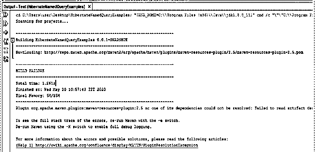

# Hibernate 命名查询

> 原文：<https://www.educba.com/hibernate-named-query/>

## Hibernate 命名查询简介

Hibernate named query 是一种用特定关键字定义查询的方法。然后在整个项目中使用这个关键字，以避免重复编写查询的混乱。这确保了代码没有混乱，并减少了维护工作量。这个特性可以在 HQL(Hibernate 查询语言)或原生 SQL 中使用。这是为查询语句提供别名的一种方式。有两种定义命名查询的方法，这将在下面的章节中解释。

### Hibernate 命名查询的工作原理

通过下面的例子可以更好地理解 HQN 的工作原理:

<small>网页开发、编程语言、软件测试&其他</small>

**代码:**

//这是对任何查询运行都很重要的实体声明:

姓名:employeedetails.java

`package com.EduCBA;
import javax.persistence.*;
import javax.persistence.Entity;
import javax.persistence.GeneratedValue;
import javax.persistence.Id;
@Entity
public class TestEmp {
@Id
@GeneratedValue()
private double idnumber;
private String empNum;
}` 

//下面是描述命名查询在项目的 Java 程序中的用法的代码片段。这是前面代码的延续。

`@org.hibernate.annotations.NamedQuery(name = "TestNamedQuery",
query = "from TestEmp where empNum= :employeeNumber")`

//下面是用于映射目的的 id 配置文件。

名称:testhiber.cfg.xml

`<hibernate-configuration>
<session-factory>
<property name="hbm2ddl.auto">update</property>
<property name="connection.url">jdbc:oracle:thin:@localhost:1521:xe</property>
<property name="connection.username">system</property>
<property name="connection.password">jtp</property>
<property name="connection.driver_class">oracle.jdbc.driver.OracleDriver</property>
<mapping class="com.EduCBA.TestEmp "/>
</session-factory>
</hibernate-configuration>`

//下面是上面创建的命名查询的使用。

名称:UsageofQuery.java

`import java.util.*;
import javax.persistence.*;
import org.hibernate.boot.Metadata;
import org.hibernate.boot.MetadataSources;
import org.hibernate.boot.registry.*
public class FetchingResults {
public static void main(String[] args) {
StandardServiceRegistry testssr = new StandardServiceRegistryBuilder().configure("hibertest.cfg.xml").build();
Metadata m = new MetadataSources(testssr).getMetadataBuilder().build();
SessionFactory sessfact=m.getSessionFactoryBuilder().build();
Session sess = sessfact.openSession();
TypedQuery testquery = sess.getNamedQuery("TestNamedQuery");
testquery.setParameter("Id","123");
List<TestEmp> employees= testquery.getResultList();
Iterator<TestEmp> i = TestEmp.iterator();
while (i.hasNext()){
TestEmp emp = i.next();
System.out.println(emp);} session.close(); }}`

**Note:** These are the code snippets to understand the named query syntax. Please follow the general guidelines to have them in your hibernate code. There are multiple other files that need to be created to have the project implemented. Please make sure that the name of files along with extension are properly maintained. The same can be done via a mapping file instead of annotation with the help of query function.

另外，请安装下面提到的所有相关的库和模块。Maven 库应该在那里构建一个项目。

**说明:**当我们通过查询选项卡加载了带有命名注释/映射的注释或映射文件时，命名查询起作用。这应该主要包含两件事。一个是查询的“名称”,它应该被用作调用该查询的参考，而另一个是“查询”,其中该查询被写入。这两个是强制声明，以便将查询分配给名称。

### Hibernate 命名查询方式

定义 Hibernate 命名查询的不同方式:

HNQ (Hibernate named query)是一种将查询字符串赋给变量的方式。这个变量可以根据需求在整个项目中使用。主要有两种定义 HNQ 的方法:

#### 1.注释

JPA (Java persistence API)下有两个注释(@keyword)用于创建命名查询。这些是一些注释-

*   **@NAMEDQUERY:** 这个注释用来生成一个可以赋给查询字符串的新关键字。要有效地使用它，需要遵循一些语法规则。HQL 命名查询使用 hibernate XML 文件中的查询元素(例如:namequeries.hbm.xml)。

下面是一个例子:

**代码:**

`@NamedQuery
(
name=”UsingNamedAnnotation”,
query=”from student stu where stu.name=:name”
)`

*   **@NAMEDNATIVEQUERY:** 该注释用于 SQL 命名查询。sql 命名查询使用 hibernate xml 文件中的原生 SQL 查询元素(例如:namedqueries.hbm.xml)。

下面是一个例子:

**代码:**

`@NamedNativeQueries
(
@NamedNativeQuery
(
name=”UsingNamedNativeAnnotation”,
query=”from school sch where sch.name=:name”
)
)`

*   **@NAMEDQUERIES:** 当我们在一个命名符号下生成多个命名查询时，会用到这个注释。这允许在一个地方同时定义多个命名查询。

下面是一个例子:

`@NamedQueries
(
@NamedQuery
(
name=”UsingNamedAnnotation1”,
query=”from student stu where stu.name=:name”
)
@NamedQuery
(
name=”UsingNamedAnnotation2”,
query=”from teacher tr where tr.name=:name”
)
)`

#### 2.映射文件

用户可以通过查询标签在映射文件中直接定义命名查询。这减少了生成注释、hibernate 配置文件以及将资源映射到 hbm 文件的需要。包含映射的文件的文件名后使用的扩展名是“. hbm.xml”，并且该“test.java”文件应包含相关的配置文件。

下面是一个例子:

**代码:**

`<query name=”UsingNamedAnnotation”>
<![CDATA[from test t where t.name= :name]]>
</query>`

### Hibernate 命名查询的优势

HQN 的一些优势列举如下:

1.  它避免了代码混乱。有一些标准的提取或更新查询在项目中重复使用，增加了代码行并在维护时造成混乱。这种命名查询语句的功能减少了代码行，改善了代码的外观。这导致维护时间和费用的减少。
2.  启动 hibernate 会话工厂的第一个实例时，会检查 HQN 的语法，因此语法检查在初始阶段只进行一次，如果语法不在 defines 结构中，就会立即抛出错误。这使得应用程序快速且防错。
3.  如果我们在查询中有语法问题，它可以在一个地方被纠正，在那里它被分配给命名注释。这降低了与查询语法相关的错误的概率。
4.  HQN 被定义为全球性的。这意味着一旦 HQN 定义了它，它就可以在整个应用程序中使用。这减少了编码工作并减少了出错的机会。

### 结论

HQN 是一个被程序员广泛使用的非常有效的工具。当谈到编写有效且易于维护的代码时，JAVA 开发人员期待命名注释。它促进了应用程序的快速开发，从而减少了项目交付所用的时间。这在 HQL 和本地 SQL 链接项目中广泛使用。当项目很大时，强烈建议使用命名查询。

### 推荐文章

这是一个 Hibernate 命名查询的指南。这里我们将讨论 Hibernate 命名查询的介绍和工作原理，以及它的不同方式和优点。您也可以浏览我们推荐的其他文章，了解更多信息——

1.  [级联休眠(示例)](https://www.educba.com/cascade-in-hibernate/)
2.  [6 大休眠版本](https://www.educba.com/hibernate-versions/)
3.  [什么是 Hibernate 框架？](https://www.educba.com/hibernate-framework/)
4.  [10 个最佳冬眠面试问题](https://www.educba.com/hibernate-interview-questions/)
5.  [Hibernate 工具|前 12 名](https://www.educba.com/hibernate-tools/)
6.  [多对多冬眠指南](https://www.educba.com/hibernate-many-to-many/)