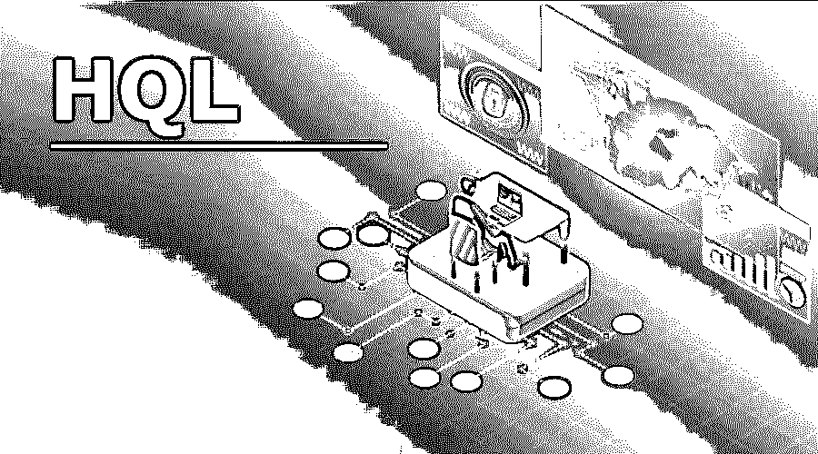

# HQL

> 原文：<https://www.educba.com/hql/>




## 什么是 HQL？

HQL 是 hibernate 查询语言的缩写。Hibernate 是一个连接传统数据库和面向对象语言(特别是 JAVA)的平台。它是 hibernate 中的一种查询语言，类似于传统 RDBMS 中的 SQL，除了我们在 HQL 中使用实体而不是表。它嵌入在 JAVA 代码中，来自 JAVA 库[的各种函数](https://www.educba.com/versions-of-java/)用于将 HQL 转换为 SQL。它可以被称为一种带有 SQL 查询语句的面向对象语言。它是一种灵活和用户友好的语言，有自己的语法和语法来检索、存储和更新数据库中的信息。它减少了 JAVA 和 RDBMS 之间的阻抗不匹配。

### 我们为什么需要 HQL？

随着 JAVA 作为一种语言对于像互联网这样的平台的重要性日益增加，我们发现在 hibernate 的帮助下将基于 JAVA 的应用程序连接到后端更为合适。Hibernate 使用 HQL 语言来建立数据库和前端之间的连接。

<small>网页开发、编程语言、软件测试&其他</small>

当我们想要根据我们的要求选择一些特定的字段和列时，我们需要 HQL。早期采用的方法效率不够高，不足以深入到这一层，例如，从数据库中取出结果集或数据集，作为具有行数和列数的完整记录。这种方法不能灵活地缩小搜索范围，使应用程序变得沉重而缓慢。这种方法被 ASP.NET 的 JDBC 连接器和许多其他语言所使用。使用 HQL 缩短了这一时间差距，并提供了具体的结果。因此，它更适用于前端涉及 JAVA 的实时环境。

### HQL 是如何运作的？

HQL 是一种 XML 文件格式，用于将 java 从前端链接到后端的数据库。我们直接使用 sql 查询在数据库中启动的 SQL 查询也可以用 hql 编写。HQL 有自己的语法，我们可以编写查询，然后将查询转换为数据库可以理解的 SQL 语句。这是用 java 语言写的，目的是减少阻抗不匹配。

除了类名和实体名，HQL 是一种不区分大小写的语言。例如:org.hibernate.eg.test 不等于 org.hibernate.eg.Test，因为“测试”和“测试”在 HQL 是两个不同的实体。

**Note:** We can use SQL in HQL queries directly using the native code.

### HQL 的优势

HQL 语作为一种语言有几个优势:

*   编码人员没有义务学习 SQL 语言。
*   HQL 是面向对象的，当我们将前端应用程序链接到后端时，它的性能很好。
*   HQL 有缓存，从而提高速度。
*   HQL 支持 OOPs 概念的流行特性，如多态、继承和关联。

### 语法以及 HQL 查询示例

hibernate 中的一些简单查询如下所示:

使用 FROM 子句:

```
From eg.Test or From Test.
```

该语句将返回该类的所有实例。在这种情况下，它是测试。我们还可以为 eg: From Test 创建一个别名作为测试。这里“测试”是 test 的别名。这个别名可以在以后代替 class 使用。

#### 示例#1

**代码:**

```
String hqlquery = "FROM Test";
Query q = session.createQuery(hqlquery);
List display = q.list();
AS Clause: From eg.Test AS T or From Test  AS T.
```

当我们想要[为 HQL 的主类创建别名](https://www.educba.com/oracle-aliases/)时，就会用到这个语句。如果我们有长的查询，这是一个有用的技术。我们可以简单地将查询分配给别名，然后使用该别名进行进一步的数据处理。别名也可以在没有 AS 关键字的情况下完成。例如:来自测试 t。

#### 实施例 2

**代码:**

```
String hqlquery = "FROM Test AS T";
Query q = session.createQuery(hqlquery);
List display = q.list();
WHERE Clause: From eg.Test T WHERE T.code=102 or From Test T WHERE T.code=102.
```

当我们在数据库表中搜索特定数据时，使用这个子句。因此，如果我们在现有测试代码的基础上搜索特定记录，那么在查询中会使用该子句。这将有助于缩小搜索标准。如果我们在 where 子句中给出表的主键 f，那么我们应该看到搜索速度的显著提高。

#### 实施例 3

**代码:**

```
String hqlquery = "FROM Test T WHERE T.code = 102";
Query q = session.createQuery(hqlquery);
List display = q.list();
SELECT Clause:
From eg. SELECT T.number FROM Test T.
```

如果我们想从数据库表中选择一个特定的列，就使用这个子句。这是缩小搜索标准的方法之一。无论我们在 select 子句中给出什么字段名，它都将被选中。如果我们有特定的信息，获取少量的数据是很有用的。

#### 实施例 4

**代码:**

```
String hql = "SELECT E.firstName FROM Employee E";
Query query = session.createQuery(hql);
List results = query.list();
DELETE Clause:
String hqlexample = "DELETE FROM Test "  +
"WHERE code = : test_code";
```

查询中的这个子句可用于从连接的数据库表中删除一个或多个对象。“瞬时”和“持久”对象都可以用这种方法删除。这是一个简单的查询，可以从数据库中删除任意数量的字段或表。这应该小心使用。

#### 实施例 5

**代码:**

```
String hqlquery =  "DELETE FROM Test "  +
"WHERE code = : test_code";
Query q = session.createQuery(hqlquery);
q.setParameter("test_code", 102);
int display = q.executeUpdate();
System.out.println("Hence the number of rows modified are: " + display);
```

### 结论

因此，HQL 是一种优雅的面向对象语言，它在面向对象 JAVA 和数据库管理系统之间架起了一座桥梁。凭借最高的市场份额，hibernate 查询语言正在成为一种流行的语言。

### 推荐文章

这是 HQL 旅游指南。在这里，我们讨论了为什么我们需要 hql 的优点、工作原理、语法以及查询示例。您也可以看看以下文章，了解更多信息–

1.  [Hibernate 框架](https://www.educba.com/hibernate-framework/)
2.  [休眠会话](https://www.educba.com/hibernate-session/)
3.  [冬眠面试问题](https://www.educba.com/hibernate-interview-questions/)
4.  [什么是 Java Hibernate？](https://www.educba.com/what-is-java-hibernate/)


