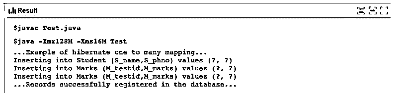

# 休眠一对多

> 原文：<https://www.educba.com/hibernate-one-to-many/>

## Hibernate 一对多简介

简单地说，“一对多”是数据库中定义的两个表之间的关系。如果表 A 中的任何条目与表 B 中的多个条目相关，那么这种关系称为“一对多”。这种关系可以在 hibernate 平台的帮助下实现。借助 JPA 注释或 xml，Hibernate 可以将基于 java 的前端应用程序链接到任何数据库。它预装了许多函数，可以通过向项目添加链接库来调用这些函数。

### Hibernate 一对多的语法

Hibernate 一对多映射的语法类似于一对一映射，但是有一点不同，即不止一个条目链接到一个列，而不只是一个列映射到另一个列。

<small>网页开发、编程语言、软件测试&其他</small>

要成功使用 hibernate 建立一对多映射，需要遵循某些语法，它们是:

*   应声明@entity 批注。
*   @table 注释应该在 java 页面中声明并定义表结构。一些相关的属性也可以在这个注释中声明，例如，catalogue、unique Constraint。
*   所有数据成员及其 getters 和 setters 都应该定义好。
*   应将@Id 和@GeneratedValue with strategy 声明为将表中的任何列标记为主键。也可以在这里定义其他属性，如列值是否应该是唯一的和非空的。
*   @OneToMany 注释应该与表一起定义，该表应该映射到该列。
*   对于其他文件，也应该重复前五个步骤，其中定义了另一个表，但是添加了一个注释:@joinColumn 以及它将映射到的列名。
*   应该创建驱动程序 java 应用程序，该应用程序将插入先前借助 hibernate 注释创建的表中维护的记录。所有配置、会话维护、提交数据记录相关的关键连接器功能都使用这个主 java 文件进行维护和调用。

### Hibernate 中的“一对多”关系是如何工作的？

表中使用了一对多映射注释，该表有许多要映射的实体。

看起来像是:

**@ onet omany(mapped by = " Student "，cascade = CascadeType。所有)**

级联规则已经在持久性库中定义，只需在实现示例时调用。这个表现在应该与另一个有多个条目的表相链接。在这种情况下，我们将另一个表作为“标记”。

看起来像是:

**@ManyToOne**

**@JoinColumn(name = "S_id")**

库下的后台有大量编码的逻辑和函数，编译器借助这些注释调用这些逻辑和函数。

### 一对多休眠示例

下面是使用 hibernate 的“一对多”映射的例子。您需要在系统中安装 Eclipse、JPA 库相关的 RAR 文件、Maven 和数据库来运行 Hibernate 相关的程序。

我们以学生和科目成绩为例。在名为“学生”和“分数”的数据库中创建了两个表。这两个表之间的关系是一对多的，因为一个学生可以进行多次测试并获得分数。

**学生:**

| 标识号 |
| 姓名 |
| S_phno |

**标记:**

| 标识号 |
| 马克 |
| M_testid |

**Note:** Make sure that you create a new Maven project in eclipse and include the Maven dependencies file to avoid any error.

**档案一:Student.java**

**代码:**

`package test
import java.util.Set;
import javax.persistence.*;
@Entity
@Table(name = "Student")
public class Student {
@Id
@GeneratedValue
@Column(name = "S_id")
private int id;
@Column(name = "S_name")
private String Name;
@Column(name = "S_phno")
private String Phone;
@OneToMany(mappedBy = "Student", cascade = CascadeType.ALL)
private Set marksDetails;
public Student() { }
public int getId() {
return S_id;
}
public void setId(long S_id)  {
this.S_id = S_id;
}
public String getName() {
return Name;
}
public void setName(String Name) {
this.Name = Name;
}
public String getPhone() {
return phone;
}
public void setPhone(String phone) {
this.phone = phone;
}
public Set getMarksDetails() {
return marksDetails;
}
public void setMarksDetails(Set marksDetails) {
this.marksDetails = marksDetails;
}
}`

**文件 2:Marks.java**

**代码:**

`package test;
import javax.persistence.*;
@Entity
@Table(name = "Marks")
public class Marks {
@Id
@GeneratedValue
@Column(name = "M_testid")
private int M_testid;
@Column(name = "M_marks")
private String M_marks;
@ManyToOne
@JoinColumn(name = "S_id")
private Student student;
public Marks() { }
public int getTestId() {
return M_testid;
}
public void setTestId(int M_testid) {
this.M_testid = M_testid;
}
public String getMarks() {
return M_marks;
}
public void setMarks(String M_marks) {
this.M_marks = M_marks;
}
public Student getStudent() {
return student;
}
public void setStudent(Student student) {
this.student = student;
}
}`

**档案三:Test.java**

**代码:**

`package test;
import org.hibernate.*;
public class Test {
static Session sO;
static SessionFactory sF;
private static SessionFactory buildSessionFactory() {
Configuration cO = new Configuration();
cO.configure("hibernate.cfg.xml");
ServiceRegistry sRO = new StandardServiceRegistryBuilder().applySettings(cO.getProperties()).build();
sFO = cO.buildSessionFactory(sRO);
return sFO;
}
public static void main(String[] args) {
System.out.println("...Example of hibernate one to many mapping...");
try {
sO = buildSessionFactory().openSession();
sO.beginTransaction();
Student studentObj = new Student("Name1", "0123456789");
sessionObj.save(studentObj);
Marks mObj = new Marks ("20", "90");
mObj.setStudent(studentObj);
sO.save(mObj);
Marks mObj = new Marks ("10", "100");
mObj.setStudent(studentObj);
sO.save(mObj);
sO.getTransaction().commit();
System.out.println("\n...Records successfully registered in the database...");
} catch(Exception sqlException) {
if(null != sO.getTransaction()) {
System.out.println("\n.......error......");
sO.getTransaction().rollback();
}
sqlException.printStackTrace();
} finally {
if(sO != null) {
sO.close();
}
}
}
}`

**输出:**

### 结论

Hibernate 是一种维护从基于 java 开发的前端应用程序到后端数据库的对象关系的模型。我们经常在数据库中直接处理的一个重要的关系类型是“一对多”。使用 hibernate 一对多映射注释在表中创建“一对多”关系变得很容易。这是一种处理数据库密集型应用程序的干净整洁的方法。它帮助开发人员专注于编写独立于任何底层数据库的业务逻辑。它绝对是 java 世界中处理数据库的最酷的工具之一。

### 推荐文章

这是一个一对多休眠的指南。这里我们讨论引言；hibernate 中的“一对多”关系是如何工作的？还有例子。您也可以看看以下文章，了解更多信息–

1.  [Hibernate 命名查询](https://www.educba.com/hibernate-named-query/)
2.  [休眠中的缓存](https://www.educba.com/caching-in-hibernate/)
3.  [冬眠注解](https://www.educba.com/hibernate-annotations/)
4.  [Hibernate 架构](https://www.educba.com/hibernate-architecture/)

