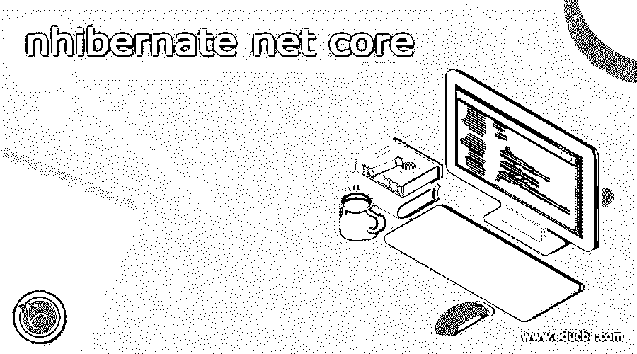
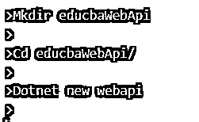
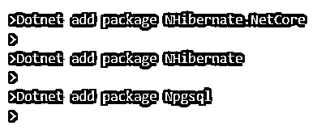
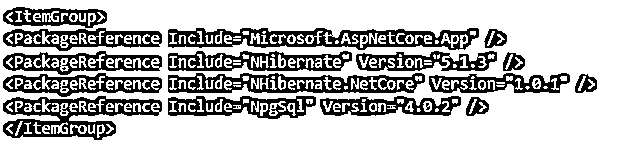
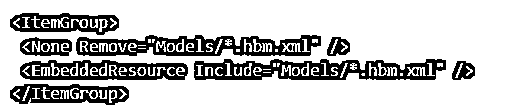
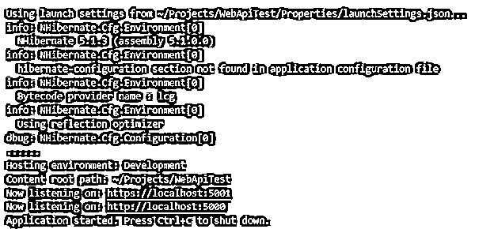

# 纳米纤维网芯

> 原文：<https://www.educba.com/nhibernate-net-core/>

## nhibernate 网络核心简介

NHibernate 是 ORM，一个在 ASP.Net 核心上工作的对象关系平台。因此，我们可以毫不费力地在 Linux 服务器上部署在 ASP.NET 开发的使用 NHibernate 的核心项目。该应用程序的工作方式与它在 windows 平台上的工作方式相同。在这篇文章中，我们将会看到什么是 NHibernate net core，created net core，使用它和它的核心方法，以及借助例子实现它。

### 什么是 nhibernate 网芯？

NHibernate net core 是指使用 NHibernate 和 ASP.Net 创建的应用程序可以在 Linux 或 Windows 平台上同等高效地工作。使用开发时，它也可以被视为 NHibernate 应用程序的扩展。网芯。此外，NHibernate 可与标准一起使用。Net 2.0 版本，这意味着我们可以将 NHibernate 与。Net core 2.0，我们将在本文中使用它。

<small>网页开发、编程语言、软件测试&其他</small>

### 创建了 nhibernate 网络核心

NHibernate net core 是一个开源的对象关系映射器，对您的实时项目非常有用。创建的库可以添加到您的项目中，只需使用 github 链接 https://github.com/nhibernate/nhibernate-core,，在这里您可以找到完整的 NHibernate 项目。

### 使用 nhibernate 网络核心

当您将 NHibernate 与。Net core，您必须执行以下任务才能使用它

*   设置系统的配置可以简单地通过添加属性来完成，而无需更改 hibernate.cfg.xml 或 app.config 中的任何内容。
*   注册 NHibernate 后，您必须执行依赖感染，并在您的服务文件中设置 ISession 和 ISessionFactory 类。
*   下一步将初始化会话工厂，即类 SessionFactory。同样，如果您在系统中使用 Nuget 包，这一步变得非常容易。
*   现在，您可以在您的核心 ASP.Net 项目中使用 NHibernate 了。

### 纳米纤维网芯法

使用网络核心的方法如以下步骤所述

*   首先，通过使用下面的命令，我们可以创建一个 Web API 的应用程序，它将具有。网络核心–

`Mkdir educbaWebApi
Cd educbaWebApi/
Dotnet new webapi`

执行上述命令的输出如下所示

*   现在，您可以添加 NHibernate 包和对应于数据库的驱动程序。例如，考虑添加 Npgsql 包。相同的命令如下所示

`Dotnet add package NHibernate.NetCore
Dotnet add package NHibernate
Dotnet add package Npgsql`

以上命令的输出如下所示

*   现在，您可以打开名为 educbaWebApi.csproj 的项目文件，并检查我们添加的包是否已添加到文件中。我这边的文件如下所示

*   现在，是时候在项目中创建模型的目录以及映射 XML 文件和实体的相应类了。该文件的代码可能如下所示

`namespace EMPNHibernate.Models
{
public class Employee
{
public virtual int writer_id { get; set; }
public virtual string f_name { get; set; }
public virtual string l_name { get; set; }
public virtual string email_id { get; set; }
public virtual string mobile_number { get; set; }
public virtual string join_date { get; set; }
public virtual string domain_id { get; set; }
public virtual string pay_amount { get; set; }
public virtual string guide_id" />
public virtual string department_id" />
}
}`

对应于上述用于映射的实体类文件的 XML 文件将如下所示

`<?xml version="1.0" encoding="utf-8" ?>
<hibernate-mapping auto-import="true" assembly="EducbaWriterHiber" namespace="EducbaWriterHiber.Models">
<class name="Educba_writers" table="Educba_writers" dynamic-update="true" >
<cache usage="read-write"/>
<id name="Id" column="writer_id" type="int">
<generator class="native" />
</id>
<property name="f_name" />
<property name="l_name" />
<property name="email_id" />
<property name="mobile_number" />
<property name="join_date" />
<property name="domain_id" />
<property name="pay_amount" />
<property name="guide_id" />
<property name="department_id" />
</class>
</hibernate-mapping>`

这是使用 NHibernate 时最常见的做法，而且有许多文档可以使用，无需考虑太多。

*   只需打开名为 educbaWebApi.csproj 的项目文件，并向其中添加一个名为 ItemGroup 的新节点，就可以编译 XML 映射文件以形成一些嵌入式资源。这可以通过使用下面的代码来完成

*   我们不会创建一个新文件来设置 NHibernate 的配置，并进一步安排这样一个系统，该文件将被进一步复制到输出目录。配置文件的代码如下所示

`<?xml version="1.0" encoding="UTF-8"?>
<hibernate-configuration >
<session-factory>
<property name="dialect">NHibernate.Dialect.PostgreSQL83Dialect</property>
<property name="show_sql">true</property>
<property name="adonet.batch_size">10</property>
<property name="connection.driver_class">NHibernate.Driver.NpgsqlDriver</property>
<property name="connection.connection_string">server=localhost;database=educba_writers;user id=payal;password=GreatEducba;</property>
<property name="format_sql">true</property>
<mapping assembly="NaturalReserveApi" />
</session-factory>
</hibernate-configuration>`

*   现在，您已经准备好打开项目的文件，并使用下面的代码在代码中添加 ItemGroup 节点

`<?xml version="1.0" encoding="UTF-8"?>
<hibernate-configuration >
<session-factory>
<property name="dialect">NHibernate.Dialect.PostgreSQL83Dialect</property>
<property name="show_sql">true</property>
<property name="adonet.batch_size">10</property>
<property name="connection.driver_class">NHibernate.Driver.NpgsqlDriver</property>
<property name="connection.connection_string">server=localhost;database=educba_writers;user id=payal;password=GreatEducba;</property>
<property name="format_sql">true</property>
<mapping assembly="NaturalReserveApi" />
</session-factory>
</hibernate-configuration>`

现在，您可以将 Itemgroup 的新节点添加到项目的文件中，如下所示

`<ItemGroup>
<Content Update="hibernate.config">
<CopyToOutputDirectory>Always</CopyToOutputDirectory>
</Content>
</ItemGroup>`

*   您现在需要将内置的依赖注入框架集成到。Net，方法是更改 startup.cs 文件。您必须通过添加以下两条语句来更改文件的 using 部分

`using NHibernate.NetCore;`

`using Microsoft.Extensions.Logging;`

*   在项目文件的构造函数中执行某些更改，并编写以下代码

`public Educba(
IConfiguration sampleConfig,
ILoggerFactory sampleFactory
) {
Configuration = sampleConfig;
sampleFactory.UseAsHibernateLoggerFactory();
}`

现在，在配置服务方法中执行某些更改，以便可以添加与 NHibernate 相关的新服务

`public void ConfigureServices(IServiceCollection sampleEducbaService) {
var samplePath = System.IO.Path.Combine(
AppDomain.CurrentDomain.BaseDirectory,
"hibernate.config"
);
sampleEducbaService.AddHibernate(samplePath);
sampleEducbaService.AddMvc()
.SetCompatibilityVersion(CompatibilityVersion.Version_2_1);
}`

*   我们现在需要更改设置为默认值的值控制器。更改构造函数，注入会话工厂的需求，然后就可以使用 NHibernate 了。让我们更改构造函数，并在其中注入 ISessionFactory

`public ValuesController(ISessionFactory sampleValue) {
this.factory = sampleValue;
}
Perform certain changes in the get method of the query of NHibernate –
[HttpGet] public ActionResult<IEnumerable<GpsPosition>> Get() {
using (var sampleEducbaSess = factory.OpenSession()) {
var sampleStatement = sampleEducbaSess.Query<GpsPosition>();
return sampleStatement.ToList();
}
}`

*   最后一步是编译项目，运行它并检查输出。为此，您可以使用以下陈述

`Dotnet run`

在 NHibernate 的初始化信息输出中，我们可以观察到以下结果

### Nhibernate 网络核心示例

为了理解它的实现，您可以理解上面在核心方法部分提到的例子。然后，我们可以观察实体的类文件、XML 映射文件、DB 上下文以及实现的主文件、服务文件和控制器。

### 结论

NHibernate 是一个成熟的对象关系映射器，在中提供了支持和实现。Net 应用程序。这篇文章给出了同样的细节。

### 推荐文章

这是一个 nhibernate 网络核心指南。在这里，我们将讨论 nhibernate net core 的实现以及示例和输出。您也可以看看以下文章，了解更多信息–

1.  [一对一冬眠](https://www.educba.com/hibernate-one-to-one/)
2.  [多对多冬眠](https://www.educba.com/hibernate-many-to-many/)
3.  [冬眠发生器](https://www.educba.com/hibernate-generator/)
4.  [休眠工具](https://www.educba.com/hibernate-tools/)

