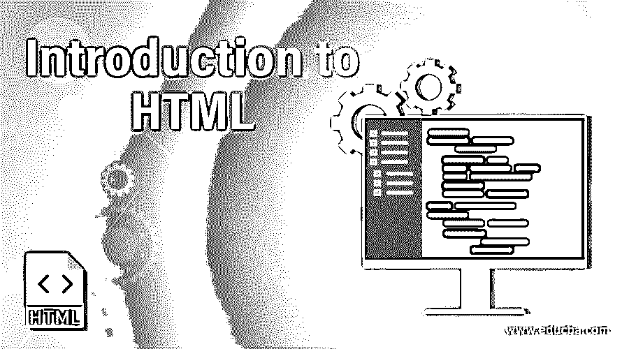
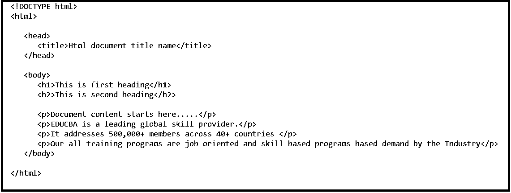
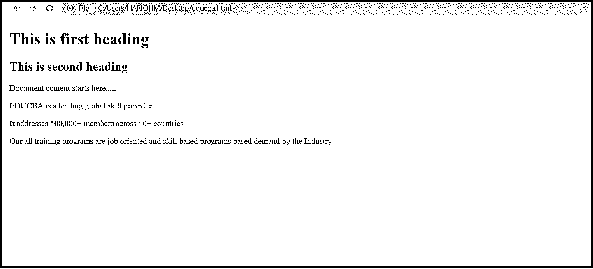

# HTML 简介

> 原文：<https://www.educba.com/introduction-to-html/>

## HTML 简介

以下文章提供了 HTML 入门的大纲。人们无法想象没有 HTML 的网页和万维网。HTML 是广泛用于编写网页的语言。它代表超文本标记语言。网页上可用的任何链接通常被称为超文本，标记是指标签或页面的结构，以便网页中列出的文档可以以结构化的格式查看。开发 HTML 的目的是理解任何文档的结构:标题、正文、内部内容或段落。所以，基本上，HTML 提供了一种显示网页内容的结构化格式。非常简单易懂。在 90 年代早期，它是由 Tim Berners–Lee 开发的，后来经历了多次修改和调整。HTML 5 是最新的 HTML 版本。

基本的 HTML 代码摘录如下所示:

<small>网页开发、编程语言、软件测试&其他</small>

### HTML 的主要组成部分

*   已经说过 HTML 是一种可以使用多个标签来格式化内容的标记语言。所有标签都包含在尖括号<tagname>中。除了少数标签，大部分标签都是以尖括号开头，以相应的尖括号结尾。</tagname>
*   定义文档类型和 Html 版本。从上面截图可以看出，Html 代码开始于角度标签之后，结束于。
*   它通常有两个主要部分，即头部和身体。每个部分都有自己的相关元素和要求。

#### 1.头部

Head 标签表示 web 文档的头部，可以容纳<title>和<link/>标签。以开始，以结束。它里面有标题组件。</title>

#### 2.标题

每个文档至少有一个标题。从上面的截图中，我们可以看到标题部分以<title>开始，以</title>结束，在这两者之间，根据需要输入文档标题的名称。从上面可以理解，需要打开角括号，关闭角括号，将标题名放在中间。这种有角度的打开和关闭几乎适用于 html 中的所有标签。

#### 3.船体分段

这一部分代表 web 文档的主体，通常包含标题、文本和段落。标题以<heading>开始，以</heading>结束。在这些标签之间，内容可以写为“这是第一个标题”。

段落将以

开始，以

结束。段落的内容应该写在这些尖括号内。

概述部分显示的基本 Html 代码用于构建一个简单的 Html 页面。当这段 html 代码在浏览器中打开时，看起来如下所示:

尽管有多种语言和组件可用于开发网页，但 Html 仍然是开发网页的首选和最简单的方法。

### HTML 的特征

下面给出了 HTML 的特征:

*   Html 是最简单的语言，易于理解和修改。
*   它提供了设计网页的灵活性，使得网页上所有列出的文档都可以进行结构化显示。
*   格式化标签可以用于 web 门户中的有效表示，这可能是因为 HTML 的缘故。
*   可以将多个链接添加到网页中，以便使用列出的链接轻松地重定向到其他页面。
*   HTML 最重要的部分是，它可以在 Macintosh、Windows 和 Linux 中显示，并支持所有环境。Html 是独立于平台的。
*   为了让我们的网页看起来更有吸引力，声音、图片和视频也可以加入 HTML。

### 应用程序

哪里有网络，哪里就有 HTML。HTML 的应用遍及所有电子设备。

*   Chrome、Firefox、Safari 等浏览器都使用 HTML 来提供网页内容，以便更好地显示。
*   不同的移动浏览器，如 Opera、Firefox focus、Microsoft edge、dolphin 和 puffin，都使用 HTML 来更好地呈现和显示移动互联网内容。
*   不同的智能设备都嵌入了 HTML 功能，以便在操作过程中更好地浏览和导航。
*   HTML 支持任何网页的主要认证通道机制，以阻止不必要的流量。
*   HTML 可以容纳大量的内容，但是对于小屏幕设备和大屏幕设备来说具有相同的可视性。

### HTML 的优点和缺点

下面给出了提到的优点和缺点:

#### 优势:

*   HTML 是独立于平台的。
*   它在全球范围内被广泛接受。
*   每个浏览器都支持 HTML。
*   易于学习、使用和修改。
*   默认情况下，它可以在所有的浏览器中使用，所以不需要购买和安装。
*   Html 对于网页设计领域的初学者来说非常有用。
*   它支持多种颜色、格式和布局。
*   它使用模板，使网站设计更容易。
*   [Html 和 XML](https://www.educba.com/html-vs-xml/) 语法非常相似，所以在这两个平台之间工作很容易。
*   FrontPage、Dreamweaver 和多种开发工具都支持 HTML。
*   Html 是最友好的搜索引擎。

#### 缺点:

*   Html 仅用于创建普通页面或静态页面。如果一个人想要动态页面，那么 HTML 是没有用的。因此，Html 不能用于动态输出。
*   有时候，HTML 的结构化很难把握。
*   制作一个简单的网站需要多行代码。
*   如果需要为更简单的事情编写多行代码，就会增加复杂性，花费更多时间。
*   它的错误代价高昂，因为一个小小的打字错误就可能导致网页无法运行。
*   Html 可以用于网络上的第一步认证，但是它不够健壮。所以，Html 的安全特性并不好，它只提供了有限的安全性。
*   为了更好地呈现网页和 Html，需要学习其他语言，比如 CSS。

### 推荐文章

这是一个 HTML 入门指南。这里我们讨论了 HTML 的组成、应用、优点和缺点。您也可以阅读以下文章，了解更多信息——

1.  [备忘单 HTML](https://www.educba.com/cheat-sheet-html/)
2.  [什么是 HTML](https://www.educba.com/what-is-html/)
3.  [HTML 命令](https://www.educba.com/html-commands/)
4.  [HTML 中不同的列表样式](https://www.educba.com/html-list-styles/)

