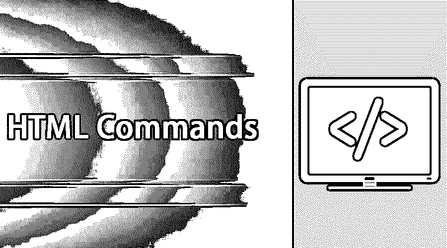
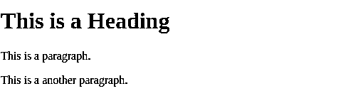
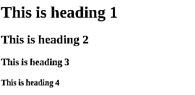
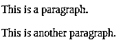
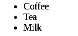
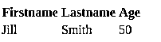
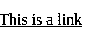
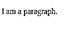
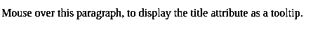
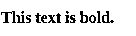

# HTML 命令

> 原文：<https://www.educba.com/html-commands/>




## HTML 命令简介

HTML 的意思是[超文本标记语言](https://www.educba.com/uses-of-html/)，是网页的标准标记语言。 [HTML 将有元素](https://www.educba.com/introduction-to-html/)，属性和其他标签。互联网上的大多数网站都使用 HTML。HTML 简单易学，功能强大。超文本是我们在网上移动的主要方式，通过[点击超链接](https://www.educba.com/remove-hyperlinks-in-excel/)可以重定向到另一个页面。标记通过将测试标记为某种类型，使用 HTML 标签显示其中的文本。HTML 命令元素是一个 [HTML](https://www.educba.com/html-style-sheets/) 页面的构建块，可以有属性提供关于元素的附加信息，并且属性将成对出现。

### 基本 HTML 命令

基本命令如下:

<small>网页开发、编程语言、软件测试&其他</small>

#### 1.写一个 HTML 文档语法示例？

样本 HTML 文档将具有 HTML 元素，它们是网页的[构建块，并且一些 HTML 元素是作为根元素的< html >、将具有元信息的< meta >、包含文档标题的< title >和包含文档数据的< body >。](https://www.educba.com/web-page-design-layout/)

**代码:**

```
<!DOCTYPE html>
<html lang="en">
<meta charset="utf-8">
<title>Page Title</title>
<body>
<h1>This is a Heading</h1>
<p>This is a paragraph.</p>
<p>This is another paragraph.</p>
</body>
</html>
```

**输出:**




#### 2.关于 HTML 标题的解释？

HTML 标题是用标签

# 到

###### 定义的 HTML 元素，其中

# 定义最重要的标签，

###### 定义不太重要的标签。

**标题如下的 HTML 代码示例:**

```
<h1> This is heading1 </h1>
<h2> This is heading2 </h2>
<h3> This is heading3 </h3>
<h4> This is heading4 </h4>
```

**输出:**




#### 3.关于 HTML 元素段落的解释？

HTML 段落是一个 HTML 元素，将使用标签

和示例代码进行定义，如下所示:

```
<p> This is a paragraph </p>
lt;p> This is another paragraph </p>
```

**输出为:**




#### 4.如何在 HTML 文档中定义 HTML images 元素？

[HTML images](https://www.educba.com/html-image-tags/) 是一个 HTML 元素，用标签< img >定义，我们需要提到图像的 src 等属性，alt 表示可选文本，要显示的图像的宽度和高度，示例代码是

**代码:**

```

```

**输出:**


#### 5.解释在 HTML 文档中列表是如何定义的？

[HTML 列表](https://www.educba.com/html-list-styles/)是 HTML 元素，使用标签< ul >或< ol >定义，其中< ul >是无序列表，< ol >是[有序列表](https://www.educba.com/html-ordered-list/)

**代码:**

```
<ul>
<li> Coffee</li>
<li> Tea </li>
<li> Milk </li>
</ul>
```

**输出:**




#### 6.如何在 HTML 文档中创建表格？

HTML 表格是一个 HTML 元素，可以使用标签和带有标签的行以及带有标签

| Cell to define, the code is as follows: |

**代码:**

```
<table>
<tr>
<th>Firstname</th>
<th> Lastname</th>
<th>Age</th>
</tr>
<tr>
<td>Jill</td>
<td>Smith</td>
<td>50</td>
</tr>
</table>
```

**输出:**




#### 7.如何在 HTML 文档中提到一个链接？

HTML 链接是 HTML 元素，可以使用标签

**代码:**

```
<a href=”https://www.w3schools.com”>This is a link </a>
```

**输出:**




#### 8.为什么要在 HTML 文档中使用 style 属性？

[HTML 属性样式](https://www.educba.com/html-style-attribute/)可以与任何 HTML 元素组合使用，如< p >，示例代码如下:

**代码:**

```
<p style=”color:red”> I am a paragraph </p>
```

**输出:**




#### 9.HTML 文档中 lang 属性的意义是什么？

在 HTML 中，使用 lang 属性，我们可以用标签声明文档的语言，语言是用 lang 属性定义的，示例代码如下:

**代码:**

```
<!DOCTYPE html>
<html lang=”en-US”>
<body>
...
...
</body>
</html>
```

**输出:**




#### 10.如何格式化 HTML 文档中的 HTML 元素？

在 HTML 中，我们可以使用格式化元素来格式化 HTML 文档，并且我们可以为具有特殊含义的文本定义特殊元素。HTML 元素，比如用**表示粗体，*表示斜体***

**代码:**

```
<b> This text is bold </b>
```

**输出:**




### 中间 HTML 命令

中间命令如下:

#### 1.如何突出显示 HTML 文档中的一些文本？

在 HTML 中，我们可以使用元素<mark>突出显示 HTML 文档中的一些文本，以便它突出显示包含在<mark>元素中的文本，示例代码如下:</mark></mark>

```
<html><body>
<h2> html <mark> Marked </mark> formtting </h2>
</body></html>
```

#### 2.如何删除 HTML 文档中的一些文本？

在 HTML 中，我们可以使用~~元素删除一些文本，这样就删除了这个元素之间的文本，示例代码如下:~~

`<html><body>
<p> My favorite color is <del> Navy blue </del> Red </p>
</body></html>`

#### 3.如何定义 HTML 文档中的上标文字？

在 HTML 中，我们可以使用 HTML 文档中的元素<sup>将文本定义为上标，这样<sup>元素中包含的文本将被上标，示例代码如下:</sup></sup>

```
<html><body>
<p> This is <sup> superscripted </sup> text </p>
```

#### 4.如何在 HTML 文档中定义缩写？

在 HTML 中，我们可以在 HTML 文档中使用 HTML 元素<abbr>来定义缩写，这将为浏览器提供有用的信息，示例代码如下:</abbr>

```
<html><body>
<p> The <abbr title=”World Health Organization” >WHO </abbr> was founded in 1948 </p>
</body></html>
```

#### 5.如何在 HTML 文档中提及地址？

在 HTML 中，我们可以使用 HTML 元素

<address>在 HTML 文档中提及地址，该元素定义了与文章或文档相关的联系信息或地址，并以斜体显示，示例代码如下:</address>

```
<html><body>
<address>
Written by Srinivas <br>
dasu.com <br>
Pincode : 500084, Hyderabad <br>
India
</address>
</body></html>
```

### 高级 HTML 命令

高级命令如下:

#### 1.如何在 HTML 文档中显示网页内部的网页？

在 HTML 中，我们可以使用 HTML iframe 在网页中显示网页，并使用标签<iframe>进行定义，src 属性指定网页的 URL，示例代码如下:</iframe>

```
<html><body>
<iframe src=”demo.html” height=”300” width=”300” > </iframe>
</body></html>
```

#### 2.如何在 HTML 文档中使用 iframe 定位到不同的目标？

在 HTML 中，我们可以使用 HTML 文档中的 iframe 标记将目标框架用作链接，链接的目标属性必须引用 iframe 的 name 属性，示例代码如下:

```
<html><body>
<iframe src=”demo.html” name=”iframe1”> </iframe>
<p> <a href=”www.google.com” target=”iframe1”> Google.co.in </a> </p>
</body></html>
```

### 使用 HTML 命令的提示和技巧

*   通过添加额外的代码使你的访问者允许改变文本颜色或背景。
*   编写 HTML 文档时添加元数据。
*   隐藏一些我们不希望用户编辑的字段是很好的做法。
*   总是添加一条水平线来分隔长的部分，这样网站看起来会更好。

### 结论

最后，它的所有关于不同类型的 HTML 命令的不同水平是简要讨论与例子。我希望你看完这篇文章后会有一个好主意，知道如何使用 HTML 命令。

### 推荐文章

这是 HTML 命令的指南。这里我们讨论了概念、基本、中级和高级 HTML 命令以及有效使用的技巧和诀窍。您也可以阅读以下文章，了解更多信息——

1.  [HTML 中的 Alt 标签](https://www.educba.com/alt-tag-in-html/)
2.  [HTML 列表样式](https://www.educba.com/html-list-styles/)
3.  [HTML 无序列表](https://www.educba.com/html-unordered-list/)
4.  [HTML 中的框架标签](https://www.educba.com/frame-tag-in-html/)


