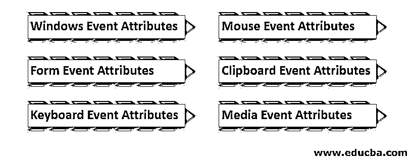

# HTML 事件

> 原文：<https://www.educba.com/html-events/>

## HTML 事件简介

在使用 HTML 脚本(超文本标记语言)创建的网页或网站中，用户和 web 工具本身执行的每个动作都被称为 HTML 事件。该描述包含每个事件的六种属性:窗口事件属性、表单事件属性、键盘事件属性、鼠标事件属性、媒体事件属性和剪贴板事件属性。这些事件属性中的每一个都有特定的专用属性，用于获取 HTML 事件的详细信息。

### 不同类型的 HTML 事件

HTML5 中有许多可用的事件属性，主要分为 6 种不同的类型。这些属性使用 JavaScript 语言工作。

<small>网页开发、编程语言、软件测试&其他</small>

*   **Windows 事件属性:**这是为 Windows 对象的动作提供的。它在身体标签<身体>中工作。
*   **表单事件属性:**如果用户在表单中执行一些动作，比如输入数据、取消、提交，那么这些事件属性就会起作用。
*   **键盘事件属性:**该键盘事件属性用于键盘动作和用户交互。
*   **鼠标事件属性:**鼠标事件属性，用于移动、点击、滚轮等鼠标动作。
*   **剪贴板事件属性:**此事件属性用于剪贴板动作:例如，剪切、复制、害虫。
*   **媒体事件属性:**该事件属性作用于视频等媒体文件。

### 事件属性的描述

以下是对事件属性的一些解释，详细内容如下:

#### 1.Windows 事件属性

| **属性** | **描述** |
| **onafterprint** | 不过，这个脚本在文档打印出来后运行。 |
| **onbeforeprint** | 不过，这个脚本在文档打印之前就开始工作了。 |
| **onbeforeunload** | 而在卸载文档之前，这个脚本是有效的。 |
| **一个错误** | 文档中发生错误，然后执行此事件。 |
| **onhashchange** | 时间事件执行的文档中 URL 更改的锚部分。 |
| **加载** | 当第一个网页被完全加载时，这个事件被执行。 |
| **onmessage** | 在文档中，事件执行时出现的消息。 |
| **onoffline** | 如果网络连接不可用，浏览器显示脱机，则执行该事件。 |
| **在线** | 当网络在浏览器中可用时，则事件被执行。 |
| **onpagehide** | 这个剧本表演；如果用户没有在当前网页上工作，则当时的当前页面可以被隐藏。 |
| **onpageshow** | 该脚本在加载当前网页时运行。 |
| **onpopstate** | 对于历史状态更改，此脚本会自动在浏览器上运行。 |
| **无记忆** | 当窗口的浏览器改变窗口大小时，这个脚本就会运行。 |
| **onstorage** | 当用户的 web 存储更新时，事件被执行。 |
| **他的上传** | 没有加载用户的当前网页或关闭窗口，则执行该事件。 |

#### 2.表单事件属性

| **属性** | **描述** |
| **onblur** | 一些[表单验证对象](https://www.educba.com/javascript-form-validation/)失去焦点，然后事件被触发。 |
| **onchange** | 表单中的值发生变化，然后触发事件。 |
| **聚焦** | 在<input>、 |
| **oninput** | 用户在表单中输入值，然后触发该事件。 |
| **钙离子有效性** | 当元素不满足其预定义的约束时，事件继续工作。 |
| **正在重置** | 用户重置表单信息，然后触发事件。 |
| **onsearch** | 用户搜索必填字段，然后触发事件。 |
| **on 选择** | 用户选择表单中的文本或文本区域，然后触发事件。 |
| **onsubmit** | 用户在最后提交表单，然后事件被触发。 |

#### 3.键盘事件属性

| **属性** | **描述** |
| **叔叔家** | 使用键盘，用户在事件发生时按下键 |
| **有一台印刷机** | 使用键盘，用户按下键并在事件发生时显示字符。 |
| **onkeyup** | 按下后，键用户释放键，然后事件工作。 |

#### 4.鼠标事件属性

| **属性** | **描述** |
| **onclick** | 用户在按钮上点击鼠标，然后事件发生。 |
| **波浪点击** | 用户双击鼠标，然后事件发生。 |
| **是 mousedown** 的缩写 | 用户在元素上按下鼠标按钮，然后事件发生。 |
| **onmousemove** | 用户将鼠标指针移动到元素上，然后事件发生。 |
| **onmouseout** | 用户将鼠标移出元素，然后事件发生。 |
| **onmouseover** | 用户将鼠标移动到元素上，然后事件发生。 |
| **是 mouseup** 的缩写 | 用户释放鼠标按钮，然后事件发生。 |
| **onmousewheel** | 使用鼠标滚轮，用户上下滚动元素，然后事件发生。 |
| **车轮上** | 使用鼠标滚轮用户上下滚动它们，然后事件发生。 |

#### 5.剪贴板事件属性

| **属性** | **描述** |
| **oncopy** | 用户使用鼠标复制内容，然后事件发生。 |
| **oncut** | 使用鼠标，用户剪切内容，然后事件发生。 |
| **onpaste** | 使用鼠标用户，粘贴内容，然后一个事件发生了。 |

#### 6.媒体事件属性

| **属性** | **描述** |
| 奥纳博特 | 当媒体文件中止下载并再次播放时，会发生一个事件。 |
| **oncanplay** | 当任何媒体文件准备好播放时，触发该触发器。 |
| **在线播放** | 无需缓冲和加载即可播放的媒体文件。 |
| **oncuechange** | 元素改变了<track>的提示，然后事件被触发。 |
| 波浪变化 | 媒体文件改变触发触发器的时间长度。 |
| **一个提示** | 如果媒体文件不可用并出现致命错误，则触发器被触发。 |
| **合二为一** | 媒体文件到达端点，然后触发触发器。 |
| **一个错误** | 当获取媒体文件出错时，触发器被触发 |
| **上传数据** | 媒体文件加载数据，然后触发触发器。 |
| **onloadedmetadata** | 媒体文件加载元数据，然后触发触发器。 |
| **onloadstart** | 媒体文件开始加载，然后触发器被触发。 |
| **开启原因** | 媒体文件暂停播放，然后触发触发器。 |
| **onplay** | 媒体文件准备好播放，然后触发触发器。 |
| **onplaying** | 触发触发器时，媒体文件开始播放。 |
| **onprogress** | 当浏览器正在连接媒体数据时，该脚本起作用。 |
| **onratechange** | 如果视频回放速度改变，则触发触发器。 |
| **接通** | 用户已完成移动；否则，跳过视频的新位置。此属性设置为 false。 |
| **开始** | 用户想要移动；否则，跳过视频的新位置。此属性设置为 true。 |
| **已安装的** | 当浏览器突然停止连接数据时，事件就会起作用。 |
| **暂停** | 当 web 浏览器故意不获取媒体数据时，事件就会起作用。 |
| **ontimeupdate** | 当用户向前和向后改变视频播放位置时。 |
| **onvolumechange** | 将媒体音量由低变高。 |
| **等待中** | 如果数据加载信息，当前视频停止缓冲，然后事件工作。 |

### 结论

Html 事件是一种在 web 浏览器和用户之间采取行动和接口的简单方式。用户可以毫不费力地获得每个动作的反应。例如，剪贴板的剪切和复制，鼠标的移动和单击，表单的按钮。事件[让 web 应用](https://www.educba.com/what-is-web-application/)实时化，让智能工作系统化。

### 推荐文章

这是一个 HTML 事件的指南。在这里，我们讨论了 HTML 事件的介绍和类型，如窗口、窗体、键盘等等，并详细解释了属性。你也可以看看下面的文章来了解更多-

1.  [基本 HTML 标签](https://www.educba.com/basic-html-tags/)
2.  [HTML 的优势](https://www.educba.com/advantages-of-html/)
3.  [HTML 格式标签](https://www.educba.com/html-format-tags/)
4.  [HTML 样式表](https://www.educba.com/html-style-sheets/)

