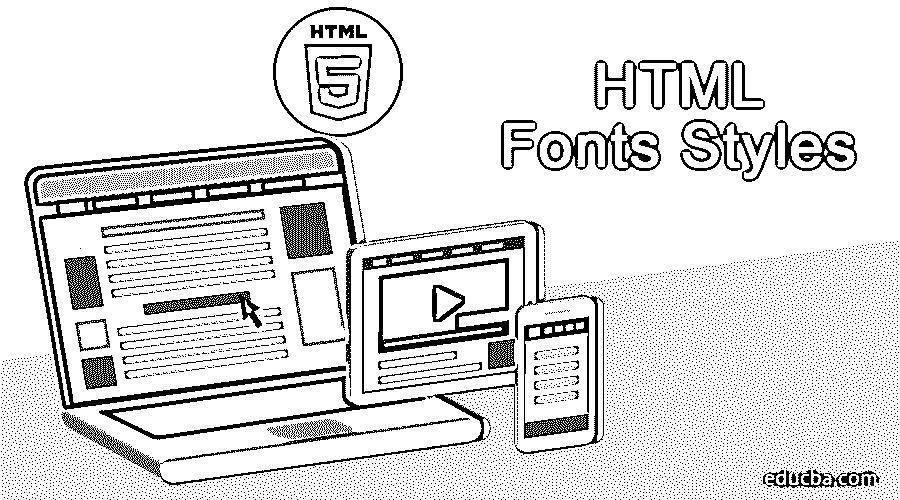

# HTML 字体样式

> 原文：<https://www.educba.com/html-fonts-styles/>




## HTML 字体样式介绍

下面这篇文章，HTML 字体样式，提供了 HTML 中最常用的字体样式的概要。HTML，通常被称为超文本标记语言，是创建网络应用程序和网站最重要的语言或脚本之一。这就像是 web 应用程序开发的主干，因为所有的标签和其他特性构成了它的底层组件。

所有的[前端开发](https://www.educba.com/front-end-developer-interview-questions/)也是基于 HTML 脚本。这只能用来提供标记标签，为了增强这些标签的外观，我们有另一个非常流行的库，CSS，它代表[级联样式表](https://www.educba.com/what-is-css/)。这可以用来实现 HTML 所需的所有类型的样式。字体和样式构成了网站的主要部分，在这篇文章中，我们将为您提供一个大多数 HTML 字体样式的列表。

<small>网页开发、编程语言、软件测试&其他</small>

### HTML 字体样式

除了增加内容可读性之外，字体在使网站更加用户友好和吸引更多流量方面起着重要作用。字体颜色和字体外观也取决于使用它的电脑和浏览器，HTML <font>标签也用于为网站上的文本添加样式、颜色和大小。</font>

标签用来将所有出现在你的网站上或者在元素中的文本设置成相同的大小、颜色和字体。字体标签由三个属性组成:字体颜色和大小，这也是网站中不同字体风格的重要组成部分。

<font>标签是最常用也是最重要的标签之一，可以用来为你的网页建立一个好的外观。跟随在打开的<font>标签之后的文本将保持同样的方式，直到被</font>标签关闭。</font>

### 让我们看看一些基本的 HTML 字体样式:

HTML 字体样式有一些基本的特性和特征，它们是:

#### 1.设置字体大小

可以利用大小属性来设置内容字体大小。该范围的可接受值从 1(最小的数字)到 7(最大的数字)。任何字体类型的默认大小都是 3。

**例，**

```
<!DOCTYPE html>
<html>
<head>
<title>Setting Basic Font Size</title>
</head>
<body>
<font size = "1">Font size = "1"</font><br />
<font size = "2">Font size = "2"</font><br />
<font size = "3">Font size = "3"</font><br />
<font size = "4">Font size = "4"</font><br />
<font size = "5">Font size = "5"</font><br />
<font size = "6">Font size = "6"</font><br />
<font size = "7">Font size = "7"</font>
</body>
</html>
```

#### 2.相对字体大小

相对字体大小用于确定和指定比实际存在的当前字体大小大多少以及小多少。这可以指定为:

```
<font size = "+f"> or by writing <font size = "−f">
```

**例，**

```
<!DOCTYPE html>
<html>
<head>
<title>Relative Font Size</title>
</head>
<body>
<font size = "-1">Font size = "-1"</font><br />
<font size = "+1">Font size = "+1"</font><br />
<font size = "+2">Font size = "+2"</font><br />
<font size = "+3">Font size = "+3"</font><br />
<font size = "+4">Font size = "+4"</font>
</body>
</html>
```

#### 3.设置字体

字体大小和相对字体大小设置之后的另一个类别是字体设置。这构成了上面列出的属性的关键部分。这可以通过使用 face 属性来设置，但是应该记住，如果被指定使用这个字体值的用户没有在他们的系统中安装这个字体，他们将看不到它。相反，只有适用于该特定用户计算机的默认字体才是可见的。

**例，**

```
<!DOCTYPE html>
<html>
<head>
<title>Font Face</title>
</head>
<body>
<font face = "Times New Roman" size = "5">Times New Roman</font><br />
<font face = "Verdana" size = "5">Verdana</font><br />
<font face = "Comic sans MS" size =" 5">Comic Sans MS</font><br />
<font face = "WildWest" size = "5">WildWest</font><br /&gt
<font face = "Bedrock" size = "5">Bedrock</font><br />
</body>
</html>
```

#### 4.指定替代字体

*   仅当用户的系统上安装了特定的字体时，这才用于指定各种字体；否则，将会看到默认安装的字体。通过列出字体名称，可以提到一个以上，特别是两个或两个以上的可选字体，字体名称之间用逗号隔开。
*   当网页被加载时，浏览器将负责显示有史以来第一个生成的字体。如果系统中没有安装所提供的字体，那么将成功显示默认字体，即 Times New Roman。

**例，**

```
<font face = "arial,helvetica">
<font face = "Lucida Calligraphy,Comic Sans MS,Lucida Console">
```

#### 5.设置字体颜色

这是形成 HTML 字体和样式列表的关键部分和组件的另一个属性。在这种字体中，颜色是利用任何颜色属性设置的；所要求的颜色可以通过使用十六进制代码和指定颜色的[颜色名称来要求。](https://www.educba.com/color-name-in-html/)

**例，**

```
<!DOCTYPE html>
<html>
<head>
<title>Setting Font Color</title>
</head>
<body>
<font color = "#FF00FF">This text is in pink</font><br />
<font color = "red">This text is red</font>
</body>
</html>
<basefont>
```

#### 6.元素

*   这个元素是特定于 HTML 语言的，应该为网页提供默认的字体大小、字样和颜色，用于不包含在<font>标签中的文档的所有部分和组件。</font>
*   <font>标签可以很容易地用来覆盖<basefont>设置。</font>
*   该标签还利用了颜色、字体和大小属性，这些属性通过为一个较大的尺寸提供值+1 或为两个较小的尺寸提供值-2 来相对支持所有的字体设置。

**例，**

```
<!DOCTYPE html>
<html>
<head>
<title>Setting Basefont Color</title>
</head>
<body>
<basefont face = "arial, verdana, sans-serif" size = "2" color = "#ff0000">
<p>This is the page's default font.</p>
<h2>Example of the &lt;basefont&gt; Element</h2>
</body>
</html>
```

### 结论

HTML 字体和样式是不可忽视的最重要的组成部分和特征，可以给你的网站一个非常好的形状和设计。当我们谈到市场上最新的 javascript 库时，它们包含了所有这些以及其他几种字体和样式。对于基本的 HTML，这仍然需要手动完成。我希望你喜欢我们的文章。请继续关注我们的博客，获取更多类似的文章。

### 推荐文章

这是一个 HTML 字体样式的指南。这里我们讨论了 HTML 的一些基本字体的介绍和详细的解释，并举例说明。您也可以浏览我们推荐的其他文章，了解更多信息——

1.  [HTML 样式表](https://www.educba.com/html-style-sheets/)
2.  [HTML 属性](https://www.educba.com/html-attributes/)
3.  [HTML 列表样式](https://www.educba.com/html-list-styles/)
4.  [HTML 块](https://www.educba.com/html-blocks/)


