# HTML 表单控件

> 原文：<https://www.educba.com/html-form-controls/>

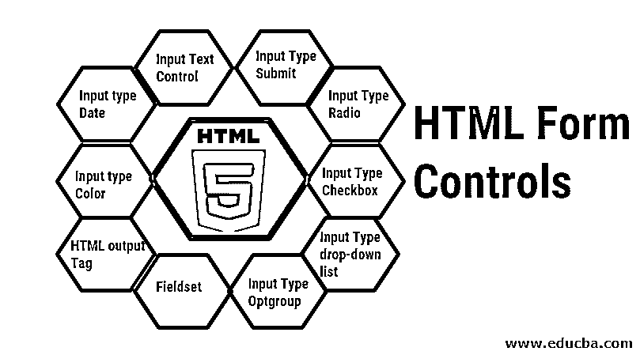

## HTML 表单控件简介

HTML 是网页创建的标记语言。它定义了网页的结构和行为。HTML 由帮助构建网页的标签和元素组成。这些元素可以组合在一个表单中，以用户友好的方式从用户那里收集数据。但是，请注意，HTML 是一种无状态协议，这意味着它不能存储任何内容，并且您将在页面刷新时丢失数据。

### HTML 表单控件

HTML 中定义了各种类型的[表单控件](https://www.educba.com/html-form-elements/)；这些控件负责以指定的方式接受用户输入。让我们来看看 HTML 中各种类型的可用表单控件。

<small>网页开发、编程语言、软件测试&其他</small>

#### 1)输入文本控件

输入文本控件用于收集自由文本形式的用户数据。在网页上，它将形成一个矩形框，用户可以在其中输入数据。

HTML 表单中可以使用不同类型的输入文本控件。让我们来看看不同类型的输入文本控件。

*   **单行输入文本控件**

这允许用户只输入单行数据。这种输入文本控件的典型例子是用于输入姓名、搜索框、城市等。

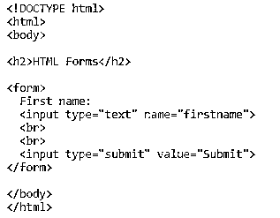

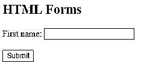

*   **多行输入文本控件**

这种输入控制类型允许用户输入多行数据。这种输入控件的典型用法是用于注释、地址、描述等。

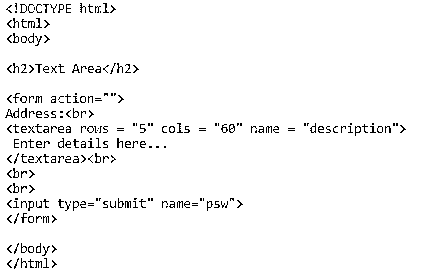

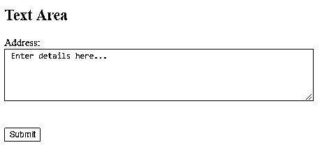

这里，行表示文本区域中的行数，列表示列数。

*   **密码输入控制**

顾名思义，这通常用于密码字段。这与输入文本字段的工作方式相同，但出于安全目的，文本被屏蔽了。

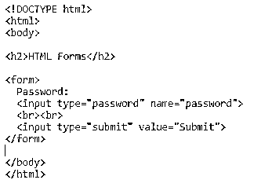

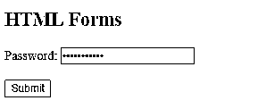

#### 2)输入类型提交

当输入类型为提交时，它执行表单动作中定义的动作，并将表单数据发送到服务器。

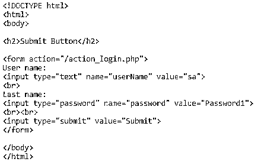

在这里，用户名和密码值将在 Submit 按钮的按钮 click 事件上提交给服务器。表单中的动作是接受输入的服务器方法。

#### 3)输入型收音机

当您希望用户以布尔值的形式[填写数据，或者您希望多个选项中只有一个输入为真时，可以使用单选按钮。单选按钮的一些常见用例是性别确定、员工类型(正式/临时)等。](https://www.educba.com/boolean-operators-in-java/)

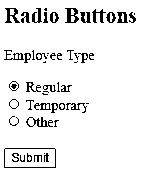

#### 4)输入类型复选框

一个复选框让用户选择在他的情况下什么信息是真实的。当可能的输入已知时，这是一种非常方便的接受数据的方式。

例如，如果你想收集个人持有的保险类型，你可以很容易地通过复选框，因为选项是有限的。

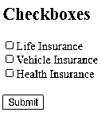

#### 5)输入类型下拉列表

下拉列表使用户能够从多个可能的选项中选择一个选项。这是一种非常用户友好的从用户处获得细节的方式，因为它提供了可能选项的详尽列表，帮助用户识别最适合他的选项。

例如，下拉列表列出雇员所属的城市

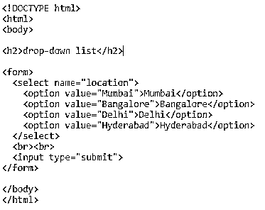

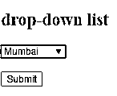

#### 6)输入类型 Optgroup

Optgroup 的工作方式与下拉列表类似；唯一的区别是 optgroup 允许您将某些选项逻辑地分组到一个伞下。它帮助用户借助 optgroup 标签快速识别相关选项。

例如，下拉列表列出了按州分组的印度不同州的城市。

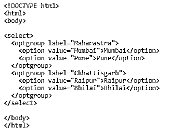

#### 7)字段集

Fieldset 是 Html 表单中另一个有用的标签，它让开发人员将某些控件逻辑分组到一个图例下；这有助于开发人员给用户明确的指示，告诉他们在这一部分应该做些什么。

例如，登录页面的字段集。

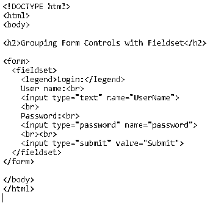

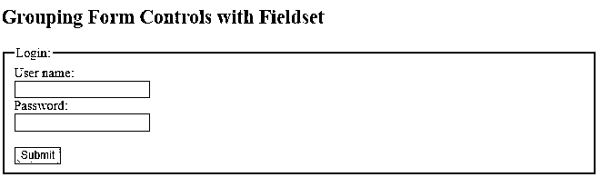

#### 8) HTML 输出标签

这个输出标签在 [HTML5](https://www.educba.com/what-is-html5/) 中引入。它可以让你立即显示计算的结果。当用户需要立即进行计算并查看结果时，这非常有用。这种情况的一个典型例子是当用户想要检查购物车中所有商品的总数时。

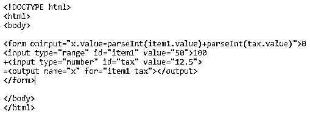

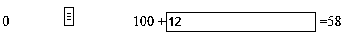

在上面的例子中，我们将商品价格范围定义为 0 到 100，并且可以在运行时更改，另一个文本框中的值为 12，是对该商品征收的税；它也可以在运行时更改。输出结果 58 是两个值的和。

**Note:** This tag is not supported on Edge 12 or Internet Explorer of an earlier version.

#### 9)输入类型颜色

在表单中经常要求只显示颜色而不显示任何文本。HTML 5 中的输入类型颜色将允许您这样做。它显示了您想要在表单中显示的颜色。使用它的典型场景是显示项目或阶段的状态。

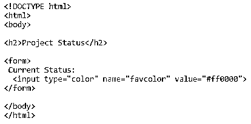

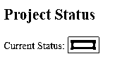

**Note**: color is not supported in certain versions of Internet Explorer and Edge.

#### 10)输入日期类型

输入类型日期通常用于用户希望输入日期类型字段的情况；它可以是任何像出生日期，雇佣日期，终止日期等。在 HTML 5 中引入，[日期格式](https://www.educba.com/php-change-date-format/)随着浏览器的变化略有变化。

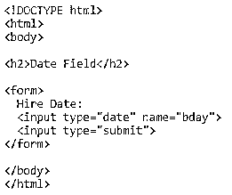

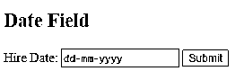

### 结论

*   随着 HTML 5 的引入，所支持的 HTML 控件的数量有了巨大的增长。这些 HTML 表单控件可以借助 [CSS 3](https://www.educba.com/what-is-css3/) 和 JavaScript / jQuery / Angular JS 赋予各种效果和颜色。
*   在本文中，我们介绍了所有常用的 HTML 表单控件。有许多控件，如隐藏，重置，周，网址，时间，电子邮件，文件，日期时间-本地，图像，电话没有在这篇文章中讨论。在项目中实现之前，检查这些控件的浏览器兼容性是非常重要的，因为许多浏览器版本不支持 HTML 5 表单控件。

### 推荐文章

这是 HTML 表单控件的指南。这里我们讨论 HTML 中定义的基本概念和各种类型的表单控件。您也可以浏览我们推荐的其他文章，了解更多信息——

1.  [HTML 属性](https://www.educba.com/html-attributes/)
2.  [HTML 格式标签](https://www.educba.com/html-format-tags/)
3.  [HTML 框架](https://www.educba.com/html-frames/)
4.  [HTML 块](https://www.educba.com/html-blocks/)

