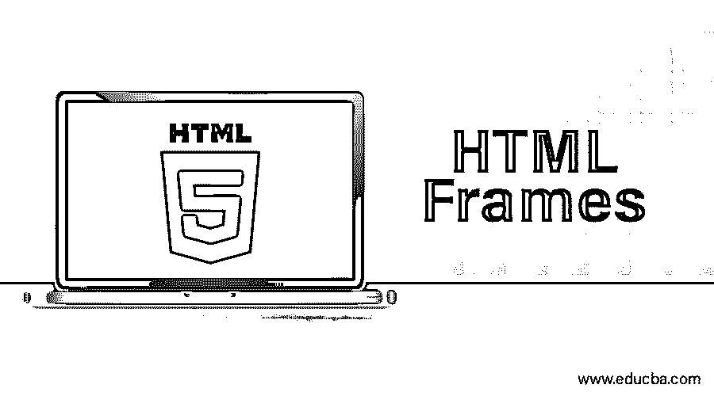
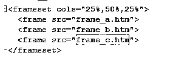
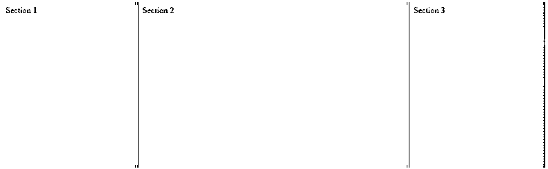
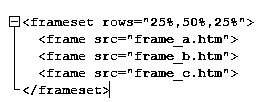
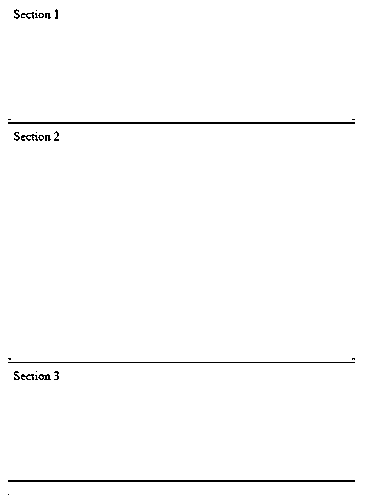

# HTML 框架

> 原文：<https://www.educba.com/html-frames/>




## Html 框架介绍

Html 框架有助于将网页或 web 浏览器分成多个部分；它们将各部分分开，然后加载不同的内容。

框架显示的内容与其容器无关。多个框架构成一个集合，称为框架集。可以认为这种排列类似于表格中行和列的方向。HTML5 中的 frame 标签[已被弃用。](https://www.educba.com/what-is-html5/)

<small>网页开发、编程语言、软件测试&其他</small>

每个帧都有一个帧标签来表示。水平框架由框架标签的 row 属性定义，垂直属性由 HTML 文档中框架标签[的 column 属性定义。一个框架中的同一个窗口可能会显示静态横幅、第二个导航菜单等。](https://www.educba.com/frame-tag-in-html/)

### 框架的语法

在 HTML 中，标签没有结束标签。当我们在网页中使用框架时，我们使用标签而不是标签。使用是我们如何指示网页分成框架的。标签定义了哪个 HTML 文档应该作为框架打开。

属性 cols 以像素为单位获取值，它们有助于指定框架集中[列的数量和大小。](https://www.educba.com/html-frameset-tag/)

```
<cols ="10%,80%,10%">
```

类似地，正如我们在上面看到的，属性行以像素为单位获取值，它们有助于指定框架集中的行数和大小。

```
<rows ="10%,80%,10%">
```

然而，需要注意的是，标签在 HTML5 中已经被弃用，不再使用。

### HTML 中不同类型的框架

框架的用途之一一直是在一个框架中加载导航栏，然后将主页加载到一个单独的框架中。A-frame 标签定义了一个内的单个窗口帧。

在 Chrome、Internet Explorer、Mozilla、Safari 和 Opera Mini 中支持浏览器。

框架中不同的和一些常用的属性是诸如边框、滚动、src、名称等属性。

### 框架标签的类型

以下是不同类型的框架标签:

#### 标签属性

有五个重要属性，我们在这里讨论它们:

**1。col:**col 属性给出了垂直框架。但是，宽度可以通过 4 种方式指定:

*   像素:绝对值可以用像素来表示。如果我们必须创建三个垂直框架，我们可以给出值:cols="100，50，100 "。

*   百分比:可以提到浏览器窗口的百分比。如果我们必须创建三个垂直框架，我们可以给出值:cols="40%，20%，40%。"

我们也可以在这里使用通配符(*)，让通配符取窗口的剩余部分，这部分没有提到。

cols="30%，*，30% "




**输出:**




**2。rows:**row 属性给出了水平帧。它指定框架集中的行。如果我们必须创建三个水平框架，我们使用:

**例如:** Rows="10%，80%，10% "。

我们还可以像前面对列所做的那样设置每行的高度。




**输出:**




**3。Border** :以像素为单位指定每一帧的边框宽度。

**例如** border="4 "。如果 border="0 "，则表示没有边框。

**4。Frameborder:** 如果需要在框架之间显示三维边框，那么我们使用这个属性。该属性的取值为 1 或 0(是或否)。

**例如:** frameborder="0 "表示没有边框。

**5。Framespacing:** 该属性指定框架集中框架之间的间距。此处可以为该属性指定任何整数值。

**例如** framespacing="12 "表示帧之间应该有 12 个像素的间距。

#### 标签属性

在此部分中可以列出 8 个属性。

**1。src:** 我们为这个属性提供文件名，这个属性应该被加载到框架中。该属性的值可以是任何 URL。

src = www.facebook.com

**2。名称:**该属性为框架提供一个名称。它定义了文档应该加载到哪个框架中。如果一个框架中有多个链接加载到另一个框架中，我们使用这个属性。那么第二个框架需要一个名称来标识它自己是链接的目标。

**例如，** name="abc.htm。"

**3。frameborder:** 这个属性被指定来显示是否显示边框。该值占用的是 1 或 0(是或否)。

**4。marginwidth:** 该属性有助于指定框架边框左右之间的空间宽度以及框架的内容。该值以像素为单位。

**例如** marginwidth="10 "。

**5。marginheight:** 该属性有助于指定框架边框顶部和底部之间的高度以及框架的内容。该值以像素为单位。

**E.g.,** marginheight=”10”.

**6。noresize:** 这个属性基本上防止用户对已经存在的框架做任何改变。如果没有该属性，任何帧都可以调整大小。

例如， noresize="noresize。"

**7。scrolling:** 这个属性控制滚动条的外观，滚动条出现在框架上。该值可以是“是”、“否”或“自动”。

**例如，** scrolling=" no "表示它不应该有滚动条。

**8。longdesc:** 该属性允许您提供到另一个页面的链接，该页面包含框架内容的详细描述。

**例如，** longdesc="framedesc.htm。"

### 框架和浏览器支持

老的浏览器不支持框架，那么

<noframes>元素应该显示给用户。</noframes>

实际上，元素应该放在

<noframes>元素里面，因为元素应该替换元素。如果浏览器不能理解元素，那么它理解包含在

<noframes>元素中的元素的内容。</noframes>

</noframes>

对于使用旧浏览器的用户来说，在这种情况下发布消息是一种不错的方法。像“对不起！您的浏览器不支持框架。通知。

### 结论

目前相当多的浏览器都不支持框架技术。人们经常注意到，对于较小的设备，网页的内容显示不正确。无论如何，了解现有的知识是有益的，这样可以开发更好的模型来与新技术兼容。

### 推荐文章

这是一个 Html 框架的指南。这里我们讨论 HTML 中不同类型的框架，以及框架和浏览器支持的框架标签类型。您也可以阅读以下文章，了解更多信息——

1.  [在 HTML 中创建表格](https://www.educba.com/create-tables-in-html/)
2.  [HTML 文本编辑器](https://www.educba.com/html-text-editors/)
3.  [Html 版本](https://www.educba.com/versions-of-html/)
4.  [HTML 图像标签](https://www.educba.com/html-image-tags/)


