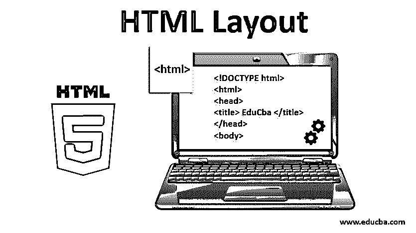
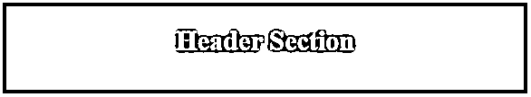
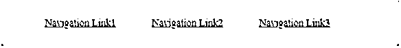
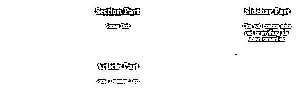
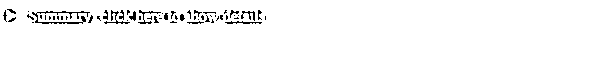
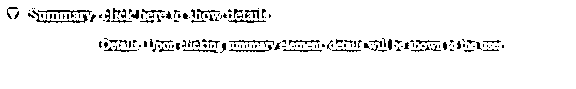
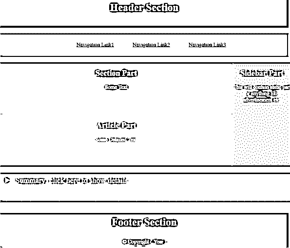

# HTML 布局

> 原文：<https://www.educba.com/html-layout/>




## HTML 布局介绍

设计网页时，以优雅的方式排列网页元素是很重要的。对于用户来说，它们应该易于导航并且简单。它提供了一种以结构良好的方式排列这些元素的方法。它给了网页一个非常好的外观，并且提供了一个简单的设计方法。这是一种简单的方法，通过它我们可以使用简单的标准 HTML 标签来设计 web 元素。HTML 提供了各种布局元素，通过这些元素我们可以设计网页的各个部分。

### HTML 布局元素

在本文中，我们将看到不同的布局元素及其示例。我们将利用这些元素设计一个类似报纸的简单结构。

<small>网页开发、编程语言、软件测试&其他</small>

#### 1.


这个元素用来定义网页的标题。它包含页面的标题或一些标志，或者可能是介绍性的内容。

**代码**:

```
<!DOCTYPE html>
<html>
<head>
<title> EduCba </title>
</head>
<body>

<h1 style=" color: #fff; text-align: center; padding-top: 25px; font-size: 30px;" > Header Section</h1>

</body>
</html>
```

**输出**:




#### 2.

<nav></nav>

这个元素将包含到菜单列表的链接。这个元素就像不同导航链接的容器。链接将在不同的页面或相同的页面。

**代码**:

让我们在上一个例子的标题下添加一个导航元素。将

```
<head>
<style>
li{
display: inline-flex;
padding: 25px
}
ul{
text-align: center;
}
</style>
</head>
<body>
<nav style = "background-color: #607d8b70;" >
<ul>
<li> <a href = "#"> Navigation Link1 </a> </li>
<li> <a href = "#"> Navigation Link2 </a> </li>
<li> <a href = "#"> Navigation Link3 </a> </li>
</ul>
</nav>
</body>
```

**输出**:




#### 3.

这个元素就像网页的主要部分。它可以包含任何类型的信息。它可以包含文本、图像等。

#### 4.

顾名思义，这个元素将包含像一个段落、对某事的任何详细描述或任何种类的信息这样的内容。通常，这将是网页上包含信息的主要部分。

#### 5.

这个元素将定义内容，它将位于主要内容的旁边，就像一个部分或一篇文章。该信息元素是可选的，并且通常包含附加信息或广告内容。

**代码**:

让我们将这三个元素一起添加到导航栏下面。

```
<style>
li { display: inline-flex;
padding: 25px
}
section{
background-color: #607D8B;
width: 79%;
position: absolute;
height: 150px;
}
article{
width: 79%;
background-color: #607d8b70;
position: absolute;
top: 368px;
height: 150px;
}
aside{
background-color: #607d8b99;
width: 20%;
position: absolute;
left: 80%;
height: 300px;
}
h2 , p {
text-align: center;
color: #9c27b0;
}
ul{
text-align: center;
}
</style>
<body>
<div class = "main" >

<h2> Section Part </h2>
<p> Some Text </p>


<h2> Article Part </h2>
<p> Some Detailed Text </p>


<h2> Sidebar Part </h2>
<p> This will contain static part or anything like advertisement etc. </p>

</div>
</body>
```

**输出**:




#### 6.<details></details>

这个元素用于向用户显示关于网页的额外细节。这可能包含用户可选的附加信息。默认情况下，这个元素提供了一个特性，可以在单击时显示或隐藏细节。

#### 7.<summary></summary>

该元素与

<details>元素一起使用。隐藏的信息和点击时显示的信息都在这个标签中。该元素将位于 details 元素内部。</details>

**代码**:

让我们在现有示例中添加 details 元素和 summary 元素。只需将下面的代码添加到标签中的 side、section 和 article 元素部分之后。

```
<body>
<details>
<summary> Summary: click here to show details</summary>
<p> Details: Upon clicking summary element, details will be shown to the user </p>
</details>
</body>
<style>
details {
margin-top: 330px;
width: 100%;
padding-top: 10px;
padding-bottom: 50px;
padding-left: 15px;
background-color: #607d8bdb;
}
details p {
font-size: 18px;
}
summary {
color: white;
font-size: 22px;
}
</style>
```

**Output1** :不点击细节元素。




**Output2:** 点击细节元素后。




#### 8.

每个网页的底部都有一个部分，称为页脚。这个

元素用于定义网页底部的页脚部分。页脚部分通常包含版权、年份、联系信息等信息。在网页中有一个页脚是一种标准的做法，它会在网页的底部。

**代码**:

让我们在网页底部添加一个页脚。

```

<h3 style = " color: #fff; text-align: center; padding-top: 10px; font-size: 30px; " >Footer Section</h3>
<p> © Copyright ( Year ) </p>

```

**输出**:


**所以我们最终的代码和它的输出会是这样的，**

**代码:**

```
<!DOCTYPE html>
<html>
<head>
<title> EduCba </title>
<style>
li{ display: inline-flex;
padding: 25px
}
section{
background-color: #607D8B;
width: 79%;
position: absolute;
height: 150px;
}
article{
width: 79%;
background-color: #607d8bc7;
position: absolute;
top: 368px;
height: 150px;
}
aside{
background-color: #607d8bde;
width: 20%;
position: absolute;
left: 80%;
height: 300px;
}
h2 , p {
text-align: center;
color: #fff;
}
ul{
text-align: center;
}
details {
margin-top: 330px;
width: 100%;
padding-top: 10px;
padding-bottom: 50px;
padding-left: 15px;
background-color: #607d8bdb;
}
details p {
font-size: 18px;
}
summary {
color: white;
font-size: 22px;
}
</style>
</head>
<body>

<h1 style=" color: #fff; text-align: center; padding-top: 25px; font-size: 30px;" > Header Section </h1>

<nav style = "background-color: #607d8b9c;" >
<ul>
<li> <a href = "#"> Navigation Link1 </a> </li>
<li> <a href = "#"> Navigation Link2 </a> </li>
<li> <a href = "#"> Navigation Link3 </a> </li>
</ul>
</nav>
<div class = "main">

<h2> Section Part </h2>
<p> Some Text </p>


<h2> Article Part</h2>
<p> Some Detailed Text </p>


<h2> Sidebar Part </h2>
<p> This will contain static part or anything like advertisement etc. </p>

</div>
<details>
<summary> Summary: click here to show details </summary>
<p> Details: Upon clicking summary element, details will be shown to the user </p>
</details>

<h3 style = " color: #fff; text-align: center; padding-top: 10px; font-size: 30px; " >Footer Section</h3>
<p> © Copyright ( Year ) </p>

</body>
</html>
```

**输出**:




### 结论

所以 HTML 布局元素在设计网页时非常有用。他们帮助开发者设计结构良好的网页。正确使用这些布局元素可以改善网页的阅读体验。我们已经详细了解了大部分主要的 HTML 布局元素。

### 推荐文章

这是一个 HTML 布局指南。在这里，我们讨论 HTML 布局元素的例子，代码和详细的输出。您也可以浏览我们的其他相关文章，了解更多信息——

1.  [HTML 字体样式](https://www.educba.com/html-fonts-styles/)
2.  [HTML 图像标签](https://www.educba.com/html-image-tags/)
3.  [HTML 框架](https://www.educba.com/html-frames/)
4.  [HTML 块](https://www.educba.com/html-blocks/)


