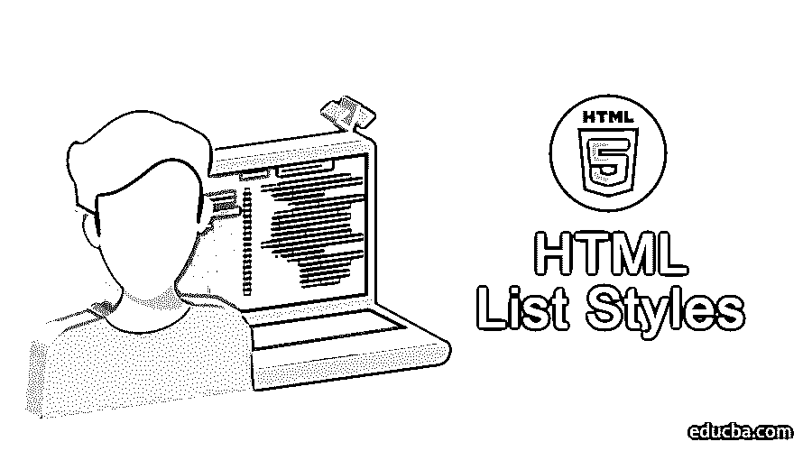
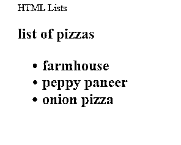
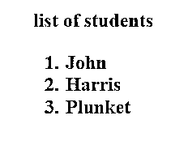
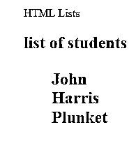
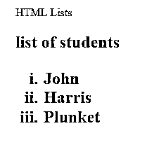
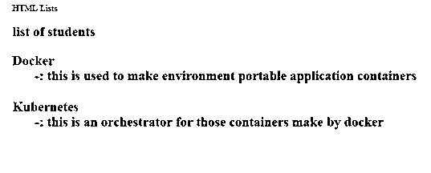
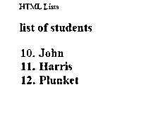

# HTML 列表样式

> 原文：<https://www.educba.com/html-list-styles/>




## HTML 列表样式介绍

*   列表是以格式化的方式放置数据的常见要求，就像如果您制作了一个网页，需要在其中显示酒店披萨菜单的内容，那么它很可能是一个 HTML 列表样式，应该以清晰和离散的方式出现。
*   其他的例子可能是，你有一组学生，他们是班上表现最好的学生；在这种情况下，要求将排名 1 的学生放在顶部，其他人按照排名的递增顺序放在它下面，为此我们需要将它格式化为一个排序列表。
*   另一种类型可以是定制列表，你可以同时使用 Javascript 和 Html 来创建，其中对象的动态也可以被设置，并且列表可以采用一些定制的外观。

### HTML 中不同的列表样式

下面是解释的各种 HTML 列表样式。

#### 1)无序列表

在这里，内容的显示顺序不是我们需要关心的事情；我们只需要很好地放置这些东西，这样 HTML 页面就能以一种良好的格式和清晰的方式将它们呈现在用户面前。

<small>网页开发、编程语言、软件测试&其他</small>

HTML 语言中有两个标签来处理这些列表，你可以只用这些标签来制作一个导航栏和垂直侧边栏。

3.  :表示列表项，放置在[无序列表](https://www.educba.com/html-unordered-list/)中的一组项，即在< ul >标签下出现在< li >标签内。标有这些标记的项目将自动在其开头带有一些项目符号或圆圈；这些是基本的 HTML 特性。

现在让我们看看基于

*   A piece of code of the unordered list, and the appearance of the HTML page; Once the file is executed, please note that you can write and save it in an editor such as Notepad. Html "extension; Therefore, it can be opened with any browser.

**示例片段—**

**代码:**

```
<html>
<head> HTML Lists </head>
<body>
<h2> list of pizzas <h2>
<ul>
<li style="color:red"> farmhouse </li>
<li style="color:green"> peppy paneer </li>
<li style="color:blue"> onion pizza </li>
</ul>
</body>
</html>
```

**输出:**




#### 2)有序列表

现在我们将看到一个例子，我们希望根据学生在班级中的排名以有序的方式排列学生，这将通过使用 HTML 的

1.  Labels, which will contain list items.

1.  Inside the label.
2.  The label has been explained above.

对于这种情况，我们也来看一个例子，您需要像上面那样保存它。

**代码:**

```
<html>
<head> HTML Lists </head>
<body>
<h2> list of students <h2>
<ol>
<li style="color:red"> John </li>
<li style="color:green"> Harris </li>
<li style="color:blue"> Plunket </li>
</ol>
</body>
</html>
```

**输出/ HTML 页面**




现在让我们看看这些的一些变体，我们可以通过在 HTML 页面中添加一些 CSS 属性来定制或格式化这些列表，这将使页面的外观看起来更好。

1.  在无序列表中，我们可以给出以下属性
2.  列表样式-类型-可以是圆盘形、圆形、方形或无。所以你在无序列表项中看到的圆圈不会出现，如果我们在这里选择无，让我们这样做。

**示例—**

**代码:**

```
<html>
<head> HTML Lists </head>
<body>
<h2> list of students <h2>
<ul style="list-style-type:none">
<li style="color:red"> John </li>
<li style="color:green"> Harris </li>
<li style="color:blue"> Plunket </li>
</ul>
</body>
</html>
```

**输出/ HTML 页面-**




所以，圆形的子弹不再存在；您可以使用上面提供的选项对它们进行定制。

类似地，有一个条款可以选择顺序列表中的值是用数字、罗马字母还是字母显示。

您可以在

**类型:**“1”、“A”、“A”、“I”、“I。”

让我们看看相同的示例代码

**代码:**

```
<html>
<head> HTML Lists </head>
<body>
<h2> list of students <h2>
<ol type = "i">
<li style="color:red"> John </li>
<li style="color:green"> Harris </li>
<li style="color:blue"> Plunket </li>
</ol>
</body>
</html>
```

**输出/ HTML 页面-**




类似地，我们也有描述列表，在那里我们可以定义需要放置描述的条目；假设你正在制作一个页面，你需要放置一些关键字的定义，然后你可以选择[描述列表](https://www.educba.com/html-description-list/)。

### 标签

我们用下面的标签来处理同样的问题。

**<dl>**–该标签定义了描述列表

**<dt>**–该标签将给出描述术语

**<DD>**–该标签携带每个术语的描述

**示例—**

**代码:**

```
<html>
<head> HTML Lists </head>
<body>
<h2> list of students <h2>
<dl>
<dt style="color:red"> Docker </dt>
<dd> -: this is used to make environment portable application containers </dd>
<br>
<dt style="color:green"> Kubernetes </dt>
<dd> -: this is an orchestrator for those containers make by docker </dd>
</dl>
</body>
</html>
```

**输出/HTML 页面-**




您还可以在

**代码:**

```
<html>
<head> HTML Lists </head>
<body>
<h2> list of students <h2>
<ol type = "1" start="10">
<li style="color:red"> John </li>
<li style="color:green"> Harris </li>
<li style="color:blue"> Plunket </li>
</>
</body>
</html>
```

**输出:**




### 结论

所以我们看到了各种可以放置数据的列表；可以使用 javascript 框架将这些数据从模型呈现给视图；我们展示的是一个静态页面，可以用 JS 把它变成动态的。这些列表可以用 bootstrap 格式化，使它们看起来也像导航栏或侧边栏。

### 推荐文章

这是一个 HTML 列表样式的指南。这里我们讨论了 HTML 风格的基本概念和不同类型，以及相应的例子和代码实现。您也可以浏览我们推荐的其他文章，了解更多信息——

1.  [HTML 格式标签](https://www.educba.com/html-format-tags/)
2.  [HTML 属性](https://www.educba.com/html-attributes/)
3.  [HTML 样式表](https://www.educba.com/html-style-sheets/)
4.  [HTML 框架](https://www.educba.com/html-frames/)


