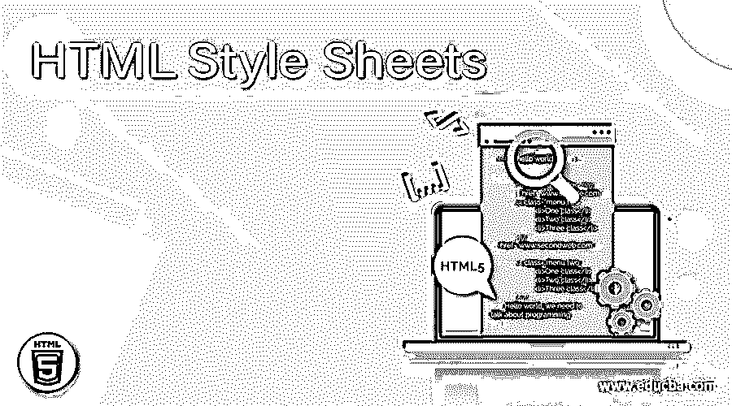

# HTML 样式表

> 原文：<https://www.educba.com/html-style-sheets/>




## 什么是 HTML 样式表？

下面的文章提供了 HTML 样式表的概要。HTML 级联样式表是一个具有规则和属性的表，这些规则和属性告诉浏览器如何使用所有指定的样式呈现 HTML。CSS 是我们设计任何网页风格的方式。CSS 拥有所有的属性，如背景、颜色、字体、间距、边框等。，我们可以为页面上的每个元素定义它。

HTML 样式表也用于设置页面的布局，例如页眉、页脚或任何其他元素在页面上的位置。CSS 总是和 HTML 一起被谈论，因为没有任何样式的页面是非常苍白的，没有突出任何标题等等。，并且整个页面都是相同的字体大小，这对用户来说一点也不好看。

<small>网页开发、编程语言、软件测试&其他</small>

### 如何使用 HTML 样式表？

过去，样式、脚本、HTML 所有的东西都写在同一个页面上。这使得页面极其冗长，极难阅读和编辑。然后出现了分离 HTML、样式和 Javascript 的方法。

### 在网页上包含 HTML 样式表的方法

有三种方法可以包含这些样式:

#### 1.内嵌样式

这是一种在名为 style 的属性中为 HTML 本身的每个元素编写样式的方法。

这种样式不被推荐，因为 HTML 看起来很混乱，我们不能遵循“一次编写，多次使用”的方法。

**举例:**

**代码:**

```
<h1 style=”font-size: 10px;margin-top: 10px;”>Hello World!</h1>
```

#### 2.内部造型

这是将样式包含在一个[样式标签](https://www.educba.com/style-tag-in-html/)中，并将它放在 HTML 之上的一个网页中。这种样式仍然比内联样式好，因为我们可以将常见的样式组合在一起，以防必须同时用于多个元素。

在开发阶段编辑 HTML 文件更容易，我们不必每次都打开相应的 CSS 文件，每次都进行编辑。

**举例:**

**代码:**

```
<html>
<head>
<style>
container-block{
font-size: 10px;
margin-top: 10px;
}
</style>
</head>
<body>
<div class=”container-block”>Hello World!</div>
</body>
```

#### 3.外部造型

这是为网页设置样式的最常见也是最好的方式。这类似于内部样式，但是不同之处在于样式是在一个单独的文件中编写的，并且带有扩展名。css，对它的引用放在网页的 head 标签中。

在网页上链接 CSS 文件的语法是:

**语法:**

```
<link rel="stylesheet" type="text/css" href="theme.css">
```

样式应该包含在 head 标签中，它位于 HTML 的 body 标签(即实际内容)之上。

### 内联、内部、外部样式之间的优先级是什么？

内联样式比内部样式优先级高，最后一个优先级是外部样式。

内嵌>内部>外部

使用 CSS 的最佳实践:

*   CSS 可以被分成许多文件，而不是一个。
*   分离的 CSS 文件可以使用链接标签一个接一个地包含在 head 标签中。
*   或者一个 CSS 文件可以有多个 import 语句来导入其余的 CSS 文件。这将在逻辑上分离 CSS，但最终得到；所有样式都从同一个文件中渲染。

**用法:**@ import’。/process . CSS '；

*   可以用选择器为任何网页元素定义样式，如 HTML 标签本身、类名、id、任何属性名。
*   有一些伪选择器可用，如:
    *   以前
    *   在...之后
    *   第 n 个孩子
    *   第一胎
    *   最小的孩子
    *   盘旋
    *   访问

这些基本上是所选元素的状态，而不是真正的精确元素。

*   当页面中包含多个 CSS 文件时，最后一个文件具有最高优先级，并覆盖具有相同选择器的先前文件的现有样式。
*   样式表应该在 HTML 本身之前使用，以便在页面加载时应用样式。如果包含在最后，HTML 将首先加载，然后慢慢应用样式，这给用户带来非常糟糕的体验。

### HTML 级联样式表的各种功能

各种功能如下所述:

*   **CSS 提供动画**:以前 [javascript](https://www.educba.com/what-is-javascript/) 只用于动画。但是最新的 CSS，也就是 [CSS3](https://www.educba.com/what-is-css3/) ，提供了使用属性本身的动画。
*   **厂商前缀:**在浏览器发布任何新特性的标准版本/属性名称之前，浏览器会在一段时间内为我们提供一些厂商前缀作为试验。开发人员需要等到浏览器发布其标准版本，与此同时，可以使用供应商前缀的实验性功能。
*   **CSS Transforms:**Transition 用于在给定的持续时间内从一个属性的另一个值渐进地转到另一个值。

**举例:**

**代码:**

`-webkit-transition: width 2s, height 4s;`

*   CSS 变换:CSS 中的变换允许你平移、旋转、缩放和倾斜元素。

### 媒体查询

移动、桌面、iPads 表现不同；然而，我们不能以同样的方式设计页面。以前的 web 标准是这样设计的，每种类型的设备都有不同的 CSS。

随着 web 标准和 web 构建方式的进步，浏览器被开发成具有可用于任何类型设备的单一 CSS。为了根据宽度和高度更改设备的样式，我们使用媒体查询来指定设备的最小或最大宽度，并在其中写入样式。

**举例:**

**代码:**

```
@media screen and (max-width: 767px){
container{
width: 60%;
padding: 20px;
}
}
```

风格绝对是网络的福音。随着 web 开发在最近几年呈指数增长，CSS3 无疑获得了大量需求，以使页面变得极具交互性和直观性。

### 推荐文章

这是 HTML 样式表的指南。在这里，我们讨论如何使用 HTML 样式表，各种功能，以及在网页上包含 CSS 的方法。您也可以阅读以下文章，了解更多信息——

1.  [什么是 CSS？](https://www.educba.com/what-is-css/)
2.  [HTML 重置按钮](https://www.educba.com/html-reset-button/)
3.  [CSS 内联样式](https://www.educba.com/css-inline-style/)
4.  [HTML 内嵌样式](https://www.educba.com/html-inline-style/)


