# HTML 文本格式标签

> 原文：<https://www.educba.com/html-text-formatting-tags/>

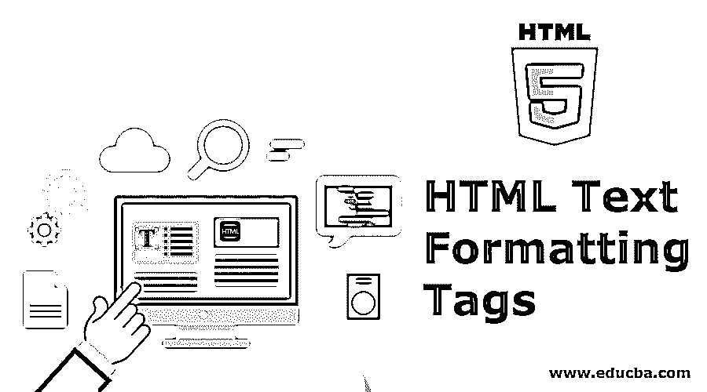


## HTML 文本格式标签介绍

格式化文本是现代互联网网页的重要部分；即使我们仅限于使用基于文本的 web 浏览器，文本格式如大小、方向等。，可用。随着现代 HTML 的修订，有大量的 HTML 标签可以用来使文本外观符合你的喜好。

### 用 HTML 标签格式化文本

下面我们将讨论一些用于格式化文本的重要 HTML 标签:

<small>网页开发、编程语言、软件测试&其他</small>

#### 1.在 HTML 中将文本格式化为粗体

HTML 有两个不同的标签来将文本设置为粗体。一个是**，另一个是**，两者产生相似的输出。**标签是一个物理标签，只是以粗体显示文本，它不会在浏览器中增加任何重要的值。******

**例子**

**代码:**

```
<!DOCTYPE>
<html>
<body>
<p> <b>Here is some text in bold. </b></p>
</body>
</html>
```

**输出:**

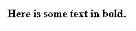


另一方面,**标签被认为是一个逻辑标签，它用来通知浏览器标签中的文本具有某种逻辑重要性。**

**例子**

**代码:**

```
<!DOCTYPE>
<html>
<body>
<p> <strong>This is an important content formatted using the strong tag </strong>, and this is just
normally formatted text</p>
</body>
</html>
```

**输出:**

#### 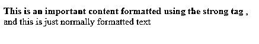


#### 2.在 HTML5 中将文本设置为斜体

就像将文本设置为粗体一样，可以使用*标签和*标签在 HTML5 上将文本设置为[斜体。](https://www.educba.com/what-is-html5/)**

使用*是为了，就像使用**一样，将文本和标签*物理显示为斜体，同时也将文本显示为斜体，让浏览器知道它具有语义重要性。****

**例子**

**代码:**

```
<!DOCTYPE>
<html>
<body>
<p> <i> This is the first para in italic text. </i></p>
<p> <em> This content is made italics with the em tag</em>, This is normal text </p>
</body>
</html>
```

**输出:**

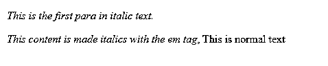


#### 3.用 HTML 代码突出显示文本

在你想用荧光笔效果突出显示一些文本的情况下，可以使用标签<mark>；使用[默认 CSS](https://www.educba.com/what-is-css/) ，标签将文本的背景设为黄色，帮助你轻松抓住访问者对文本的注意力。</mark>

**例子**

**代码:**

```
<!DOCTYPE>
<html>
<body>
<h3> This text uses <mark> Mark</mark> tag to highlight text on the page </h3>
</body>
</html>
```

**输出:**

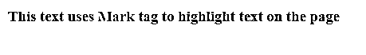


#### 4.给 HTML 中的文本加下划线

HTML 标签<u>可用于在文本中添加下划线。注意不要使用蓝色下划线，因为这可能会让访问者误以为这是一个链接。</u>

**例子**

**代码:**

```
<!DOCTYPE>
<html>
<body>
<p> <u> This is Text with underline tag. </u> </p>
</body>
</html>
```

**输出:**

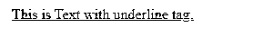


#### 5.带删除线的文本

如果需要在文本中画一条水平线，可以使用标签~~。线条很细，所以穿过的文字仍然可以很容易地阅读。~~

**例子**

**代码:**

```
<!DOCTYPE>
<html>
<body>
<p> <strike> Here is a sentence with strike through text </strike>. </p>
</body>
</html>
```

**输出:**

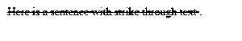


#### 6.在 HTML 中以等宽字体书写

当你想引用一些东西或者想在浏览器中显示一些代码时，使用等宽会很有用。等宽码，顾名思义，使每个字符的宽度相同。要在浏览器上得到它，我们必须使用`标签。`

**例子**

**代码:**

```
<!DOCTYPE>lt;html>
<body>
<p> This is normal text. <tt>This is some sample text in monospace fonts, neat. </tt> </p>
</body>
</html>
```

**输出:**

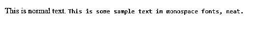


#### 7.HTML 中的下标文本

在数学和化学中，使用下标在很多场合是绝对需要的。在一般写作中，你也可能遇到适合使用下标文本的情况。在 HTML 中，<sub>标签下的任何文本在浏览器中都将作为下标。</sub>

**例子**

**代码:**

```
<!DOCTYPE>
<html>
<body>
<p> This is normal text <sub>Notice something different with this text? </sub> </p>
</body>
</html>
```

**输出:**

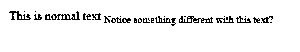


#### 8.HTML5 中删除的文本

标签被用作告诉浏览器文本中的文本被删除的逻辑方式。请记住，对于用户来说，显示的文本与带删除线标签中的标签相同，这意味着它以删除线格式显示。

**例子**

**代码:**

```
<!DOCTYPE>
<html>
<body>
<p> This is normal text <del> This is text between del tag. </del> </p>
</body>
</html>
```

**输出:**

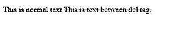


#### 9.HTML5 中的上标文本格式

<sup>标签中的文本以上标显示。这在数学、化学等涉及数学的地方很有用。您可以在引用时使用标签，并添加页面内链接。</sup>

**例子**

**代码:**

```
<!DOCTYPE>
<html>
<body>
<p> This is Normal text<sup> This text is in superscript. </sup> </p>
</body>
</html>
```

**输出:**

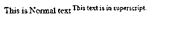


#### 10.使用 HTML 格式使文本变大

如果您需要在屏幕上以更大的尺寸显示一些文本，但您不想使用标题或增加标签的字体大小，使用<big>该标签之间的内容将会以明显更大的文本尺寸显示。</big>

**例子**

**代码:**

```
<!DOCTYPE>
<html>
<body>
<p> This is Normal text <big> This text in in larger size. </big> </p>
</body>
</html>
```

**输出:**


#### 11.用 HTML 缩小文本

像标签<big>一样，你可以使用<small>让文本在屏幕上变小，而不需要使用 CSS 或者标题。</small></big>

**例子**

**代码:**

```
<!DOCTYPE>
<html>
<body>
<p> This is Normal text <small> the size of this text is smaller </small> </p>
</body>
</html>
```

**输出:**

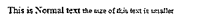


### 结论

现在您已经了解了 HTML 中文本的格式是如何工作的，您应该能够设计具有正确和专业外观的文本布局和格式的页面。如果您尽可能使用普通文本和格式，将会有所帮助；仅在需要时使用自定义格式可以使页面看起来整洁。正常的文本大小也很重要，太小的话，可读性会受到负面影响，如果太大的话，屏幕上的信息会减少。

### 推荐文章

这是一个 HTML 文本格式化标签的指南。这里我们讨论基本概念，如何通过使用不同的 HTML 格式化标签来格式化文本。您也可以看看以下文章，了解更多信息–

1.  [HTML 命令](https://www.educba.com/html-commands/)
2.  [HTML 格式标签](https://www.educba.com/html-format-tags/)
3.  [HTML 罢工标签](https://www.educba.com/html-strike-tag/)
4.  [基本 HTML 标签](https://www.educba.com/basic-html-tags/)


