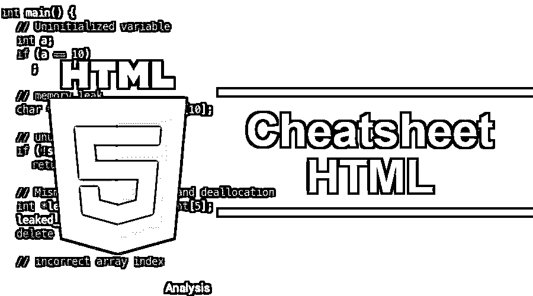

# 备忘单 HTML

> 原文：<https://www.educba.com/cheat-sheet-html/>

## 备忘单 HTML 简介

HTML 通常称为超文本标记语言，是一种用于开发 web 应用程序和网页的标准标记语言。HTML 是由 W3C & WHATWG 设计和开发的。HTML 第一次出现在 1993 年，也就是 25 年前。最新版本是 HTML 5.x，文件扩展名为。html 或者。htm 和是由 ISO/IEC、W3C 和 HTML 最新推荐标准开发的。JavaScript 和 CSS ( [层叠样式表](https://www.educba.com/css-interview-questions/))进一步使得 HTML 在万维网技术中更加强大。

### 备忘单 HTML 上的元素和内容

HTML 元素是 HTML 网页的关键组成部分。HTML 元素是以标签的形式出现的，在元素名称周围使用闭尖括号。HTML 可以以嵌入代码的形式在其内容中包含脚本，如 JavaScript 程序。没有任何内容的 HTML 元素称为空元素。每个 HTML 元素都包含一个开始标签和一个结束标签。下面是提到的备忘单 HTML 元素列表，表示不同种类的功能:

<small>网页开发、编程语言、软件测试&其他</small>

| **元素** | **描述** |
| **HTML 元素** |
|  | 这个标签定义了一个段落。 |
|  | 这用于定义将一个网页链接到另一个网页的超链接。href 是 |
|  | 这用作隐藏其他页面元素实现的容器标记。 |
| 
 | 这个标签用来断行，叫做断行元素。 |
|  | 这个标签被用作 header 元素来显示标题内容，这是更重要的。这也叫页面标题。 |
|  | 这个标签被用作一个标题，这个标题被用作页面标题。 |
|  | 该标签用作标题，该标题用作第三标题。 |
|  | 该标签用作标题，该标题用作四元标题。 |
|  | 该标签用于显示粗体文本。 |
|  | 这个标签用于显示斜体文本。 |
|  | 该标签用于使用 style 属性显示带下划线的文本。 |
|  | 该标签用于定义缩写。 |
| <iframe></td> <td width="325">该标签用于内嵌框架，用于在当前 HTML 文档中嵌入另一个文档。</td> </tr> <tr> <td width="291"><q/></td> <td width="325">这个标签用来表示一个简短的引用。</td> </tr> <tr> <td width="291"><blockquote/></td> <td width="325">此标签用于定义从其他来源引用的报价的一部分</td> </tr> <tr> <td width="291"></td> <td width="325">这个标签用于在 HTML 网页上插入和定义图像。</td> </tr> <tr> <td style="text-align: center" colspan="2" width="616"><strong> HTML 语义元素</strong></td> </tr> <tr> <td width="291">
</td> <td width="325">这个标签用来表示这个标签中作为容器标签的任何 HTML 元素。</td> </tr> <tr> <td width="291"></td> <td width="325">该标签用于对内联元素应用分组和样式。</td> </tr> <tr> <td width="291"></td> <td width="325">该标签用于定义 HTML 文档中的自包含内容。</td> </tr> <tr> <td width="291"></td> <td width="325">此标签用于显示页面中除相关部分之外的部分。</td> </tr> <tr> <td width="291">
</td> <td width="325">此标签用于显示附加信息，使用额外按钮选项可以隐藏这些信息。</td> </tr> <tr> <td width="291"></td> <td width="325">这个标签用于定义一个部分或文档的标题内容。</td> </tr> <tr> <td width="291"></td> <td width="325">此标签用于定义其最近的或分段根元素的页脚内容。</td> </tr> <tr> <td width="291"><nav/></td> <td width="325">此标签用于定义到其他页面或同一页面内部分的链接。</td> </tr> <tr> <td style="text-align: center" colspan="2" width="616"><strong> HTML 非语义元素</strong></td> </tr> <tr> <td width="291"><form/></td> <td width="325">该标签用于声明包含许多对的表单。</td> </tr> <tr> <td width="291"><table/></td> <td width="325">这个标签用于在网页上创建一个表格。</td> </tr> <tr> <td width="291"></td> <td width="325">该标签用于定义 HTML 内容中的自包含组合。</td> </tr> </tbody> </table> <h3>使用备忘单 HTML 命令的免费提示和技巧</h3> 
下面是一些提示和技巧:
 <ol> <li>HTML 中还有其他重要的关键字叫做<a href="https://www.educba.com/html-entities/"> HTML 实体</a>用来显示 HTML 中的保留字符。例如，如果文本中使用了&lt;或&gt;符号，那么这些符号可能被认为是 HTML 元素的尖括号标签，在显示内容时，这些标签可能被 HTML 网页误解。</li> <li>备忘单 HTML 表单包含要在其中定义的不同属性，以收集用户输入、文本字段、复选框、提交按钮、单选按钮等。,</li> <li>Form 元素中的 select 元素用于显示带有不同选项的下拉列表，这些选项使用值属性。</li> <li>HTML5 表单元素是最近添加的<datalist>和<output>标签，其中<datalist>元素用于定义作为输入数据的预定义选项列表，而<output>标签用于显示计算结果。</output></datalist></output></datalist></li> <li>备忘单 HTML 版本的迁移可以通过从 div 元素到命名元素的转换来完成。比如 HTML 4 版本中的 header 元素是&lt; div id="header" &gt;到 HTML 5 版本就像&lt; header &gt;。其他的标签元素也可以用同样的方式，比如 nav，section，article，footer。</li> <li>HTML 5 中有不同的功能，如 HTML Canvas、HTML SVG(可缩放矢量图形)、HTML <a href="https://www.educba.com/career-in-google-maps/"> Google Maps，这些都是最新 HTML </a>版本的功能，如下所述:</li> </ol> <table> <tbody> <tr> <td style="text-align: center" width="283"><strong>元素</strong></td> <td style="text-align: center" width="285"><strong>描述</strong></td> </tr> <tr> <td width="283"><canvas/></td> <td width="285">这个标签用于在网页上绘制图形</td> </tr> <tr> <td width="283"><svg/></td> <td width="285">这个标签用于以容器的形式显示 SVG 图形。</td> </tr> <tr> <td width="283">
</td> <td width="285">这个标签用于将谷歌地图添加到 HTML 格式的网页中。</td> </tr> </tbody> </table> <ol start="7"> <li>网络上不同类型的多媒体有音频、视频、电影、动画、图像、电影等。,</li> <li>HTML APIs 包含地理位置，拖放，网络存储，网络工人，SSE 等。，用于用户的地理位置、可拖动元素、用户浏览器中的存储，</li> </ol> <h3>结论</h3> 
HTML Cheat Sheet 用于开发网页，HTML 最新版本 5.x 在其 HTML 元素和表单标签中具有不同的特性和功能。其他不同的特性是浏览器中的 HTML 本地和会话存储。这些特性与其他技术(如 JavaScript 和 CSS)一起在网页开发中非常有用，从而使其成为丰富的互联网应用程序。它还会有服务器事件通知，这是一种单向通信的形式。备忘单 HTML 也有不同的特性，如事件、颜色、属性、文档类型、字符集、URL 编码、语言代码等。;它还包含 WebGL (Web Graphics Library)，这是一个用于渲染和显示图形的 JavaScript API。

 <h3>推荐文章</h3> 
这里有一个备忘单 HTML 的指南；我们已经讨论了内容和 HTML 命令以及备忘单 HTML 的免费提示和技巧；您也可以阅读以下文章，了解更多信息——
 <ol> <li><a href="https://www.educba.com/cheat-sheet-css/">备忘单 CSS </a></li> <li><a href="https://www.educba.com/html-list-styles/"> HTML 列表样式</a></li> <li><a href="https://www.educba.com/html5-semantic-elements/"> HTML5 语义元素</a></li> <li><a href="https://www.educba.com/textarea-tag-in-html/">HTML 中的 TextArea 标签</a></li> </ol> &#13; &#13; &#13; &#13; 
&#13; &#13; 
&#13; <!-- Ad Unit 9 - Footer -->&#13; &#13; <!-- AI CONTENT END 1 --> 
Primary Sidebar
 
&#13; &#13; 
&#13; <!-- Ad Unit 1 -->&#13; &#13; &#13; 
&#13; &#13; 
&#13; <!-- Ad Unit 2 -->&#13; &#13; &#13; 
&#13; &#13; 
&#13; <!-- Ad Unit 3 -->&#13; &#13; &#13; 
&#13; &#13; 
&#13; <!-- Ad Unit 4 -->&#13; &#13; &#13; 
&#13; &#13; 
&#13; <!-- Ad Unit 5 -->&#13; &#13; &#13; 
&#13; &#13; 
&#13; <!-- Ad Unit 6 -->&#13; &#13; &#13; 
&#13; &#13; 
&#13; <!-- Ad Unit 7 -->&#13; &#13; &#13; 
&#13; 
&#13; <!-- Ad Unit 10 -->&#13; &#13; &#13; 
&#13; 
 
  </body> </html></iframe> |