# HTML 事件属性

> 原文：<https://www.educba.com/html-event-attributes/>

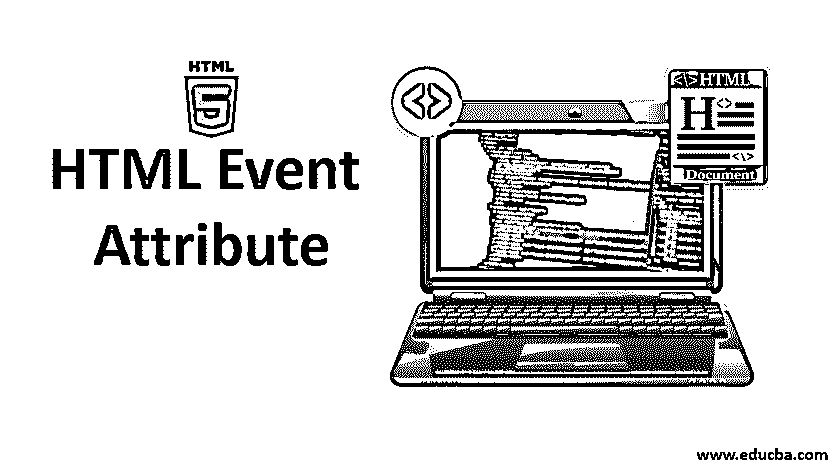


## HTML 事件属性简介

在本文中，我们将详细讨论 HTML 事件属性。事件是作为用户操作的结果而执行的操作。例如，当用户按下键盘来读取数据时，就称为键盘事件。当用户查看网站并执行按钮点击时，或者当按下刷新按钮加载页面时，浏览器对页面进行操作，这些活动就完成了；所有这些行为都被说成是一个事件。在这里，我们将对事件及其如何在浏览器中作用于用户动作有一个基本的了解。在整个浏览器窗口中会发生不同类型的事件，这将在下面的章节中进行解释。

### 前 5 个 HTML 事件属性

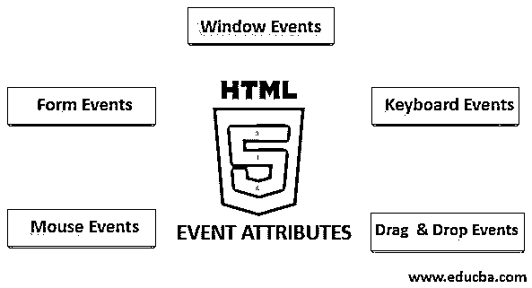


<small>网页开发、编程语言、软件测试&其他</small>

HTML 中有一个不同的事件变体。所有这些事件都有一小段名为事件处理程序的代码，在执行事件操作时触发。这些被附加到 HTML 元素上。事件处理程序或事件侦听器在 HTML 事件属性中起着重要的作用。让我们来看看不同类型的事件属性，它们是全局声明的，并应用于 HTML 元素，以及它们的详细工作。主要使用四种主要的事件属性。它们是:

1.  窗口事件
2.  表单事件
3.  鼠标事件
4.  键盘事件
5.  拖放事件

我们将用一个例子来逐一描述所有这些属性。首先，我们将与。

#### 1.窗口事件

*   **onafterprintEvent:** 所有的 Html 标签都支持这个属性，当一个页面开始打印并且有一个单值脚本时，这个属性就会起作用。下面是一个 HTML 代码的例子。此示例显示按钮被按下的时间；它在对话框消息中打印正在打印的消息。

**代码:**

```
<!DOCTYPE html>
<html>
<head>
<title>
Windows onafterprint Event
</title>
</head>
<body onafterprint="myfun()">
<h1>Windows onafterprint Event </h1>
<p>This attribute works in IE and Mozilla</p>
<body style = "text-align:center">
<script>
function myfun() {
alert("Document is being printed");
}
</script>
</body>
</html>
```

**输出:**

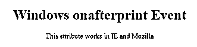


*   **onbeforeprint:** 打印前起作用。该事件在打印过程之后被触发。下面是示例代码。

**代码:**

```
<!DOCTYPE html>
<html>
<head>
<style>
body {
color: #9370DB;
background-color: #BC8F8F;
text-align: center;
padding: 20px;
}
p {
font-size: 2rem;
}
</style>
</head>
<body onbeforeprint="get()">
<h1> Attribute Demo</h1>
<p style="color:#0000FF;">trigger to print.</p>
<div class="show"></div>
<script>
function get() {
document.body.style.background = "#00BFFF";
}
</script>
</body>
</html>
```

**输出:**

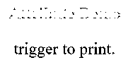


*   **onerror:** 该函数在没有元素存在的情况下抛出错误时触发。

**代码:**

```
<!DOCTYPE html>
<html>
<body>

<p>hello world.</p>
<script>
function myFun() {
alert("problem with image loading.");
}
</script>
</body>
</html>
```

**输出:**

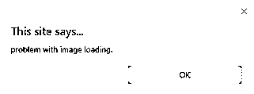


*   **onload:** 这个函数有助于加载一个对象，并且可以很好地查看一个网页是否被正确加载。

**代码:**

```
<!DOCTYPE html>
<html>
<head>
<title>onload event demo</title>
</head>
<body>

<script>
function ldImg() {
alert("image loaded without error");
}
</script>
</body>
</html>
```

**输出:**

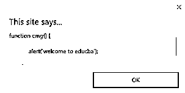


*   **onresize:** 浏览器窗口调整大小时触发该事件，resize 属性下任何元素都可以触发。

**代码:**

```
<!DOCTYPE html>
<head>
<title>onresize event</title>
</head>
<body>
<script type="text/javascript">
function cmg() {
alert('welcome to educba');
}
window.onresize = cmg;
</script>
</head>
<body>
<input type="button"  value="Click the button"
onclick="alert(window.onresize);">
</body>
</html>
```

**输出:**

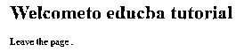


*   **onunload:** 当网页窗口关闭或用户离开网页时触发该事件。下面的代码在用户离开时卸载页面，并发出感谢搜索的提示。该事件有时适用于所有浏览器。

**代码:**

```
<!DOCTYPE html>
<html>
<body onunload="onfunc()"><h1>Welcometo educba tutorial</h1>
<p>Leave the page .</p>
<script>
function onfunc() {
alert("Thank you for searching!");
}
</script>
</body>
</html>
```

**输出:**

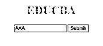


#### 2.表单事件

它适用于表单控件。以下是用户与浏览器交互时出现的属性。

*   **onblur:** 当用户的注意力离开窗体窗口时，该事件发生。下面的例子接受小写的输入，当点击 submit 按钮时，它将输出变成大写。

**代码:**

```
<!DOCTYPE html>
<html>
<head>
<title> Form onblur </title>
<style>
body {
text-align:center;
}
h1 {
color:pink;
}
</style>
</head>
<body>
<h1>EDUCBA</h1>
<input type="text" name="fname" id="aaa"
onblur="myfunc()">
<button type="button">Submit</button>
<script>
function myfunc() {
var a = document.getElementById("aaa");
a.value = a.value.toUpperCase();
}
</script>
</body>
</html>
```

**输出:**

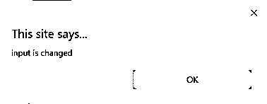


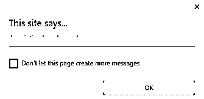


*   **onchange:** 当用户更改表单中的现有元素时，会发生该事件。当一个元素失去焦点时就会发生这种情况。

**代码:**

```
<!DOCTYPE html>
<html lang="en">
<head>
<meta charset="utf-8">
<title>HTML onchange</title>
</head>
<body>
<form name="example" action="">  <input type="text" name="rahul" onchange="alert('input is changed')"><br>
<label>select the dress color</label>
<select onchange="alert('You have changed the selection!');">
<option>pink</option>
<option>Yellow</option>
<option>White</option>
</select>
<p><strong>Note:</strong> Select any option </p>
<label>Describe yourself in short : </label>   <br/><textarea cols="15" rows="7" name="details" onchange="alert('description has changed')">   </textarea><br>
<button type="button" name="submit">Submit</button>
</form>
</body>
</html>
```

**输出:**

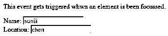


*   **onfocus:** 当用户关注网页上的元素或者输入被聚焦时，该属性被启用。当我们在字段中输入内容时，下面的示例会突出显示。

**代码:**

```
<!DOCTYPE html>
<html>
<body>
<p>This event gets triggered whwn an element is been focussed.</p>
Name: <input type="text" id="name" onfocus="onfoc(this.id)"><br>
Location: <input type="text" id="loc" onfocus="onfoc(this.id)">
<script>
function onfoc(a) {
document.getElementById(a).style.background = "pink";
}
</script>
</body>
</html>
```

**输出:**

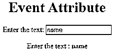


*   **oninput:** 当输入被输入到输入字段时，该事件被触发。当文本字段中的值改变时，它被激活。它反映了元素值的变化。

```
<!DOCTYPE html>
<html>
<head>
<title> HTML oninput </title>
</head>
<style>
body {
text-align:center;
}
h1 {
color:red;
}
</style>
<body>
<h1> Event Attribute </h1>
Enter the text:
<input type="text" id="EDUCBA"  oninput="myon()">
<p id= "sid"></p>
<script>
function myon()
{
var x = document.getElementById("EDUCBA").value;
document.getElementById("sid").innerHTML = "Enter the text : " +x;
}
</script>
</body>
</html>
```

**输出:**

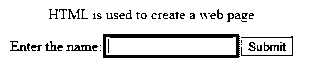


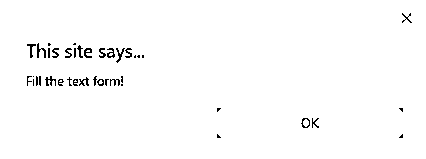


*   **oninvalid:** 当输入类型中输入的文本无效或保持为空时，该属性调用事件。该事件属性必须填充输入元素。

**代码:**

```
<!DOCTYPE html>
<html>
<head>
<title> example oninvalid Event </title>
<style>
p {
color:orange;
}
body {
text-align:center;
}
</style>     </head>
<body>
<p> HTML is used to create a web page</p>
<form  method="get">
Enter the name:
<input type="text" oninvalid="alert('Fill the text form!');" required>
<input type="submit" value="Submit">
</form>  </body>
</html>
```

**输出:**

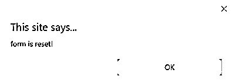


*   **onreset:** 当一个窗体是一个休止符时它被触发。下面的例子说明当你提交按钮时，一个表单被处理，当你点击重置时，表单被重置。

**代码:**

```
<!DOCTYPE html>
<html>
<style>
body {font-family:calibri;}
label {font-variant:small-caps;}
ol {background-color:#610000; margin-top:35px;}
li {margin-top:3px; padding:3px; background-color:rose; font-size:15px;}
div {position:absolute;top:250px;left:70px; font-size:1.5em;
}
</style>
<body>
<ol>
<li>Form with input to reset and submit</li>
</ol>
<form action="" method="get" onreset="onRes()" onsubmit="onSub()">
<label>Enter input:<br /><input type="text" id="iv" oninvalid="onInva()" oninput="onInp()"></label><br /><br />
<input type="submit" value="press"> <input type="reset">
</form>
<div id="a_box"></div>
<script>
function onInva() {
alert("Input field cannot be empty!");
}
function onInp() {
var input_value = document.getElementById("iv").value;
document.getElementById("a_box").innerHTML = "Input value: <br />" + iv;
}
function onRes() {
alert("form is reset!");
}
function onSubmitEvent() {
alert("Form is loading");
location.reload();
}
</script>
</body>
</html>
```

**输出:**


*   **onsearch:** 当用户按下 enter 按钮时，它就会工作。

**代码:**

```
<!DOCTYPE html>
<html>
<body>
<p>Write in the field.</p&gt
<input type="search" id="value1" onsearch="myF()">
<p id="sample"></p>
<script>
function myF() {
var k = document.getElementById("value1");
document.getElementById("sample").innerHTML = "search element is: " + k.value;
}
</script>
</body>
</html>
```

**输出:**

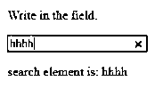


*   **onselect:** 当输入框中的文本被选中时触发。它会抛出一个对话框，打印一条警告消息。

**代码:**

```
<!DOCTYPE html>
<html>
<head>
<title>onselect demo</title>
<style>
h1 {
color:magenta;
}
body {
text-align:center;
}
</style>
<script>
function eduhtml() {
alert("text highlighted!");
}
</script>
</head>
<body>
<h1>EDUCBA Online tutorial</h1>
Text Box: <input type="text" value="onselectattribute: A well defined portal" onselect="eduhtml()">
</body>
</html>
</html>
```

**输出:**

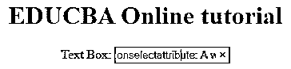


*   **onsubmit:** 这个事件的目的是执行按下提交按钮时执行的动作。

**代码:**

```
<!DOCTYPE html>
<html>
<body>
<head>
<title> Onsubmit Example</title>
</head>
<form action="demo_form.asp" onsubmit="myF()">
Enter name: <input type="text" name="fname">
<label>Email :</label>
<input id="email" name="email" type="text">
<input type="submit" value="Submit">
</form>
<script>
function myF() {
alert("The form was submitted");
}
</script>
</body>
</html>
```

**输出:**

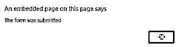


#### 3.键盘属性

*   **OnKeyDown:** 当用户按下向下箭头键时触发。

**代码:**

```
<!DOCTYPE html>
<html>
<body>
<p>Example for Onkeydown.</p>
<input type="text" onkeydown="mykedwn()">
<script>
function mykedwn() {
alert("key press is activated");
}
</script>
</body>
</html>
```

**输出:**

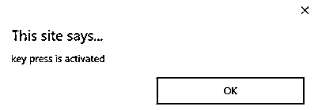


*   **OnKeyPress:** 当用户按下键盘上的任意键时，该事件被触发。注意:有些浏览器不支持按任何键。

**代码:**

```
<!DOCTYPE html>
<html>
<body>
<p> This example shows when a user type in the text area it triggers an event </p>
<form>
<textarea onkeypress="alert('triggering onkeypress event.')" placeholder="Place the cursor inside the textarea and press a key."  " cols="30" rows="4" style="background-color:pink;">> </textarea> </form>
</body>
</html>
```

**输出:**

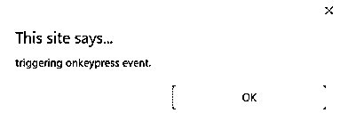


*   **OnKeyUp:** 当用户从文本字段释放光标时，该属性被触发。下面是演示。

**代码:**

```
<!DOCTYPE html>
<html>
<body>
<p> This example transforms the character to lower case.</p>
Fill the name: <input type="text" id="jjj" onkeyup="mykey()">
<script>
function mykey() {
var g = document.getElementById("jjj");
g.value = g.value.toLowerCase();
}
</script>
</body>
</html>
```

**输出:**

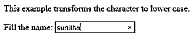


#### 4.鼠标事件属性

当从计算机或任何外部设备(如智能手机或平板电脑)按下鼠标时，此操作会触发鼠标事件。下面给出了一些鼠标事件:

*   **onclick:** 当用户在鼠标上按下按钮时触发。下面给出了一个输入示例，展示了单击鼠标时的事件。

**代码:**

```
<!DOCTYPE html>
<html>
<body>
<h1>HTML onclick Event</h1>
<p> Event plays a vital role in HTML.</p>
<button onclick="oncf()">Click </button>
<p id="sample"></p>
<script>
function oncf() {
document.getElementById("sample").innerHTML = "Hello World";
}
</script>
</body>
</html>
```

**输出:**

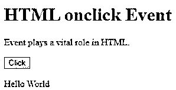


*   当鼠标在图像上向任何方向移动时，它被触发。

**代码:**

```
<!doctype html>
<html>
<head><title> Event onmousemove demo</title>
</head>
<body>
<p>This event is activated when the pointer drags its direction.</p>
<body style="width:200px;height:80px;border:2px solid;" onmousemove="javascript:alert('mouse action');">Sample text</body>
</body>
</html>
```

**输出:**

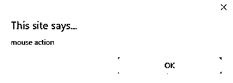


*   当用户释放输出上的按钮时，这个事件给出一个通知。

**代码:**

```
<!DOCTYPE html>
<html>
<head>
<style>
body {
color:  "#ff0000";
height: 120vh;
background-color: #610000;
text-align: center;
}
.polygon {
float: right;
shape-inside: polygon(0 0, 0 200px, 100px 200px);
clip-path: polygon(0 0, 0 250px, 100px 300px);
height: 200px;
width: 200px;
background: linear-gradient(to bottom left, #7CFC00, #8B008B);
}
p {
margin: 30px auto;
}
</style>
</head>
<body>
<h1>HTML onmouseup Demo</h1>
<div class="polygon" onmouseup="mupfn()"></div>
<p> click below object</p>
<script>
function mupFn() {
document.querySelector('.polygon').style.transform = 'scale(2.2)';
}
</script>
</body>
</html>
```

**输出:**

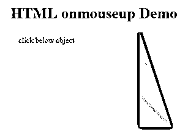


*   **Onmouseover:** 当鼠标指针在图像上移动时执行一个 JavaScript

**代码:**

```
<!DOCTYPE html>
<html>
<body>
<title>Example demonstrating Onmouseover.</title>
<h1 id="sample" onmouseover="A()" onmouseout="B()">Mouse over </h1>
<script>
function A() {
document.getElementById("sample").style.color = "yellow";}
function B() {
document.getElementById("sample").style.color = "green";
}
</script>
</body>
</html>
```

**输出:**

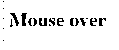


#### 5.拖动事件属性

当用户拖动输入元素时，这个应用程序在 HTML 窗口中提供帮助。下面是 HTML 中用来存储拖动数据的不同事件监听器。

*   **Ondrag:** 当从网页中拖动元素时使用。
*   **Ondragstart** :当用户开始从输入字段拖动时触发。下面的例子演示了如何拖动双目标区域。

**代码:**

```
<!DOCTYPE HTML>
<html>
<head>
<style type = "text/css">
#b1, #b2 {
float:left;padding:11px;margin:11px; -moz-user-select:none;
}
#b1 { background-color: #FF6699; width:65px; height:85px;  }
#b2 { background-color: #808000; width:180px; height:180px; }
</style>
<script type = "text/javascript">
function dStart(e) {
e.dataTransfer.effectAllowed = 'move';
e.dataTransfer.setData("Text", e.target.getAttribute('id'));
e.dataTransfer.setDragImage(e.target,0,0);
return true;
}
</script>
</head>
<body>
<center>
<h2>Drag demo</h2>
<div> Drag the box.</div>
<div id = "b1" draggable = "true"
ondragstart = "return dStart(e)">
<p>Drag it</p>
</div>
<div id = "b2">welcome</div>
</center>
</body>
</html>
```

**输出:**

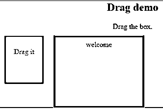


*   **ondrop:** 当一个可拖动的元素被放到< div >元素中时，执行这个属性。

**代码:**

```
<!DOCTYPE HTML>
<html>
<head>
<style type = "text/css">
#b1, #b2 {
float:left;padding:11px;margin:11px; -moz-user-select:none;
}
#b1 { background-color: #FF6699; width:65px; height:85px;  }
#b2 { background-color: #808000; width:180px; height:180px; }
</style>
<script type = "text/javascript">
function dStart(e) {
e.dataTransfer.effectAllowed = 'move';
e.dataTransfer.setData("Text", e.target.getAttribute('id'));
e.dataTransfer.setDragImage(e.target,0,0);
return true;
}
</script>
</head>
<body>
<center>
<h2>Drag  dropdemo</h2>
<div> drop the box.</div>
<div id = "b1" draggable = "true"
ondragstart = "return dStart(e)">
<p>Drag it</p>
</div>
<div class="droptarget"
ondrop="drop(event)"
ondragover="allowDrop(event)">
</div>
<div id = "b2">welcome</div>
 dropzone 
</center>
</body>
</html>
```

**输出:**

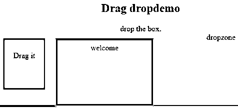


### 结论

这个事件属性有助于使 web 应用程序变得非常简单和有吸引力。动作的不同发生产生不同的事件。尽管通常避免使用这种方法，但程序员喜欢学习为 HTML 属性事件分配的函数。这些事件处理程序仍然被执行来美化网页。

### 推荐文章

这是一个 HTML 事件属性的指南。这里我们讨论 HTML 事件属性的介绍以及代码实现和输出。您也可以浏览我们推荐的文章，了解更多信息——

1.  [HTML 框架](https://www.educba.com/html-frames/)
2.  [HTML 样式属性](https://www.educba.com/html-style-attribute/)
3.  [HTML 的应用](https://www.educba.com/uses-of-html/)
4.  [HTML vs HTML5](https://www.educba.com/html-vs-html5/)


