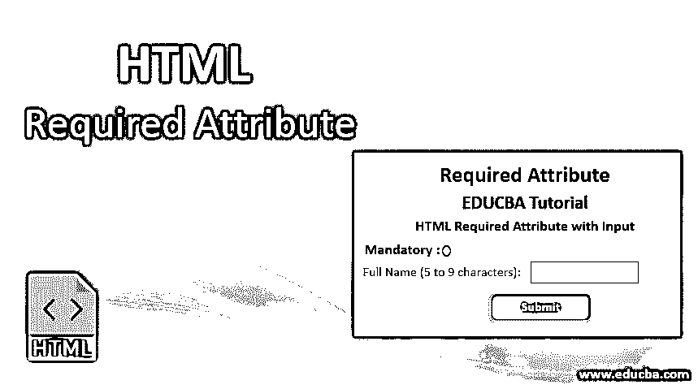
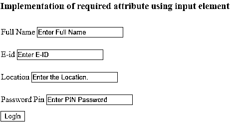
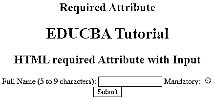
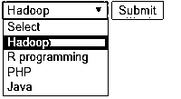
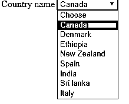

# HTML 必需属性

> 原文：<https://www.educba.com/html-required-attribute/>




## HTML 必需属性介绍

它可以被称为布尔属性，有时被称为开发人员友好的强制或强制字段。它应该被任何形式的控件标记为在网页上提交任何表单之前有一个不应该为空的值。这可以通过在输入字段的末尾提供属性来实现，我们希望它是必需的。客户端会收到一个弹出警告，提示必须填写必填字段；同时，[对 HTML5](https://www.educba.com/what-is-html5/) 来说是新的，也能很好地处理像复选框、单选按钮、文本等输入字段。，可能有助于前端验证。

本文介绍了必需属性的基本概念，并给出了在 Chrome 6、Firefox、opera 等浏览器中启动和运行的简单示例，这些浏览器都有不同的默认行为。实际上，属性是一个特殊的词，它为 HTML 中的任何元素提供了功能。与 HTML5 一样，所需的属性作为 UI 助手是可见的。当用户提交表单时，无论表单是否包含数据，服务器都会在收到请求时执行验证。

<small>网页开发、编程语言、软件测试&其他</small>

### 句法

下面给出了语法，您可以做的一个微小的改变是在表单中使用关键字“Attribute”来创建文本输入字段。在提交表单之前，必须在表单中设置要填写的字段。为此，给出了“必需的”属性。

**一般语法:**此处使用的可能值为空或必需。

```
<element required>
```

**输入元素的语法:**

```
< input type =" " required>
```

**文本区语法:<文本区必选>**

```
<text area rows ="   " cols = " " name =" " required> < /text area>
```

**选择区域的语法:**

```
<select name =" "required>
<option value >
</option> </select>
```

### HTML 必需的属性是什么？

据说 HTML5 有很多布尔属性，分别代表真值和假值，现在我们开始解释一下。它们允许我们执行以下操作:

*   如果字段留空，停止提交表单。
*   在任何未选中的字段上，提供一条通知消息。

Html required 属性应用于最常用的三个元素，如下所示:它们是

1.  **<输入> :** 该属性在<输入>元素中指定。该字段包括各种输入类型，如电子邮件、文本、单选按钮、复选框和 URL。
2.  **<文本区> :** 这个元素可以容纳任意数量的字符，以固定宽度显示。文本区域由同时显示的<列>和<行>的数量决定。如果是用 CSS，描述高度和宽度的属性。HTML5 文本区域具有自动聚焦、占位符、表单、最大长度、必需、换行等属性。
3.  **<select>:**Html select 元素提示用户通过添加一个空值的简单模式“required”从列表中进行选择。

### HTML 必需属性的示例

让我们试用 HTML 代码来学习 HTML 中所需的属性。首先，我们将使用<input>属性。

#### 1.<input>属性:必填字段

将一个字段标记为 simple 就是将“required”属性添加到输入元素中。以下代码显示了在提交时填写必填字段时，这些字段在浏览器中是如何工作的。让我们看看在适当的地方添加所需的属性。

##### 示例#1

**代码:**

```
<html>
<head>
<h3>
Implementation of required attribute using input element
</h3>
<style>
div
{
padding: 12px 1;
}
</style>
<head>
<body>
<form>
<div>
<label> Full Name</label>
<input type="text" placeholder="Enter Full Name" name="name" required>
</div>
<div>
<label> E-id </label>
<input type="email" placeholder="Enter E-ID" name="email" required>
</div>
<div>
<label> Location </label>
<input type="text" placeholder="Enter the Location." name="Loc" required>
</div>
<div>
<label>Password Pin</label>
<input type="password" placeholder="Enter PIN Password" name="pwd" required>
<br>
</div>
<button type="submit" VALUE="SUBMIT"> Login </button>
</form>
</body>
</html>
```

**输出:**




##### 实施例 2

检测一个单选按钮是否没有被选中。

**代码:**

```
<!DOCTYPE html>
<html>
<head>
<h2>
Required Attribute
<h2>
<style>
h1,
h2 {
color: Orange;
font-style: Verdina;
}
body {
text-align: center;
}
</style>
</head>
<body>
<h1>EDUCBA Tutorial</h1>
<h2>
HTML required Attribute with Input
</h2>
<form action="">
<label for="name"> Full Name (5 to 9 characters): </label>
<input type="text" id="name" name=" Full name" required
minlength="5" maxlength="9" size="14">
Mandatory:
<input type="radio"
name="radiocheck"
required>
<br>
<input type="submit">
</form>
</body>
</html>
```

**输出:**




#### 2.<text area="">属性</text>

这个布尔属性指定了文本区域元素在提交之前不应该单独存在，还指定了多行输入控件。下面的例子说明了这个属性在表单外的使用。

**代码:**

```
<!DOCTYPE>
<html>
<head>
<title>Required Attribute implementation</title>
<style>
h1
{
color: brown;
font-style: Arial;
}
body {
text-align: center;
}
</style>
</head>
<body>
<h1> Text Area Required Attribute</h1>
<form action="updates.jsp" id="user idform">
E-mail id: <input type="text" name="username">
<input type="submit">
</form>
<br>
<textarea rows="10" cols="60" name="comment" form="user idform">
Enter text here... </textarea>
```

**输出:**


即使在上面的例子中，我们也可以使用最小长度和最大长度属性来指定它。

#### 3.<select>属性</select>

下面的例子演示了 required 属性和<select attribute="">的用法。它允许浏览器从表单控件中进行选择并提交。</select>

##### 示例#1

**代码:**

```
<!DOCTYPE html>
<html>
<body>
<form action="/act_page.php">
<select required>
<option value="">Select</option>
<option value="Air India">Hadoop</option>
<option value="Emirates"> R programming</option>
<option value="Doha">PHP</option>
<option value="Spice Jet"> Java</option>
</select>
<input type="submit">
</form>
</body>
</html>
```

**输出:**




**Note:** Also, check their working without attempting the selection option in the <select> list while submitting the form.

##### 实施例 2

以下示例无效，因为第一个子元素的值属性为空。在第 5 行我提到了<option>选择。要使代码有效，请选择</option>。

**代码:**

```
<form action="#" method="post">
<div>
<label for="Country">Country name</label>
<select required aria-required="true" id="Country" name="Country">
<option>Choose</option>
<option value=" CN"> Canada</option>
<option value="DM">Denmark</option>
<option value="ETH">Ethiopia</option>
<option value="NZ">New Zealand</option>
<option value="sa">Spain</option>
<option value="IND">India</option>
<option value="SL">Sri lanka</option>
<option value="It">Italy</option>
</select>
</div>
</form>
```

**输出:**




### 结论

它有助于定义输入字段的状态，并寻求浏览器来验证客户端输入字段。作为 HTML5 中一个奇妙的元素，使得客户端表单验证变得容易，并为用户提供了更好的增强。只需一次验证的即时方法改善了用户互动。

### 推荐文章

这是一个 HTML 必需属性的指南。在这里，我们讨论了基本概念、语法和各种带有适当代码和输出的 HTML 必需属性的例子。您也可以浏览我们的其他相关文章，了解更多信息——

1.  [HTML 中的旁白标签](https://www.educba.com/aside-tag-in-html/)
2.  [HTML 样本标签](https://www.educba.com/html-samp-tag/)
3.  [HTML 复选框标签](https://www.educba.com/html-checkbox-tag/)
4.  [HTML 文本属性](https://www.educba.com/html-text-attributes/)


