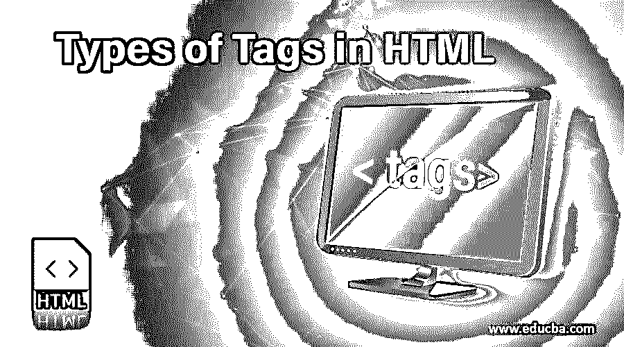
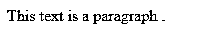
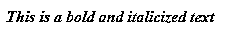
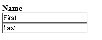
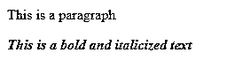

# HTML 中的标签类型

> 原文：<https://www.educba.com/types-of-tags-in-html/>




## HTML 标签简介

标签可以被定义为直接嵌入到 HTML 文档文本中的指令。HTML 文档中使用的标签类型负责告诉 web 浏览器做一些事情(按照指示)，而不仅仅是显示文本。在 HTML 文档中，所有的标签名称都与其他简单的文本不同。标签名称用尖括号或“小于”和“大于”符号()括起来。

### HTML 中最常见的三种标签

HTML 文档是使用不同类型的标签创建的。HTML 标签可以基于不同的基础来定义和划分。让我们在本文接下来的部分中看到它们。我们根据以下分类对 HTML 标签进行了划分:

<small>网页开发、编程语言、软件测试&其他</small>

#### **1。成对和不成对的标签**

 **下面是 HTML 中的成对和不成对标签，借助例子详细解释。

##### 成对标签

当一个 HTML 标签包含一个开始标签和一个结束标签作为它的伙伴标签时，这个标签被称为成对标签。一个 HTML 成对标签以一个开始标签开始:在尖括号内的标签名称；例如，段落开始标记被写成'

'。内容跟在开始标签后面，以结束标签结束:标签名以正斜杠开头；例如，一个结束段落标记被写成'【T1]'。第一个标记可以称为“开始标记”，第二个标记可以称为结束标记。

****例#1:****

```
<p> This text is a paragraph . </p>
```

****输出:****




**注:**此处开始标签为，结束标签为< /p >。

**例 2:**

成对标签的另一个例子是斜体和/或粗体标签:

```
<i> <b> This is a bold and italicized text </b> </i>
```

****输出:****




**Note:** These paired tags are also called Container Tags.

##### 不成对的标签

当 HTML 标签只有开始标签而没有结束标签或伴随标签时，该标签称为不成对标签。不成对的 HTML 标记不需要结束标记；在这种类型中，开始标记就足够了。不成对标签有时也被称为独立标签或单个标签，因为它们不需要伴随标签。

**举例:**

```
<p> This is a paragraph </p>
<hr>
<i> <b> This is a bold and italicized text </b> </i>
```

**输出:**

**Note:** Here, the <hr> is the unpaired tag used to create a horizontal line. In older versions, you might see hr tag written as <hr/> instead of <hr>. These tags are also called Empty Tag.

#### **2。自动结束标签**

 **自结束标签是那些没有伙伴标签的 HTML 标签，其中第一个标签是对格式有效的唯一必要标签。主要和重要的信息包含在元素中作为其属性。图像标签是自结束标签的典型例子。下面让我们来看看它的实际应用:

**举例:**

```

```

**注意:**在旧版本中，自结束标记在结束或结束“大于”符号/符号前使用“正斜杠”，如下所示:


#### **3。基于实用程序的标签**

 **HTML 标签可以根据它们的用途，也就是说，根据它们所服务的目的进行广泛的区分。我们可以将它们基本分为三类，如下所述:

##### 格式化标签

HTML 标签帮助设置文本的格式，比如文本的大小、字体样式、加粗等等。这是通过使用像<字体>、< b >、< u >等标签来完成的。表格、分部和 span 标签也是那些帮助格式化网页或文档以及设置页面布局的标签。下面是一个小程序，使用 divisions 和一些其他的格式化标签来格式化页面。

**举例:**

```
<body>
<div class="container">
<div class="row">
<div class="col-25">
<label for="email"><b>Name</b></label>
</div>
<div class="col-35">
<input type="text" placeholder="First" name="fname" required>
</div>
<div class="col-35">
<input type="text" placeholder="Last" name="lname" required>
</div>
</div>
</div>
</body>
```

**输出:**




##### 结构标签

帮助构建 HTML 文档的 HTML 标签称为结构标签。描述、标题、html、标题、正文等。，形成页面结构标签组。结构标签仅帮助从根创建或形成基本 html 页面；也就是说，它们不影响或不参与文本的格式化。所以一个基本的 HTML 程序是一组基本的结构标签:

**举例:**

```
<!doctype html>
<html>
<head>
<meta charset="utf-8">
<title>Types of Tags Demo</title>
</head>
<body>
<p> This is a paragraph </p>
<i><b> This is a bold and italicized text </b></i>
</body>
</html>
```

**输出:**




##### 控制标签

可以创建的另一类标签是“控制标签”。脚本标签、单选按钮或复选框、表单标签等。，形成控制标签。这些是用于管理内容或管理外部脚本或库的标签。所有的表单标签、下拉列表、输入文本框等。，用于与访问者或用户进行交互。

HTML 标签的上述区别是基于标签的类型和它们的效用。HTML 标签也可以简单地根据基本类别进行划分，如基本 HTML 根标签、格式标签、音频和视频标签、表单和输入标签、[框架标签](https://www.educba.com/frame-tag-in-html/)、链接标签、列表标签、表格标签、样式标签、元标签等。

### 推荐文章

这是 HTML 中标签类型的指南。在这里，我们讨论 HTML 中的基本概念和前三种标签类型，以及不同的例子和代码实现。您也可以阅读以下文章，了解更多信息——

1.  [HTML 中的引号](https://www.educba.com/quotation-tag-in-html/)
2.  [HTML 中的 Iframes 标签](https://www.educba.com/iframes-in-html/)
3.  [HTML 命令](https://www.educba.com/html-commands/)
4.  [HTML 中的 Meta 标签](https://www.educba.com/meta-tag-in-html/)


******