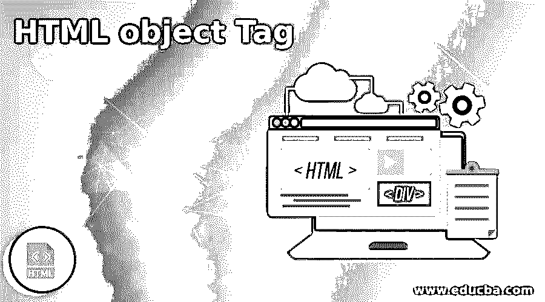
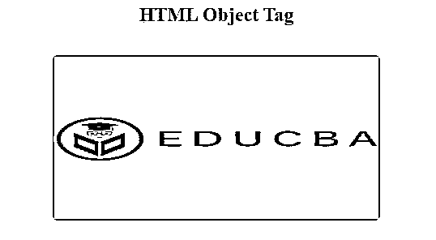
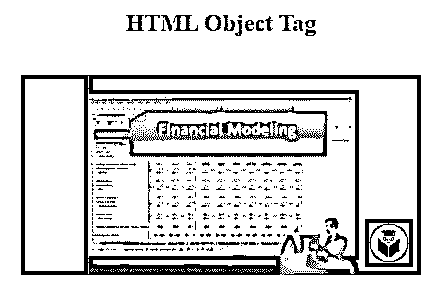
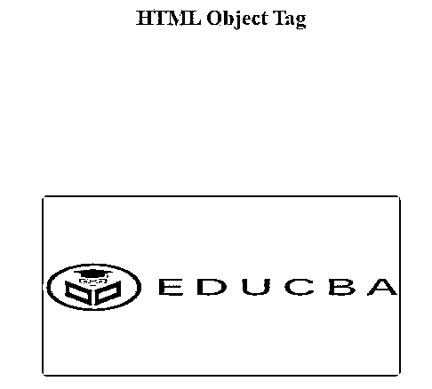
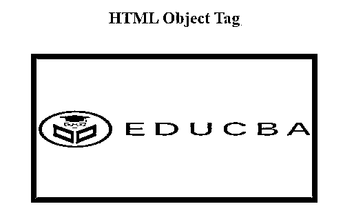

# HTML 对象标签

> 原文：<https://www.educba.com/html-object-tag/>




## HTML 对象标签简介

外部资源的 HTML <object>标签指定了一个容器。外部资源将用于演示网页中的多媒体，如音频、视频、图像、pdf 和 Flash。这可以用来在 HTML 页面中显示另一个网页。除了这个标签，<param>标签也用于描述不同的参数。与标签<video>和

<audio>相比，HTML object 标签允许将多媒体文件插入网页。由于兼容性问题，<object>标签比<embed>标签更常用于嵌入资源。这个标签通常被称为元素<object>。</object></object></audio></video></object> 

### 句法

HTML 对象标记的语法可以写成如下所示:

<small>网页开发、编程语言、软件测试&其他</small>

```
<object data= "url " type= "content type ">
. . . . .
</object>
```

举个例子，

```
<object height= "200" width= "400" data= "url"> </object>
```

它显示具有指定高度和宽度属性的对象。

#### 因素

对象标签的参数是:

*   数据:它规定了对象将使用的资源 URL。
*   类型:它指定数据描述的资源内容的类型。
*   表单:表示与对象元素相关的表单元素。
*   高度:它提供了对象的高度。
*   宽度:它提供了对象的高度。
*   name:它提供了对象的名称。
*   类型必须匹配:它清楚地表明，如果类型属性符合数据属性上提供的资源的适当文本类型，就应该插入资源。

### HTML 对象标签是如何工作的？

元素可以用来合并一个包含的组件、要呈现的数据以及对象在编译时需要的其他值。我们可以组合对象元素，利用这种可能性，我们可以为每个浏览器定义多个对象。虽然所有主流浏览器都不支持 object 元素，但该元素的使用却很少。

### 实现 HTML 对象标签的示例

下面是提到的例子:

#### 示例#1

**代码:**

```
<!DOCTYPE html>
<html lang="en">
<head>
<meta charset="utf-8">
<title> HTML Object Tag Example </title>
<style>
body {
background-color: #8FBC8F;
}
</style>
</head>
<body>
<center>
<h2> HTML Object Tag</h2> <br>
<object data= "https://www.shareasale.cimg/edu-logo.jpg" width="400px" height="200px"></object>
</center>
</body>
</html>
```

**输出:**




**解释:**在上面的例子中，我们用< center >标签在网页的中央创建了 object 标签。对象元素以 400 像素的高度和 200 像素的宽度显示。十六进制#8FBC8F 表示 HTML 页面正文的背景色。

#### 实施例 2

**代码:**

```
<!DOCTYPE html>
<html lang="en">
<head>
<meta charset="utf-8">
<title> HTML Object Tag Example </title>
<style>
body{
background-color: #8FBC8F;
}
</style>
</head>
<body>
<center>
<h2> HTML Object Tag</h2> <br>
<object height="200px" width="400px" data="https://www.youtube.com/embed/Xs3MCM0dXW0"></object>
</center>
</body>
</html>
```

**输出:**




**解释:**在上面的例子中，我们使用 HTML object 标签嵌入了视频，并借助高度和宽度属性将视频设置在适当的位置。嵌入来自 YouTube 的视频 url，并粘贴到数据属性中。

#### 实施例 3

**代码:**

```
<!DOCTYPE html>
<html lang="en">
<head>
<meta charset="utf-8">
<title> HTML Object Tag Example </title>
<style>
body{
background-color: #8FBC8F;
}
</style>
</head>
<body>
<center>
<h2> HTML Object Tag</h2> <br>
<object data= "https://www.shareasale.cimg/edu-logo.jpg" width="400px" height="200px" vspace="150"></object>
</center>
</body>
</html>
```

**输出:**




**解释:**在上面的例子中，我们使用了 object 标签来显示网页上的图像。object 标签使用 vspace 属性来定义对象元素顶部和底部的空白。这里，我们在顶部和底部设置了 150 像素的边距。

#### 实施例 4

**代码:**

```
<!DOCTYPE html>
<html lang="en">
<head>
<meta charset="utf-8">
<title> HTML Object Tag Example </title>
<style>
body{
background-color: #8FBC8F;
}
</style>
</head>
<body>
<center>
<h2> HTML Object Tag</h2> <br>
<object data= "https://www.shareasale.cimg/edu-logo.jpg" width="400px" height="200px" border="8"></object>
</center>
</body>
</html>
```

**输出:**




**解释:**在上面的例子中，我们使用了 border 属性来显示 object 元素的边框。border 属性以像素为单位指定边框的宽度。这里，我们用 8 个像素来表示边框宽度。

### 结论

到目前为止，我们已经研究了可以保留在内联元素、块级元素(pre 除外)中的 HTML 对象标签。在大多数情况下，HTML 对象用于插入由浏览器插件辅助的内容。定义数据时，最好使用 type 属性，因为它有助于用户避免加载不支持的内容类型的信息。

### 推荐文章

这是一个 HTML 对象标签的指南。在这里，我们讨论一个 HTML 对象标签的介绍，语法，它是如何与编程的例子。您也可以浏览我们的其他相关文章，了解更多信息——

1.  [DOCTYPE HTML](https://www.educba.com/doctype-html/)
2.  [HTML 文章标签](https://www.educba.com/html-article-tag/)
3.  [HTML 表单动作](https://www.educba.com/html-form-action/)
4.  [HTML 中的嵌套表格](https://www.educba.com/nested-table-in-html/)


