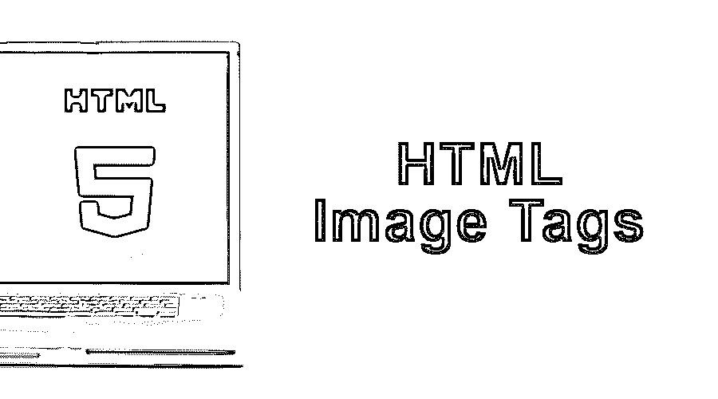
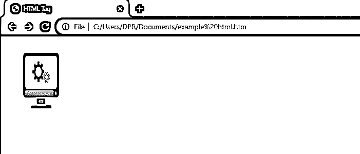

# HTML 图像标签

> 原文：<https://www.educba.com/html-image-tags/>




## 什么是 HTML 图像标签？

HTML 是一个纯文本文档，它允许多种格式的编程语言来实现基于 web 的应用程序，这些应用程序使用标签来描述网页的功能。一个这样的基本标签是 image 标签，它允许开发人员将图像文件合并到代码中，以便在网页上显示相应的图像。这个语法是< img src = '复制图像 URL' >，其中' image '是标记名，而' src = '应该有指定给它的所需图像的 URL。在这个主题中，我们将学习 HTML 图像标签。

### 将图像添加到网页

您可以通过在 HTML 文档中使用标签将 IMG 添加到 HTML 页面中；下面是语法:

<small>网页开发、编程语言、软件测试&其他</small>

```

```

这里，IMG 告诉浏览器该标签是关于向文档添加一个 IMG 的，而“src=”指定从哪里下载图像。

### 带有图像的页面示例

**代码:**

```
<!DOCTYPE html>
<html>
<head>
<title> Example HTML IMG Tag </title>
</head>
<body>

</body>
</html>
```

**输出:**




关于这些 HTML 页面的一个有趣的事实是，当你使用 IMG 标签时，图像不会被插入到所述网页中；相反，它创建了一个保存空间，图像一旦下载就放在那里。

**浏览器支持和与属性的兼容性**

如你所料，所有现代浏览器都支持图片和 IMG 标签的使用。有时，如果图像没有设置为响应，移动浏览器会调整图像的大小以适应屏幕。

关于属性与 HTML 4.01 和更新的 [HTML5](https://www.educba.com/html5-new-elements/) 的兼容性，大部分标签都可以，除了 aligning、border、hspace 和 space，后者根本不支持。

**图片作为链接:**

有时候，你会想要一个图片作为另一个页面的链接。你可以通过在

*   

#### 将图像设置为网页的背景

使用页面 Body 元素中的 background-image CSS 属性，可以将图像指定为网页的背景图片。

```
<body style="background-image:url(‘car.jpg');">
<h1>Background Image </h1>
</body>
```

#### 将图像设定为在浏览器中浮动

我们可以使用 [CSS 属性](https://www.educba.com/what-is-css/)“float”来设置一个图像在浏览器窗口的任何地方浮动。让我们看一个例子来帮助你理解。

```
<p> 
```

在这里，汽车的图像将浮动到文本的右侧。

```
<p>
```

在这里，汽车的图像将浮动到文本的左侧。

### 图像标签的属性

以下是图像标签的属性。

#### 1)对齐

**可能值:**顶部、底部、中间、左侧或右侧。

light 属性用于指定图片在网页上的对齐方式。

#### 2)备选

**值类型:**文本

Alt 用于指定网页图片的可选文本。在无法显示 IMG 的情况下，浏览器会向用户显示该文本。Google 和 Bing 等搜索引擎使用这种替代文本来显示图片搜索的结果。

#### 3)边界

**值类型:**像素

它用于在图片周围创建用户定义厚度的边框。在 HTML5 中[不起作用。](https://www.educba.com/what-is-html5/)

#### 4)跨原点

**值类型:**匿名使用-凭证

当我们想要指定如何处理跨原点照片时，会用到这个属性。这主要用于使用 JavaScript web 应用程序的画布元素的情况。

#### 5)身高

**值类型:**百分比或像素

这个用来表示 HTML 网页中图片的高度。

#### 6) hspace

**值类型:**像素

在 HTML5 中不受支持，hspace 属性用于以像素为单位指定要在插入图像的左侧和右侧添加多少空白。

#### 7) ismap

**值类型:**页面的 URL

ismap 我们曾经将上述图像定义为服务器端图像映射。当用户点击(或轻击)图像内部时，浏览器将点击(或轻击)坐标作为 URL 发送到 web 服务器。

#### 8) Longdesc

**值类型:** URL

Longdesc 通过使用 URL 给出了图像的详细描述。属性中的 URL 用作图像的描述。

#### 9) src

**值类型:** URL

src 代表源。它用于指定浏览器将从中检索图像的地址；此 URL 可以应用于同一服务器上目录内的图像。它还可以将图像存储在具有不同域名的第三方服务器中。

#### 10) usemap

**值类型:** #mapname

usemap 属性定义客户端图像映射的图像。usemap 总是与 map 和 area HTML 标签一起使用。

#### 11)虚拟空间

**值类型:**像素

HTML5 中不支持，Vspace 属性用于设置网页上图像顶部和底部用作空白的像素数量。

#### 12)宽度

**值类型:**像素

顾名思义，width 属性用于指定 HTML 网页中图片的宽度。

### 结论–HTML 图像标签

现在，我们已经了解了如何将图像添加到 HTML 页面以及如何设置它们的属性，我们可以在 web 项目中创建外观漂亮的 web 页面。

除了给网页增加视觉效果之外，图像也很有价值，因为它们有助于搜索引擎优化。在图像中添加适当的 alt 标签和描述有助于搜索引擎更好地理解网页的内容，并在许多情况下提高网页的排名。

### 推荐文章

这是一个 HTML 图像标签的指南。这里我们已经讨论了图像标签的基本概念和属性，比如浏览器支持和与属性的兼容性。您也可以看看以下文章，了解更多信息–

1.  [HTML 命令](https://www.educba.com/html-commands/)
2.  [HTML 属性](https://www.educba.com/html-attributes/)
3.  [HTML 的用途](https://www.educba.com/uses-of-html/)
4.  [HTML 框架](https://www.educba.com/html-frames/)


